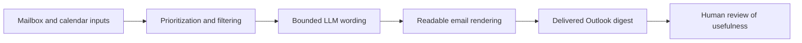

## req_004_day_captain_digest_quality_and_email_polish - Day Captain digest quality, email polish, and assistant usefulness
> From version: 0.4.0
> Status: Done
> Understanding: 100%
> Confidence: 100%
> Complexity: High
> Theme: Quality
> Reminder: Update status/understanding/confidence and references when you edit this doc.

# Needs
- Improve the actual mailbox experience now that end-to-end delivery works.
- Replace the current raw plain-text email feel with a digest that looks intentional and readable in Outlook.
- Reduce low-value or weakly relevant items so the digest feels selective instead of merely functional.
- Make the wording sound more assistant-like and less heuristic, using the existing bounded LLM layer where appropriate.
- Keep the digest operationally safe: readable without the LLM, cheap to run, and predictable in both local and hosted modes.

# Context
- The repository now supports the full path from Graph ingestion to real Outlook delivery.
- A real mailbox validation already proved that the digest lands in `Inbox`, but the received message exposed clear product gaps:
  - email formatting is still plain text and visually rough
  - timestamps are raw ISO values rather than user-friendly local formatting
  - prioritization still surfaces weak watch items that do not feel especially useful
  - wording remains too mechanical for something presented as an assistant digest
- In scope for this request:
  - higher-quality email rendering for delivered digests
  - prioritization and filtering refinements to improve signal quality
  - practical activation/configuration of the bounded LLM wording path
  - validation based on the actual received mailbox experience
- Out of scope for this request:
  - full UI product work outside the email digest
  - multi-user personalization workflows
  - agentic actions or autonomous replies
  - large-scale model-driven ranking over the full mailbox

# Acceptance criteria
- AC1: Delivered digests use a noticeably improved rendering format suitable for Outlook, with readable structure and user-friendly timestamps.
- AC2: The prioritization/filtering logic reduces weak or noisy watch items compared with the current received digest behavior.
- AC3: The bounded LLM wording path can be configured and exercised for delivered digests without breaking deterministic fallback.
- AC4: The delivered digest reads like a concise assistant summary rather than a raw structured dump.
- AC5: The work is validated against real delivered email output, not only local JSON payloads.
- AC6: The updated digest remains compatible with both `json` mode and `graph_send`.
- AC7: The implementation stays within the project’s low-cost bounded-LLM constraints.
- AC8: The work is broken into concrete implementation tasks for rendering, prioritization quality, and LLM-assisted wording.

# Task traceability
- AC1 -> `task_008_day_captain_email_rendering_and_formatting_upgrade`. Proof: task `008` explicitly upgrades delivered rendering quality.
- AC2 -> `task_009_day_captain_digest_signal_quality_tuning`. Proof: task `009` explicitly reduces weak digest items through scoring/filter tuning.
- AC3 -> `task_010_day_captain_llm_digest_wording_activation_and_tuning`. Proof: task `010` explicitly activates and tunes the bounded LLM path.
- AC4 -> `task_008_day_captain_email_rendering_and_formatting_upgrade` and `task_010_day_captain_llm_digest_wording_activation_and_tuning`. Proof: rendering polish and wording tuning jointly improve assistant-like readability.
- AC5 -> `task_008_day_captain_email_rendering_and_formatting_upgrade`, `task_009_day_captain_digest_signal_quality_tuning`, and `task_010_day_captain_llm_digest_wording_activation_and_tuning`. Proof: each task includes delivered email review in validation.
- AC6 -> `task_008_day_captain_email_rendering_and_formatting_upgrade` and `task_009_day_captain_digest_signal_quality_tuning`. Proof: both tasks explicitly preserve `json` and `graph_send` compatibility.
- AC7 -> `task_010_day_captain_llm_digest_wording_activation_and_tuning`. Proof: task `010` keeps bounded-cost and deterministic fallback in scope.
- AC8 -> `task_008_day_captain_email_rendering_and_formatting_upgrade`, `task_009_day_captain_digest_signal_quality_tuning`, and `task_010_day_captain_llm_digest_wording_activation_and_tuning`. Proof: the request explicitly decomposes the quality slice into those three implementation tasks.

# Definition of Ready (DoR)
- [x] Problem statement is explicit and user impact is clear.
- [x] Scope boundaries (in/out) are explicit.
- [x] Acceptance criteria are testable.
- [x] Dependencies and known risks are listed.

# Backlog
- `item_004_day_captain_digest_quality_and_email_polish` - Improve the usefulness and presentation quality of the delivered digest. Status: `In Progress`.
- `task_008_day_captain_email_rendering_and_formatting_upgrade` - Upgrade email rendering, structure, and timestamp formatting. Status: `Delivered, pending chain closure`.
- `task_009_day_captain_digest_signal_quality_tuning` - Refine prioritization and filtering to reduce weak digest items. Status: `Delivered, pending chain closure`.
- `task_010_day_captain_llm_digest_wording_activation_and_tuning` - Configure and tune bounded LLM wording for delivered digests. Status: `In Progress`.
