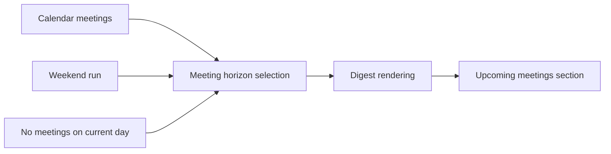

## req_005_day_captain_meeting_horizon_fallbacks - Day Captain meeting horizon fallbacks for weekends and empty days
> From version: 0.5.0
> Status: Done
> Understanding: 100%
> Confidence: 98%
> Complexity: Medium
> Theme: Productivity
> Reminder: Update status/understanding/confidence and references when you edit this doc.

# Needs
- Make the `Upcoming meetings` section more useful when the digest is generated on a weekend.
- Show Monday meetings when the digest runs on Saturday or Sunday, and clearly say that the section is showing Monday rather than the current day.
- Avoid empty meeting sections on a workday when there are no meetings for the current day by showing the next day's meetings instead, with explicit wording.
- Keep the behavior deterministic and inspectable, without changing the rest of the digest contract.

# Context
- The current digest contract includes an `Upcoming meetings` section, but its horizon is effectively tied to the current day.
- This creates two usability gaps:
  - weekend digests can show no meetings even though Monday is the relevant planning horizon
  - a weekday digest can show an empty meeting section even when the next day already contains useful scheduled context
- The requested behavior is not a ranking change; it is a meeting-window selection and presentation rule.
- In scope for this request:
  - weekend-aware meeting horizon fallback to Monday
  - next-day fallback when the current day has no meetings
  - explicit wording in the rendered digest so the user knows which day is being shown
  - test coverage and real payload validation
- Out of scope for this request:
  - broad calendar summarization across multiple future days
  - changing mail scoring or non-meeting digest sections
  - speculative rescheduling or free/busy recommendations

# Acceptance criteria
- AC1: When the digest runs on Saturday or Sunday, the meeting section shows Monday meetings instead of an empty current-day section.
- AC2: The delivered output explicitly states that Monday meetings are being shown when the weekend fallback is used.
- AC3: When there are no meetings for the current digest day, the section shows the next day's meetings instead of `None`.
- AC4: The delivered output explicitly states that next-day meetings are being shown when the empty-day fallback is used.
- AC5: Existing behavior remains unchanged when meetings exist for the current digest day.
- AC6: The behavior remains compatible with both `json` mode and `graph_send`.
- AC7: Automated tests cover weekend fallback, empty-day fallback, and unchanged same-day behavior.

# Task traceability
- AC1 -> `task_011_day_captain_meeting_horizon_fallbacks`. Proof: task `011` implements the meeting horizon fallback rules.
- AC2 -> `task_011_day_captain_meeting_horizon_fallbacks`. Proof: task `011` includes explicit rendered labeling for weekend fallback.
- AC3 -> `task_011_day_captain_meeting_horizon_fallbacks`. Proof: task `011` includes explicit next-day fallback behavior.
- AC4 -> `task_011_day_captain_meeting_horizon_fallbacks`. Proof: task `011` includes rendered labeling for empty-day fallback.
- AC5 -> `task_011_day_captain_meeting_horizon_fallbacks`. Proof: task `011` preserves same-day output when meetings already exist.
- AC6 -> `task_011_day_captain_meeting_horizon_fallbacks`. Proof: task `011` keeps the delivery contract compatible across modes.
- AC7 -> `task_011_day_captain_meeting_horizon_fallbacks`. Proof: task `011` explicitly requires focused automated coverage.

# Definition of Ready (DoR)
- [x] Problem statement is explicit and user impact is clear.
- [x] Scope boundaries (in/out) are explicit.
- [x] Acceptance criteria are testable.
- [x] Dependencies and known risks are listed.

# Backlog
- `item_005_day_captain_meeting_horizon_fallbacks` - Make the meeting section smarter on weekends and empty meeting days. Status: `Done`.
- `task_011_day_captain_meeting_horizon_fallbacks` - Implement weekend and next-day fallback rules for `Upcoming meetings`. Status: `Done`.
