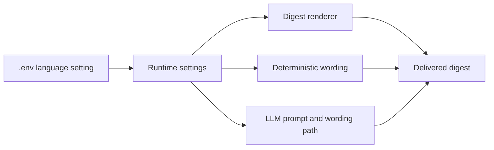

## req_006_day_captain_digest_language_configuration - Day Captain digest and LLM language configuration via environment
> From version: 0.5.0
> Status: Ready
> Understanding: 99%
> Confidence: 98%
> Complexity: Medium
> Theme: Localization
> Reminder: Update status/understanding/confidence and references when you edit this doc.

# Needs
- Make the digest language configurable through environment variables instead of being implicitly fixed in English.
- Keep English as the default output language for digest rendering, labels, and LLM wording behavior.
- Allow switching to another supported language such as French through `.env` without code changes.
- Ensure the configured language applies coherently across deterministic rendering, fallback wording, and the LLM prompt path.

# Context
- The current product outputs digest labels and wording assumptions primarily in English.
- This is acceptable as a default, but it is too rigid for a single-user assistant that may operate in another working language.
- The user explicitly wants environment-level control over:
  - digest language
  - LLM wording language
  - related rendered labels and phrasing
- In scope for this request:
  - add explicit language configuration in settings and `.env.example`
  - make digest rendering labels and fallback wording honor the configured language
  - make the LLM prompt path honor the configured language while preserving deterministic fallback
  - define English as the default and support at least French as an alternate language
  - validate behavior in both `json` and `graph_send`
- Out of scope for this request:
  - full i18n framework for arbitrary locales
  - automatic language detection from mailbox content
  - translation of source emails or meeting titles
  - region-specific date formatting beyond current timezone-aware display rules unless needed by the selected digest language

# Acceptance criteria
- AC1: The application exposes a language setting in environment-backed configuration, defaulting to English.
- AC2: Digest section labels and other user-visible rendered wording honor the configured language.
- AC3: Deterministic fallback wording honors the configured language.
- AC4: The LLM wording path receives and uses the configured language in its prompt/input behavior.
- AC5: French can be selected through `.env` and produces a coherent French digest without code changes.
- AC6: Existing behavior remains unchanged when no language is configured explicitly.
- AC7: Compatibility with both `json` mode and `graph_send` is preserved.
- AC8: Tests cover default English behavior, French configuration, and fallback safety.

# Backlog traceability
- AC1 -> `item_006_day_captain_digest_language_configuration`. Proof: the item explicitly scopes env-backed language selection.
- AC2 -> `item_006_day_captain_digest_language_configuration`. Proof: the item explicitly scopes digest label localization.
- AC3 -> `item_006_day_captain_digest_language_configuration`. Proof: the item explicitly scopes deterministic fallback wording localization.
- AC4 -> `item_006_day_captain_digest_language_configuration`. Proof: the item explicitly scopes language-aware LLM behavior.
- AC5 -> `item_006_day_captain_digest_language_configuration`. Proof: the item explicitly requires French support through configuration.
- AC6 -> `item_006_day_captain_digest_language_configuration`. Proof: the item explicitly preserves default English behavior.
- AC7 -> `item_006_day_captain_digest_language_configuration`. Proof: the item explicitly keeps both delivery modes in bounds.
- AC8 -> `item_006_day_captain_digest_language_configuration`. Proof: the item explicitly requires focused tests for default, alternate language, and fallback behavior.

# Task traceability
- AC1 -> `task_012_day_captain_digest_language_configuration`. Proof: task `012` adds env-backed language configuration.
- AC2 -> `task_012_day_captain_digest_language_configuration`. Proof: task `012` localizes rendered digest labels.
- AC3 -> `task_012_day_captain_digest_language_configuration`. Proof: task `012` localizes deterministic fallback wording.
- AC4 -> `task_012_day_captain_digest_language_configuration`. Proof: task `012` threads the selected language into the LLM path.
- AC5 -> `task_012_day_captain_digest_language_configuration`. Proof: task `012` explicitly validates French output from env-only configuration.
- AC6 -> `task_012_day_captain_digest_language_configuration`. Proof: task `012` preserves default English behavior.
- AC7 -> `task_012_day_captain_digest_language_configuration`. Proof: task `012` validates both delivery modes.
- AC8 -> `task_012_day_captain_digest_language_configuration`. Proof: task `012` explicitly requires focused automated coverage.

# Definition of Ready (DoR)
- [x] Problem statement is explicit and user impact is clear.
- [x] Scope boundaries (in/out) are explicit.
- [x] Acceptance criteria are testable.
- [x] Dependencies and known risks are listed.

# Backlog
- `item_006_day_captain_digest_language_configuration` - Make digest language configurable through environment-backed settings. Status: `Ready`.
- `task_012_day_captain_digest_language_configuration` - Implement env-driven digest and LLM language selection with English default and French support. Status: `Ready`.
