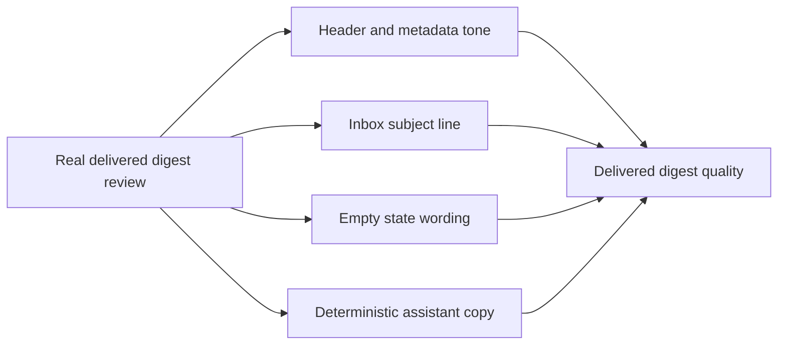

## req_007_day_captain_mailbox_tone_and_copy_polish - Day Captain mailbox tone and copy polish after real digest review
> From version: 0.5.0
> Status: Done
> Understanding: 100%
> Confidence: 98%
> Complexity: Medium
> Theme: Quality
> Reminder: Update status/understanding/confidence and references when you edit this doc.

# Needs
- Remove the remaining "system email" feel from the delivered digest now that the HTML structure is in place.
- Replace technical framing such as `Generated`, `Review window`, and `None` with copy that reads like an assistant rather than an internal report.
- Make the mail subject line feel natural and useful in a real inbox instead of looking like a technical artifact.
- Improve deterministic wording so the digest still feels polished even before the LLM path is fully validated in production.

# Context
- A real delivered digest review showed that the product is structurally readable but still feels too operational and too literal.
- The visible issues are concentrated in four remaining UX defects:
  - header copy is too system-like
  - subject line is too utilitarian
  - empty states read as `None`
  - fallback wording is still close to raw source text
- Two adjacent concerns are already tracked elsewhere and should not be duplicated here:
  - meeting fallback behavior is covered by `req_005_day_captain_meeting_horizon_fallbacks`
  - configurable digest language is covered by `req_006_day_captain_digest_language_configuration`
- In scope for this request:
  - more natural header and metadata copy
  - better inbox-facing email subject wording
  - assistant-like empty-state wording
  - stronger deterministic fallback copy when LLM wording is unavailable or disabled
  - real delivered validation against mailbox output
- Out of scope for this request:
  - language configuration itself
  - weekend and next-day meeting horizon logic
  - broad model-based ranking changes
  - general UI work outside the delivered email

# Acceptance criteria
- AC1: The delivered header copy reads like a user-facing digest rather than an internal system report.
- AC2: The email subject line becomes more natural and useful in the inbox.
- AC3: Empty sections use assistant-like wording instead of `None`.
- AC4: Deterministic fallback wording becomes more concise and assistant-like while staying factual.
- AC5: The work is validated against a real delivered digest, not only local payload inspection.
- AC6: Compatibility with both `json` mode and `graph_send` is preserved.
- AC7: The implementation remains safe when the LLM path is disabled or unavailable.
- AC8: The request is broken into concrete tasks for header/subject polish and copy/empty-state polish.

# Backlog traceability
- AC1 -> `item_007_day_captain_mailbox_tone_and_copy_polish`. Proof: the item explicitly scopes header and metadata tone.
- AC2 -> `item_007_day_captain_mailbox_tone_and_copy_polish`. Proof: the item explicitly scopes inbox-facing subject wording.
- AC3 -> `item_007_day_captain_mailbox_tone_and_copy_polish`. Proof: the item explicitly scopes empty-state copy improvements.
- AC4 -> `item_007_day_captain_mailbox_tone_and_copy_polish`. Proof: the item explicitly scopes deterministic assistant-like wording.
- AC5 -> `item_007_day_captain_mailbox_tone_and_copy_polish`. Proof: the item explicitly requires real delivered validation.
- AC6 -> `item_007_day_captain_mailbox_tone_and_copy_polish`. Proof: the item explicitly keeps both delivery modes in scope.
- AC7 -> `item_007_day_captain_mailbox_tone_and_copy_polish`. Proof: the item explicitly preserves deterministic behavior when LLM wording is not active.
- AC8 -> `item_007_day_captain_mailbox_tone_and_copy_polish`. Proof: the item explicitly decomposes the work into two tasks.

# Task traceability
- AC1 -> `task_013_day_captain_digest_header_and_subject_polish`. Proof: task `013` explicitly improves header and subject tone.
- AC2 -> `task_013_day_captain_digest_header_and_subject_polish`. Proof: task `013` explicitly upgrades inbox subject wording.
- AC3 -> `task_014_day_captain_digest_empty_states_and_fallback_copy_polish`. Proof: task `014` explicitly replaces technical empty states.
- AC4 -> `task_014_day_captain_digest_empty_states_and_fallback_copy_polish`. Proof: task `014` explicitly improves deterministic fallback copy.
- AC5 -> `task_013_day_captain_digest_header_and_subject_polish` and `task_014_day_captain_digest_empty_states_and_fallback_copy_polish`. Proof: both tasks include delivered digest validation.
- AC6 -> `task_013_day_captain_digest_header_and_subject_polish` and `task_014_day_captain_digest_empty_states_and_fallback_copy_polish`. Proof: both tasks keep `json` and `graph_send` in scope.
- AC7 -> `task_014_day_captain_digest_empty_states_and_fallback_copy_polish`. Proof: task `014` explicitly preserves deterministic fallback quality without requiring LLM availability.
- AC8 -> `task_013_day_captain_digest_header_and_subject_polish`. Proof: the request explicitly decomposes the mailbox polish slice into a dedicated header/subject task.
- AC8 -> `task_014_day_captain_digest_empty_states_and_fallback_copy_polish`. Proof: the request explicitly decomposes the mailbox polish slice into a dedicated copy and empty-state task.

# Definition of Ready (DoR)
- [x] Problem statement is explicit and user impact is clear.
- [x] Scope boundaries (in/out) are explicit.
- [x] Acceptance criteria are testable.
- [x] Dependencies and known risks are listed.

# Backlog
- `item_007_day_captain_mailbox_tone_and_copy_polish` - Remove the remaining system-report feel from the delivered digest. Status: `Done`.
- `task_013_day_captain_digest_header_and_subject_polish` - Improve digest header copy and inbox subject wording. Status: `Done`.
- `task_014_day_captain_digest_empty_states_and_fallback_copy_polish` - Replace technical empty states and improve deterministic assistant copy. Status: `Done`.
