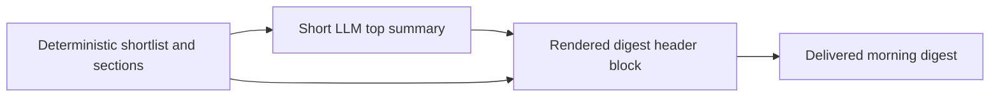

## req_008_day_captain_llm_top_summary_block - Day Captain top-of-digest LLM summary block
> From version: 0.6.0
> Status: Ready
> Understanding: 99%
> Confidence: 98%
> Complexity: Medium
> Theme: Quality
> Reminder: Update status/understanding/confidence and references when you edit this doc.

# Needs
- Add a short assistant-style summary block at the top of the delivered digest.
- Use the existing bounded LLM layer to synthesize the already-selected digest content into a concise overview.
- Keep the detailed digest sections below as the source of truth, so the summary block enhances readability without replacing the deterministic structure.
- Preserve safety, cost bounds, and deterministic fallback when the LLM path is disabled or fails.

# Context
- The current LLM usage is limited to item-level wording polish.
- That improves copy quality locally, but it does not yet create the strongest possible user-facing value for the top of the email.
- A short overview block could provide:
  - immediate understanding of what matters today
  - a more assistant-like first impression
  - better perceived value than only rewording individual lines
- In scope for this request:
  - a short top summary block generated from the already-shortlisted digest content
  - bounded prompt/input size using the final structured digest content only
  - rendered placement at the top of the email before the detailed sections
  - deterministic fallback when the LLM path is disabled, unavailable, or returns unusable output
  - validation in both `json` and `graph_send`
- Out of scope for this request:
  - replacing the detailed digest sections
  - LLM-driven selection/ranking of raw mailbox inputs
  - long narrative summaries
  - autonomous action-taking or recommendations beyond the digest context

# Acceptance criteria
- AC1: The delivered digest can include a short top summary block above the detailed sections.
- AC2: The LLM summary block uses only the already-selected digest content as input.
- AC3: The summary stays short and bounded rather than becoming a second long digest.
- AC4: The detailed sections remain present and unchanged as the authoritative digest content.
- AC5: When the LLM path is disabled or fails, the digest still renders safely without the top summary block or with a deterministic fallback.
- AC6: The feature remains compatible with both `json` mode and `graph_send`.
- AC7: The implementation stays within the project’s bounded-LLM cost constraints.
- AC8: Tests and validation cover enabled behavior, fallback behavior, and delivered rendering placement.

# Backlog traceability
- AC1 -> `item_008_day_captain_llm_top_summary_block`. Proof: the item explicitly scopes a rendered top summary block.
- AC2 -> `item_008_day_captain_llm_top_summary_block`. Proof: the item explicitly limits the summary input to final digest content.
- AC3 -> `item_008_day_captain_llm_top_summary_block`. Proof: the item explicitly scopes a short bounded overview.
- AC4 -> `item_008_day_captain_llm_top_summary_block`. Proof: the item explicitly preserves the detailed sections below the summary.
- AC5 -> `item_008_day_captain_llm_top_summary_block`. Proof: the item explicitly preserves deterministic fallback safety.
- AC6 -> `item_008_day_captain_llm_top_summary_block`. Proof: the item explicitly keeps both delivery modes in scope.
- AC7 -> `item_008_day_captain_llm_top_summary_block`. Proof: the item explicitly stays inside the bounded-LLM design.
- AC8 -> `item_008_day_captain_llm_top_summary_block`. Proof: the item explicitly requires tests for enabled, fallback, and placement behavior.

# Task traceability
- AC1 -> `task_015_day_captain_llm_top_summary_block`. Proof: task `015` adds the rendered top summary block.
- AC2 -> `task_015_day_captain_llm_top_summary_block`. Proof: task `015` builds the prompt from the final digest content only.
- AC3 -> `task_015_day_captain_llm_top_summary_block`. Proof: task `015` explicitly bounds the summary length and format.
- AC4 -> `task_015_day_captain_llm_top_summary_block`. Proof: task `015` renders the top summary above unchanged detailed sections.
- AC5 -> `task_015_day_captain_llm_top_summary_block`. Proof: task `015` explicitly preserves safe fallback behavior.
- AC6 -> `task_015_day_captain_llm_top_summary_block`. Proof: task `015` validates both supported delivery modes.
- AC7 -> `task_015_day_captain_llm_top_summary_block`. Proof: task `015` keeps the feature within the project’s bounded-LLM constraints.
- AC8 -> `task_015_day_captain_llm_top_summary_block`. Proof: task `015` explicitly requires tests and delivered rendering validation.

# Definition of Ready (DoR)
- [x] Problem statement is explicit and user impact is clear.
- [x] Scope boundaries (in/out) are explicit.
- [x] Acceptance criteria are testable.
- [x] Dependencies and known risks are listed.

# Backlog
- `item_008_day_captain_llm_top_summary_block` - Add a short LLM-generated overview block above the detailed digest sections. Status: `Ready`.
- `task_015_day_captain_llm_top_summary_block` - Implement bounded top-of-digest LLM synthesis with safe fallback and rendered placement. Status: `Ready`.
