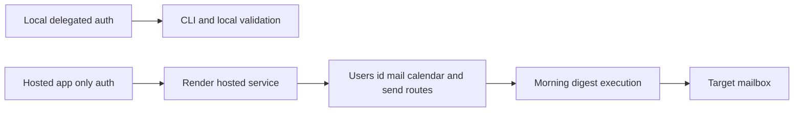

## req_009_day_captain_hosted_graph_app_only_authentication - Day Captain hosted Microsoft Graph app-only authentication
> From version: 0.7.0
> Status: Ready
> Understanding: 99%
> Confidence: 98%
> Complexity: High
> Theme: Delivery
> Reminder: Update status/understanding/confidence and references when you edit this doc.

# Needs
- Replace the current hosted delegated Graph refresh-token path with a service-friendly authentication model.
- Make the Render-hosted deployment viable without manual token refresh handling or fragile delegated token persistence.
- Keep local delegated auth available for development while introducing a separate hosted app-only path for unattended execution.
- Preserve the existing digest product behavior: mailbox ingestion, meeting ingestion, and mail delivery to the target mailbox.

# Context
- The current codebase supports delegated Microsoft Graph auth well for local usage, including real mailbox reads and delegated `sendMail`.
- The hosted Render deployment now boots successfully, but the real morning-digest job fails on the delegated refresh-token path with Microsoft returning `invalid_grant`.
- That failure is operationally expected: delegated refresh tokens are awkward for unattended hosted services and create a brittle deployment experience.
- The better hosted model is Microsoft Graph app-only authentication through client credentials, with the target mailbox identified explicitly instead of relying on `/me`.
- In scope for this request:
  - add a hosted app-only Graph authentication mode using client credentials
  - target mailbox reads and sends through `/users/{id}` rather than `/me`
  - keep local delegated auth support intact for CLI and local validation
  - document the Entra app-permission setup and hosted env requirements
  - validate the hosted flow end to end after deployment
- Out of scope for this request:
  - multi-tenant mailbox routing
  - certificate-based auth in V1 if a client secret is sufficient to ship the hosted path
  - Graph webhook subscriptions or long-lived background workers
  - removing the existing delegated local workflow

# Acceptance criteria
- AC1: The hosted service can authenticate to Microsoft Graph without relying on delegated refresh tokens.
- AC2: Hosted mail, calendar, and send operations target an explicit mailbox identity rather than `/me`.
- AC3: Local delegated auth remains available for local development and mailbox validation workflows.
- AC4: Hosted configuration and docs make the required Entra app permissions and env vars explicit.
- AC5: Automated tests cover the hosted app-only auth path and Graph route selection behavior.
- AC6: A hosted validation task exists to prove that the Render deployment can run the morning digest successfully with app-only auth.
- AC7: The migration remains compatible with the existing bounded digest architecture and current delivery modes.
- AC8: The Logics chain separates code migration from deployed hosted validation.

# Definition of Ready (DoR)
- [x] Problem statement is explicit and user impact is clear.
- [x] Scope boundaries (in/out) are explicit.
- [x] Acceptance criteria are testable.
- [x] Dependencies and known risks are listed.

# Backlog
- `item_009_day_captain_hosted_graph_app_only_authentication` - Replace the fragile hosted delegated token path with app-only Graph auth. Status: `Ready`.
- `task_016_day_captain_hosted_graph_app_only_authentication_implementation` - Implement hosted Graph app-only auth and `/users/{id}` route support. Status: `Ready`.
- `task_017_day_captain_hosted_graph_app_only_authentication_validation` - Validate the Render-hosted digest flow end to end with app-only auth. Status: `Ready`.
