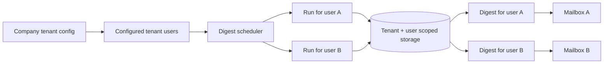

## req_010_day_captain_tenant_scoped_multi_user_digests - Day Captain tenant-scoped multi-user digests
> From version: 0.7.0
> Status: Ready
> Understanding: 99%
> Confidence: 97%
> Complexity: High
> Theme: Product
> Reminder: Update status/understanding/confidence and references when you edit this doc.

# Needs
- Evolve Day Captain beyond the current single-user deployment model so one service instance can serve one company tenant and generate separate digests for multiple users within that tenant.
- Ensure each user receives only their own mailbox-derived digest, with strict isolation of stored data, preferences, feedback, and run history under a tenant-aware model.
- Keep the first multi-user version operationally simple: operator-managed tenant configuration for a bounded set of users, not full public self-service onboarding.
- Preserve the existing digest product behavior while making orchestration, auth targeting, and persistence tenant-aware and user-aware.

# Context
- The current request stack explicitly narrowed V1 to single-user deployment first.
- That assumption was useful to ship fast, but it is now a major product constraint because the intended usage clearly extends to one company tenant containing multiple people who should each receive their own digest.
- Today the application uses a single active mailbox identity, a single token/cache path, and storage tables without tenant or user partition keys.
- As a result, the current system is not safely reusable for several users inside the same tenant without structural changes to auth targeting, data partitioning, and scheduled execution.
- In scope for this request:
  - introduce a stable tenant and user/account concept across storage, digest runs, feedback, and preferences
  - support operator-managed configuration for one tenant with multiple target mailboxes
  - require an explicit list of target users who should receive digests rather than assuming everyone in the tenant is in scope by default
  - execute digest generation per configured user within the tenant rather than as one global run
  - preserve digest rendering and delivery contracts while scoping them to the active tenant and target user
  - clean up the `.env*` model so obsolete single-user settings are removed and new tenant-scoped settings are explicit
  - document operational setup for a bounded tenant-scoped multi-user deployment
- Out of scope for this request:
  - public self-service signup or onboarding UI
  - arbitrary cross-company multi-tenant SaaS billing and tenant administration
  - shared digest views across users
  - full enterprise RBAC beyond what is required to operate the service safely

# Acceptance criteria
- AC1: The domain and storage model support stable tenant-scoping and user-scoping keys so stored messages, meetings, digests, preferences, and feedback are partitioned by tenant and target user.
- AC2: The application can execute a digest run for a specific configured user inside a tenant without leaking state or delivery output across users.
- AC3: Operator-managed configuration supports multiple target users/mailboxes within one tenant deployment without requiring code changes per added user, and only explicitly configured target users receive digests.
- AC4: Delivery and recall behavior remain consistent, but operate against the selected tenant and user scope.
- AC5: Automated tests cover tenant-scoped persistence, user-targeted execution, and cross-user isolation behavior inside one tenant.
- AC6: Documentation makes the initial tenant-scoped multi-user operating model explicit, including the fact that it is operator-managed rather than self-service, and clarifies that not every tenant user is a digest recipient by default.
- AC9: The `.env.example`, hosted env guidance, and related config docs are cleaned up so outdated single-user variables are removed or deprecated clearly, and the new tenant-scoped targeting model is explicit.
- AC7: The design remains compatible with the existing app-only hosted-auth direction and with explicit target mailboxes inside one tenant.
- AC8: The Logics chain separates implementation from multi-user validation and operational proof.

# Definition of Ready (DoR)
- [x] Problem statement is explicit and user impact is clear.
- [x] Scope boundaries (in/out) are explicit.
- [x] Acceptance criteria are testable.
- [x] Dependencies and known risks are listed.

# Backlog
- `item_010_day_captain_tenant_scoped_multi_user_digests` - Introduce tenant-scoped and user-scoped data and execution for bounded multi-user operation. Status: `Ready`.
- `task_018_day_captain_tenant_scoped_multi_user_foundations_and_execution` - Implement tenant-scoped storage, config, and per-user digest execution. Status: `Ready`.
- `task_019_day_captain_tenant_scoped_multi_user_validation_and_ops_documentation` - Validate tenant-scoped multi-user isolation and document the operator workflow. Status: `Ready`.
