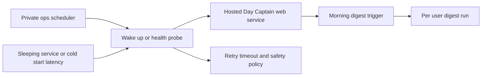

## req_011_day_captain_hosted_sleep_and_cold_start_trigger_robustness - Day Captain hosted sleep and cold-start trigger robustness
> From version: 0.8.0
> Status: Done
> Understanding: 99%
> Confidence: 99%
> Complexity: Medium
> Theme: Reliability
> Reminder: Update status/understanding/confidence and references when you edit this doc.

# Needs
- Make the hosted trigger path more robust when the Render web service is asleep, cold-starting, or otherwise slow to become responsive before the morning job runs.
- Preserve the current private `day-captain-ops` scheduling model while making the hosted validation and trigger tooling tolerate wake-up latency and transient startup failures better.
- Avoid turning a sleeping backend into a silent missed digest or a flaky operator experience.
- Keep the recommendation that serious production scheduling should prefer a non-sleeping paid service, while still handling cold starts safely when the deployment sleeps.

# Context
- The current hosted model uses a Render web service plus an external scheduler from a private ops repository.
- That model works well when the service is warm, but a sleeping or cold-starting web service can make the first HTTP call slow or temporarily unavailable.
- This risk is especially relevant if the hosted service runs on a plan that spins down after inactivity.
- The repo already has:
  - `validate-hosted-service`
  - reusable hosted trigger tooling
  - a protected `/healthz` path with runtime validation metadata
  - explicit target-user fan-out for multi-user hosted runs
- Those foundations are useful, but they still assume the hosted service is already awake and responsive within a relatively tight timeout window.
- In scope for this request:
  - wake-up-aware hosted validation and trigger behavior
  - configurable timeout and retry strategy for cold starts
  - safe sequencing such as health probe or warm-up before the real job trigger
  - operator docs that explain sleeping-service tradeoffs and the preferred production stance
  - compatibility with private `day-captain-ops` scheduling and explicit `target_user_id` fan-out
- Out of scope for this request:
  - replacing Render
  - building a queue worker architecture
  - guaranteeing free-tier infrastructure behaves like paid always-on infrastructure
  - redesigning digest scoring, delivery content, or Graph auth

# Acceptance criteria
- AC1: Hosted trigger tooling can tolerate a sleeping or cold-starting web service through an explicit wake-up-aware sequence instead of assuming an already-warm backend.
- AC2: Timeout and retry behavior for hosted validation and trigger flows are configurable and documented for cold-start scenarios.
- AC3: The robustness path reduces false-negative scheduler failures caused by cold starts while keeping job responses and logs minimal.
- AC4: Operator docs explicitly distinguish the preferred production posture (non-sleeping hosted service) from the fallback posture (sleeping service with warm-up and longer timeouts).
- AC5: Automated tests cover wake-up-aware hosted trigger behavior, including delayed availability and timeout/error handling.
- AC6: The slice remains compatible with app-only hosted auth, private `day-captain-ops` scheduling, and tenant-scoped explicit target-user execution.
- AC7: The work is scoped as an operational reliability improvement and does not redefine the digest contract or the hosted auth model.

# Definition of Ready (DoR)
- [x] Problem statement is explicit and user impact is clear.
- [x] Scope boundaries (in/out) are explicit.
- [x] Acceptance criteria are testable.
- [x] Dependencies and known risks are listed.

# Backlog
- `item_011_day_captain_hosted_sleep_and_cold_start_trigger_robustness` - Make hosted triggering more reliable when the backend is asleep or cold-starting. Status: `Done`.
- `task_021_day_captain_hosted_sleep_and_cold_start_trigger_robustness` - Implement wake-up-aware hosted trigger behavior, timeout/retry policy, and operator guidance. Status: `Done`.
