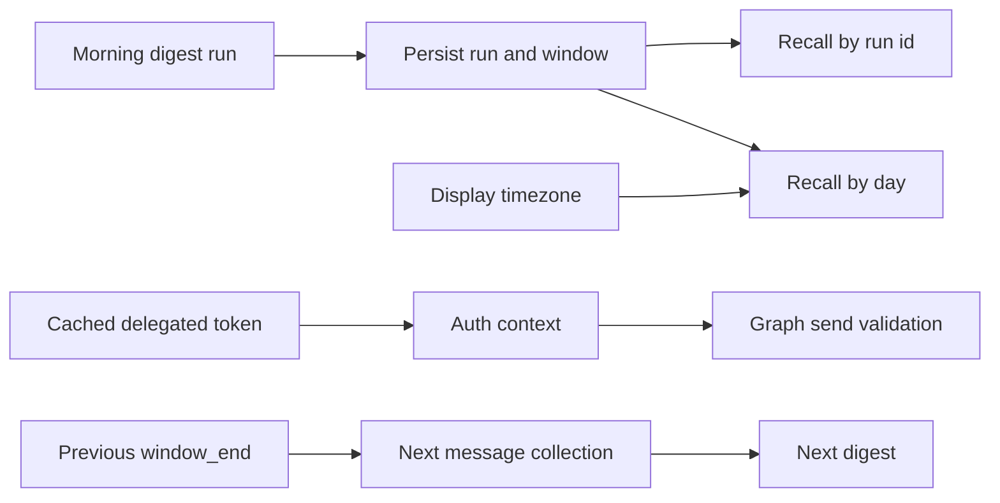

## req_012_day_captain_recall_and_auth_reliability_hardening - Day Captain recall and auth reliability hardening
> From version: 0.9.0
> Status: Done
> Understanding: 100%
> Confidence: 100%
> Complexity: Medium
> Theme: Reliability
> Reminder: Update status/understanding/confidence and references when you edit this doc.

# Needs
- Harden Day Captain after the project review uncovered correctness bugs in recall, auth scope reporting, and collection boundary handling.
- Make `recall-digest` reliable whether the caller targets a run explicitly or asks for the latest digest for a given day.
- Align recall semantics with the configured display timezone so user-facing "today" and "that day" behavior matches the digest presentation layer.
- Ensure delegated Graph auth reports the scopes actually available on the active token instead of overstating them from configuration alone.
- Prevent duplicate message ingestion at digest window boundaries across consecutive runs.

# Context
- The current repository is functionally mature and the main digest flow works locally, hosted, and with real mailbox delivery, but the review found several remaining reliability defects that are easy to miss because the happy-path tests still pass.
- The first defect affects `recall-digest --run-id ...`: in the default flow, the application scopes the lookup using resolved tenant/user values before calling storage, which can fail to find a run that was just created successfully under the authenticated user scope.
- The second defect affects `recall-digest --day ...`: recall is keyed to the UTC date of `generated_at` instead of the configured display timezone, so a digest generated around midnight UTC can be recalled under the wrong calendar day from the user's point of view.
- The third defect affects delegated Graph auth: when an unexpired cached token is reused, the provider can claim the requested scopes were granted even if the cached token was minted earlier with a narrower scope set, which can delay failures until the later Graph call.
- The fourth defect affects ingestion continuity: consecutive digest windows currently reuse the previous `window_end` as the next `window_start` while Graph message collection uses an inclusive lower bound, which can duplicate a message received exactly at the boundary timestamp.
- In scope for this request:
  - fix explicit recall-by-run correctness under tenant-scoped and user-scoped storage
  - fix recall-by-day semantics so they are consistent with configured display timezone behavior
  - make delegated auth scope reporting and validation truthful when cached tokens are reused
  - harden collection window boundaries so consecutive digest runs do not re-ingest the same message at exact boundary timestamps
  - add automated regression coverage for all reviewed defects
- Out of scope for this request:
  - redesigning digest scoring or wording quality
  - changing the product digest contract or mailbox presentation
  - replacing Microsoft Graph auth modes or storage backends
  - introducing new product features unrelated to the review findings

# Acceptance criteria
- AC1: `recall_digest(run_id=...)` returns the persisted run reliably without requiring the caller to pass a redundant explicit target user when the run already identifies its scope.
- AC2: `recall_digest(day=...)` resolves the intended digest day using the configured display timezone rather than raw UTC date comparison, for both in-memory and persisted storage backends.
- AC3: Delegated auth returns or validates the scopes actually present on the active cached/refreshed token bundle, so downstream `Mail.Send` prerequisites cannot pass on a false positive.
- AC4: Consecutive message collection windows do not duplicate a message received exactly at the previous run boundary timestamp.
- AC5: Automated tests cover:
  - recall by explicit `run_id` without redundant `target_user_id`
  - recall by day around a non-UTC midnight boundary such as `Europe/Paris`
  - delegated auth with an unexpired cached token narrower than current configured scopes
  - exact-boundary message timestamps across consecutive digest runs
- AC6: The fixes preserve tenant-scoped and user-scoped isolation behavior for multi-user hosted execution.
- AC7: The request is delivered as a reliability hardening slice, not as a new product capability.

# Definition of Ready (DoR)
- [x] Problem statement is explicit and user impact is clear.
- [x] Scope boundaries (in/out) are explicit.
- [x] Acceptance criteria are testable.
- [x] Dependencies and known risks are listed.

# Backlog
- `item_012_day_captain_recall_and_auth_reliability_hardening` - Harden recall correctness, auth scope truthfulness, and window boundaries. Status: `Done`.
- `task_022_day_captain_recall_and_delivery_evolution_orchestration` - Orchestrate recall hardening, dedicated sender delivery, and email-command recall, with README/docs closure required before `Done`. Status: `Done`.
- Closed on Sunday, March 8, 2026 after automated regression coverage and hosted validation on `https://day-captain.onrender.com`.
- Suggested split:
  - one implementation task for recall scope/day-boundary correctness
  - one implementation task for delegated scope truthfulness and ingestion boundary hardening
  - one validation task for regression coverage across SQLite, Postgres semantics, and hosted flows
