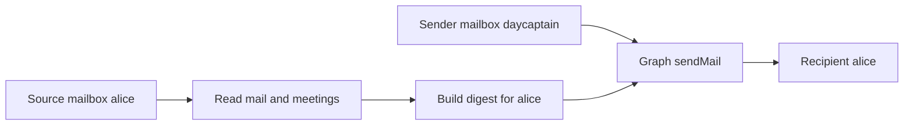

## req_013_day_captain_dedicated_sender_mailbox_for_digest_delivery - Day Captain dedicated sender mailbox for digest delivery
> From version: 0.9.0
> Status: Done
> Understanding: 100%
> Confidence: 100%
> Complexity: Medium
> Theme: Delivery
> Reminder: Update status/understanding/confidence and references when you edit this doc.

# Needs
- Allow Day Captain to send digest emails from a dedicated mailbox identity such as `daycaptain@company.com`, instead of always sending from the same mailbox that was read to build the digest.
- Keep mailbox ingestion scoped to the real target user while decoupling the sender identity used for Outlook delivery.
- Support a professional branded sender experience, including a shared mailbox or service mailbox with its own display name and profile picture.
- Preserve explicit recipient targeting so each user still receives only their own digest.

# Context
- The repository already supports:
  - Microsoft Graph app-only auth for hosted unattended execution
  - explicit target-user execution inside one tenant
  - real Graph `sendMail` delivery
- Today, however, the same Graph mailbox identity is used for:
  - reading inbox messages
  - reading meetings
  - discovering the fallback recipient
  - sending the digest through `sendMail`
- That coupling is acceptable for single-mailbox delivery, but it prevents a cleaner operating model where:
  - the digest is built from `alice@company.com`
  - the digest is sent to `alice@company.com`
  - the sender shown in Outlook is `daycaptain@company.com`
- A dedicated sender mailbox is especially attractive now that a shared mailbox named `daycaptain` has been created in Microsoft 365.
- The hosted app-only model is the natural place for this feature because it can target explicit `/users/{id}` Graph routes for both source and sender identities.
- In scope for this request:
  - introduce a distinct sender mailbox identity for delivery
  - keep source mailbox reads and sender mailbox writes independently addressable
  - require explicit recipients so delivery does not silently fall back to the sender mailbox
  - document the Entra, Exchange, and configuration prerequisites for a dedicated sender mailbox, including a shared mailbox option
  - cover the feature with automated tests and one real validation path
- Out of scope for this request:
  - delegated local auth sending as an arbitrary other user
  - complex per-user sender selection rules
  - public self-service branding controls
  - advanced Exchange features such as send-on-behalf variants unless needed to ship the main path

# Acceptance criteria
- AC1: Hosted Day Captain can read data from one mailbox identity and send the digest from a different mailbox identity within the same tenant.
- AC2: Delivery configuration supports an explicit dedicated sender mailbox such as `DAY_CAPTAIN_GRAPH_SENDER_USER_ID` or equivalent documented setting.
- AC3: The digest send path uses the configured sender mailbox route for `sendMail` while keeping message/calendar collection on the target user's mailbox route.
- AC4: The recipient is explicit and does not silently default to the sender mailbox when a dedicated sender identity is configured.
- AC5: Automated tests cover the split between source mailbox identity and sender mailbox identity, including Graph route selection and recipient construction.
- AC6: Documentation explains the recommended Microsoft 365 setup for a dedicated sender mailbox, including the shared-mailbox option and its licensing/operational constraints.
- AC7: A validation task exists to prove end-to-end delivery from the dedicated sender mailbox to a target user's inbox.
- AC8: The design remains compatible with tenant-scoped multi-user hosted execution and app-only Graph auth.

# Definition of Ready (DoR)
- [x] Problem statement is explicit and user impact is clear.
- [x] Scope boundaries (in/out) are explicit.
- [x] Acceptance criteria are testable.
- [x] Dependencies and known risks are listed.

# Backlog
- `item_013_day_captain_dedicated_sender_mailbox_for_digest_delivery` - Decouple digest sender mailbox from the source mailbox. Status: `Done`.
- `task_022_day_captain_recall_and_delivery_evolution_orchestration` - Orchestrate recall hardening, dedicated sender delivery, and email-command recall, with README/docs closure required before `Done`. Status: `Done`.
- Closed on Sunday, March 8, 2026 after hosted validation on `https://day-captain.onrender.com` confirmed `configured_sender_user=daycaptain@circle-mobility.com`.
- Suggested split:
  - one implementation task for sender/source mailbox identity separation in config, auth context, and delivery routing
  - one validation task for real mailbox delivery from the dedicated sender identity
