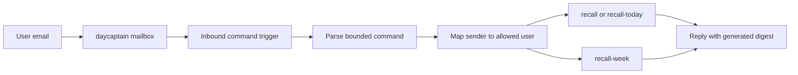

## req_014_day_captain_email_command_triggered_recall - Day Captain email-command-triggered recall
> From version: 0.9.0
> Status: Done
> Understanding: 100%
> Confidence: 100%
> Complexity: Medium
> Theme: Product
> Reminder: Update status/understanding/confidence and references when you edit this doc.

# Needs
- Let a user trigger Day Captain recall by sending a simple email command to the dedicated `daycaptain` mailbox.
- Support a minimal explicit command set instead of free-form natural language.
- Provide at least these commands:
  - `recall` or `recall-today` to generate the digest for the current day
  - `recall-week` to generate the digest from the start of the current week
- Keep the experience email-native so the user can ask for a recall directly from Outlook without using CLI, HTTP tooling, or ops-only endpoints.

# Context
- The repository already supports:
  - scheduled morning digest generation
  - same-day recall by CLI and hosted HTTP trigger
  - tenant-scoped explicit target-user execution
  - a dedicated sender/shared mailbox direction through `daycaptain@...`
- The next useful step is to let that mailbox also act as a command inbox.
- The intended flow is:
  - a user sends an email to `daycaptain@company.com`
  - Day Captain detects the incoming message
  - Day Captain parses a bounded command from the subject or body
  - Day Captain maps the sender to an allowed target user
  - Day Captain generates the requested recall digest and replies by email
- The command vocabulary should stay intentionally narrow for V1:
  - `recall`
  - `recall-today`
  - `recall-week`
- `recall` and `recall-today` are synonyms.
- `recall-week` should generate a digest covering the period from the start of the current week through the current time, using the configured display timezone.
- Unless later changed explicitly, "start of week" should mean Monday 00:00 in the configured display timezone.
- There are several viable technical trigger mechanisms:
  - Microsoft Graph webhook change notifications on the `daycaptain` mailbox
  - polling or delta-query against the `daycaptain` mailbox
  - an external automation layer that forwards the inbound event to Day Captain
- This request should stay product-oriented and avoid prematurely locking the implementation to one trigger transport unless needed to ship the first version.
- In scope for this request:
  - email-triggered recall commands through the dedicated mailbox
  - bounded command parsing and validation
  - sender allowlisting or sender-to-user mapping
  - reply delivery with the generated recall digest
  - explicit handling of `recall`, `recall-today`, and `recall-week`
  - safe idempotent handling so one inbound command does not trigger duplicate replies
  - operator documentation for the inbound command model and supported phrases
- Out of scope for this request:
  - arbitrary natural-language assistant conversations over email
  - attachment commands
  - cross-tenant public self-service onboarding
  - a fully generic mailbox automation platform

# Acceptance criteria
- AC1: A supported inbound email command to the dedicated Day Captain mailbox can trigger a recall response without CLI or manual ops intervention.
- AC2: The system supports `recall` and `recall-today` as equivalent commands for generating the current-day digest.
- AC3: The system supports `recall-week` as a command for generating a digest from the start of the current week through the current time.
- AC4: Week boundaries use the configured display timezone, with Monday as the default week start unless explicitly configured otherwise later.
- AC5: The sender of the inbound command is validated against an explicit allowlist or a deterministic sender-to-target-user mapping so one user cannot trigger another user's recall accidentally.
- AC6: The system replies by email with the requested digest through the Day Captain delivery path.
- AC7: Duplicate handling is safe: the same inbound message is not processed repeatedly into multiple recall replies.
- AC8: Automated tests cover command parsing, sender mapping or allowlisting, week-window resolution, and duplicate suppression.
- AC9: Documentation explains the supported command vocabulary, the intended mailbox setup, and the chosen trigger mechanism for the first shipped version.
- AC10: The design remains compatible with tenant-scoped multi-user hosted execution and a dedicated sender mailbox.

# Definition of Ready (DoR)
- [x] Problem statement is explicit and user impact is clear.
- [x] Scope boundaries (in/out) are explicit.
- [x] Acceptance criteria are testable.
- [x] Dependencies and known risks are listed.

# Backlog
- `item_014_day_captain_email_command_triggered_recall` - Add recall triggered by inbound email commands. Status: `Done`.
- `task_022_day_captain_recall_and_delivery_evolution_orchestration` - Orchestrate recall hardening, dedicated sender delivery, and email-command recall, with README/docs closure required before `Done`. Status: `Done`.
- Closed on Sunday, March 8, 2026 after hosted `email-command-recall` validation succeeded for `recall-week` on `https://day-captain.onrender.com`.
- Suggested split:
  - one implementation task for inbound command trigger ingestion and bounded parsing
  - one implementation task for recall window generation, sender mapping, and duplicate suppression
  - one validation task for end-to-end inbound-mail recall behavior
