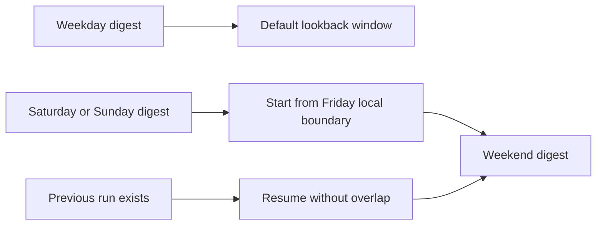

## req_015_day_captain_weekend_digest_window_from_friday - Day Captain weekend digest window from Friday
> From version: 0.10.0
> Status: Done
> Understanding: 99%
> Confidence: 99%
> Complexity: Medium
> Theme: Product
> Reminder: Update status/understanding/confidence and references when you edit this doc.

# Needs
- Make the weekend morning digest feel like a real Friday-to-weekend recap instead of a simple rolling 24-hour window.
- On Saturday and Sunday, avoid missing important messages that arrived on Friday but are still relevant for the first weekend digest.
- Keep the existing weekend meeting fallback to Monday, while aligning the message collection window with a more useful weekend reading experience.

# Context
- Today, the default message collection window uses one of two paths:
  - if a previous digest run exists for the scoped user, Day Captain resumes from `previous_run.window_end + 1 microsecond`
  - otherwise it falls back to `current_time - DAY_CAPTAIN_DEFAULT_LOOKBACK_HOURS`
- With the default `24h` lookback, a Sunday digest only sees roughly the last 24 hours of mail unless a previous run already widened the effective continuity window.
- That behavior is acceptable on weekdays, but it under-serves weekend usage because the first digest a user opens on Saturday or Sunday should usually include the mail backlog since Friday.
- The repository already has special weekend behavior for meetings:
  - on Saturday and Sunday, meeting preview shifts to Monday
- This request extends that weekend-specific product logic to the default mail window selection used by `morning-digest`.
- In scope for this request:
  - weekend-specific default mail window behavior for `morning-digest`
  - explicit definition of how Saturday and Sunday resolve the fallback start time
  - timezone-consistent weekend boundary handling using `DAY_CAPTAIN_DISPLAY_TIMEZONE`
  - regression coverage for Friday/Saturday/Sunday window selection
  - preserving non-overlap guarantees across repeated runs
- Out of scope for this request:
  - changing `recall-week`, which already uses a week-based window
  - changing weekday digest behavior
  - redesigning scoring, wording, or delivery
  - changing the existing weekend Monday meeting fallback

# Acceptance criteria
- AC1: On Saturday, when `morning-digest` falls back to the default lookback path rather than a previous run boundary, the message window starts at Friday `00:00` in `DAY_CAPTAIN_DISPLAY_TIMEZONE`.
- AC2: On Sunday, when `morning-digest` falls back to the default lookback path rather than a previous run boundary, the message window starts at Friday `00:00` in `DAY_CAPTAIN_DISPLAY_TIMEZONE`.
- AC3: Weekday behavior remains unchanged: when no previous run exists, the message window still falls back to `current_time - DAY_CAPTAIN_DEFAULT_LOOKBACK_HOURS`.
- AC4: Existing non-overlap safety remains intact across repeated runs: if a previous run exists, Day Captain does not reopen the full Friday-to-weekend window and still resumes from `previous_run.window_end + 1 microsecond`.
- AC5: Weekend meeting behavior remains unchanged: Saturday and Sunday still preview Monday meetings.
- AC6: Automated tests cover:
  - Saturday first-run window selection
  - Sunday first-run window selection
  - a weekday control case
  - a repeated weekend run proving no overlap regression
- AC7: User-facing docs explain the weekend digest mail horizon so operators and users understand that weekend digests intentionally pull from Friday onward.

# Definition of Ready (DoR)
- [x] Problem statement is explicit and user impact is clear.
- [x] Scope boundaries (in/out) are explicit.
- [x] Acceptance criteria are testable.
- [x] Dependencies and known risks are listed.

# Backlog
- `item_015_day_captain_weekend_digest_window_from_friday` - Extend the first weekend digest mail window back to Friday. Status: `Done`.
- `task_023_day_captain_weekend_window_and_reliability_orchestration` - Orchestrate weekend digest horizon and reliability hardening, with README/docs closure required before `Done`. Status: `Done`.
- Suggested split:
  - one implementation task for weekend window selection in `morning-digest`
  - one validation/doc task for tests and operator-facing explanation
