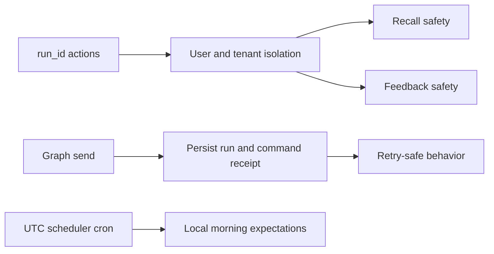

## req_016_day_captain_isolation_and_delivery_reliability_hardening - Day Captain isolation and delivery reliability hardening
> From version: 0.10.0
> Status: Ready
> Understanding: 99%
> Confidence: 99%
> Complexity: High
> Theme: Reliability
> Reminder: Update status/understanding/confidence and references when you edit this doc.

# Needs
- Close the remaining isolation and idempotency gaps uncovered by the latest project review before they become production incidents in the hosted multi-user model.
- Ensure `run_id`-based actions cannot cross user boundaries when `target_user_id` is omitted.
- Make digest persistence and inbound email-command deduplication resilient to partial failures after mail delivery has already been accepted by Microsoft Graph.
- Remove the current operational ambiguity where the ops scheduler is configured in fixed UTC even though product expectations are framed as local-morning behavior.

# Context
- The repository has progressed significantly on hosted delivery, tenant-scoped multi-user support, dedicated sender mailbox routing, and email-command recall.
- A fresh review still surfaced four important reliability risks:
  - `recall_digest(run_id=...)` can still return another user’s digest in a multi-user setup when `target_user_id` is omitted and the caller knows a valid `run_id`
  - `record_feedback(run_id=...)` can also infer another user scope from that run and mutate that user’s learning state without an explicit target user
  - `_build_digest_for_window()` sends the digest before persisting the completed run, and `process_email_command_recall()` stores the command dedupe receipt only after the send path returns, so a partial failure can resend the same digest on retry
  - the production scheduler in `day-captain-ops` is defined with a fixed UTC cron, which will drift by one hour relative to Europe/Paris wall-clock expectations after DST changes
- These issues are subtle because:
  - the happy-path test suite is green
  - the hosted web surface already guards some cases, which can hide application-level isolation gaps in CLI or in-process usage
  - partial-failure ordering bugs only show up when Graph delivery and persistence do not fail together
- In scope for this request:
  - harden `run_id`-based recall scoping in multi-user setups
  - harden `run_id`-based feedback scoping in multi-user setups
  - make digest send/persist ordering explicitly safe or idempotent under partial failure
  - make inbound email-command dedupe safe when delivery succeeded but persistence partially failed
  - define and document the intended scheduler time semantics for production, including DST behavior
  - add regression coverage for the reviewed defects
- Out of scope for this request:
  - redesigning digest scoring, wording, or rendering
  - changing the supported email-command vocabulary
  - building a new inbound trigger transport such as a Graph webhook
  - changing the product contract for `recall-week`

# Acceptance criteria
- AC1: In a multi-user setup, `recall_digest(run_id=...)` does not return another user’s digest when `target_user_id` is omitted; the application either resolves the correct scope safely or rejects the request explicitly.
- AC2: In a multi-user setup, `record_feedback(run_id=...)` does not infer and mutate another user’s preferences when `target_user_id` is omitted; the application either resolves scope safely or rejects the request explicitly.
- AC3: If Graph delivery succeeds but run persistence fails immediately afterward, retrying the same operation does not silently send duplicate digests without a durable way to reconcile the prior send.
- AC4: If `email-command-recall` delivery succeeds but persistence of the command receipt fails immediately afterward, replaying the same inbound message does not produce duplicate replies.
- AC5: Production scheduling semantics are explicit and documented:
  - either the cron remains fixed in UTC and docs state the resulting DST shift clearly
  - or the scheduler is adjusted so the intended Europe/Paris morning wall-clock time remains stable across DST transitions
- AC6: Automated tests cover:
  - cross-user `run_id` recall attempts
  - cross-user `run_id` feedback attempts
  - delivery/persistence partial-failure behavior
  - email-command replay behavior after partial persistence failure
  - the chosen scheduler time semantics or the documented invariant around them
- AC7: Hosted and operator docs are updated so the final behavior is operationally explicit, not just encoded in tests.

# Definition of Ready (DoR)
- [x] Problem statement is explicit and user impact is clear.
- [x] Scope boundaries (in/out) are explicit.
- [x] Acceptance criteria are testable.
- [x] Dependencies and known risks are listed.

# Backlog
- `item_016_day_captain_isolation_and_delivery_reliability_hardening` - Harden run isolation, retry safety, and scheduler time semantics. Status: `Ready`.
- `task_023_day_captain_weekend_window_and_reliability_orchestration` - Orchestrate weekend digest horizon and reliability hardening, with README/docs closure required before `Done`. Status: `Ready`.
- Suggested split:
  - one implementation task for `run_id` isolation hardening across recall and feedback
  - one implementation task for send/persist ordering and retry-safe email-command dedupe
  - one validation/doc task for regression tests plus scheduler semantics
