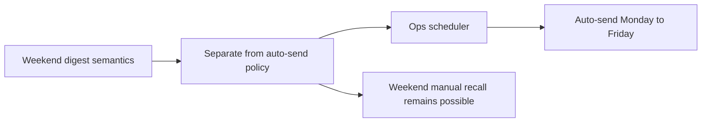

## req_017_day_captain_ops_scheduler_weekday_only_delivery - Day Captain ops scheduler weekday-only delivery
> From version: 0.10.0
> Status: Done
> Understanding: 100%
> Confidence: 100%
> Complexity: Low
> Theme: Operations
> Reminder: Update status/understanding/confidence and references when you edit this doc.

# Needs
- Make the production ops scheduler contract explicit: automatic digest delivery must not run on Saturday or Sunday.
- Prevent the weekend digest-window enhancement from being misread as a requirement to auto-send weekend emails.
- Keep weekend digest access available through manual or recall flows while preserving weekday-only scheduled delivery in ops.

# Context
- The `day-captain-ops` repository already contains the production GitHub Actions scheduler used to trigger hosted `morning-digest` execution.
- A new weekend-product request now broadens the first weekend digest mail horizon back to Friday, but that does not imply the scheduler should auto-send digests during the weekend.
- The desired operating model is:
  - scheduled production sends remain weekday-only
  - weekend digests are still available through manual dispatch, recall, or explicit operator action when needed
- In scope for this request:
  - freeze the ops scheduling contract so Saturday and Sunday do not auto-trigger morning delivery
  - verify the `day-captain-ops` workflow expresses weekday-only behavior clearly
  - document the difference between weekend digest content semantics and weekday-only scheduled sending
  - keep this contract explicit even if a separate Sunday-evening `weekly digest` is later added
  - add validation or operator-facing proof steps so the contract can be checked easily later
- Out of scope for this request:
  - changing weekend digest mail-window behavior
  - changing recall command behavior
  - redesigning the hosted delivery pipeline
  - changing local CLI semantics

# Acceptance criteria
- AC1: The production ops scheduler does not auto-trigger `morning-digest` on Saturday or Sunday.
- AC2: Weekend digest access remains available through manual dispatch or recall flows; weekday-only scheduling does not remove weekend manual access.
- AC3: The `day-captain-ops` workflow and operator docs make the weekday-only policy explicit so future edits do not accidentally re-enable weekend sends.
- AC4: Validation guidance exists so an operator can confirm the scheduler is configured for weekdays only.

# Definition of Ready (DoR)
- [x] Problem statement is explicit and user impact is clear.
- [x] Scope boundaries (in/out) are explicit.
- [x] Acceptance criteria are testable.
- [x] Dependencies and known risks are listed.

# Backlog
- `item_017_day_captain_ops_scheduler_weekday_only_delivery` - Freeze ops auto-send to weekdays only. Status: `Done`.
- `task_023_day_captain_weekend_window_and_reliability_orchestration` - Orchestrate weekend digest horizon, weekday-only ops scheduling, and reliability hardening, with README/docs closure required before `Done`. Status: `Done`.
- Suggested split:
  - one implementation or validation task for explicit weekday-only ops scheduling semantics
  - one documentation task for operator-facing explanation and verification steps
