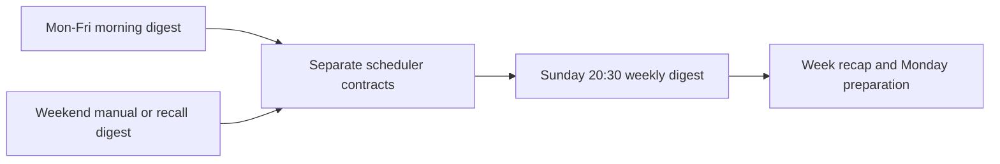

## req_018_day_captain_sunday_evening_weekly_digest - Day Captain Sunday evening weekly digest
> From version: 0.10.0
> Status: Ready
> Understanding: 99%
> Confidence: 99%
> Complexity: Medium
> Theme: Product
> Reminder: Update status/understanding/confidence and references when you edit this doc.

# Needs
- Add a distinct weekly digest generated every Sunday at `20:30` so the user gets a consolidated week recap and can prepare for Monday.
- Keep the ops rule that weekend `morning-digest` auto-send does not run on Saturday or Sunday.
- Separate the product contract of a Sunday evening weekly recap from both weekday morning delivery and weekend manual recall.

# Context
- The current ops policy is being frozen as weekday-only for automatic `morning-digest` delivery.
- Weekend first-run digest semantics are also being refined so manual or explicit weekend access can still look back to Friday when useful.
- A Sunday evening weekly digest is a different product need:
  - it is intentionally scheduled on the weekend
  - it is not a weekday `morning-digest`
  - it should summarize the week at a stable Sunday-evening time rather than rely on ad hoc recall
- In scope for this request:
  - define a scheduled `weekly digest` run every Sunday at `20:30`
  - clarify the separation between weekday `morning-digest` auto-send and Sunday-evening `weekly digest`
  - define the expected time semantics in the product timezone or ops scheduler docs
  - add operator documentation for the weekly scheduler path
  - require validation guidance for the new scheduled weekly flow
- Out of scope for this request:
  - redesigning weekday morning digest behavior
  - changing the bounded recall command vocabulary
  - changing the weekend first-run Friday lookback rules
  - building a new mail transport beyond the current hosted delivery pattern

# Acceptance criteria
- AC1: The product has an explicit `weekly digest` slice scheduled every Sunday at `20:30`.
- AC2: The Sunday `weekly digest` is documented as distinct from weekday `morning-digest` auto-send behavior.
- AC3: The ops scheduler/docs make it clear that weekend `morning-digest` auto-send stays disabled while Sunday-evening `weekly digest` is allowed.
- AC4: Validation guidance exists so an operator can confirm both scheduler contracts:
  - no automatic `morning-digest` on Saturday or Sunday
  - automatic `weekly digest` on Sunday at `20:30`

# Definition of Ready (DoR)
- [x] Problem statement is explicit and user impact is clear.
- [x] Scope boundaries (in/out) are explicit.
- [x] Acceptance criteria are testable.
- [x] Dependencies and known risks are listed.

# Backlog
- `item_018_day_captain_sunday_evening_weekly_digest` - Add a Sunday-evening weekly digest schedule. Status: `Ready`.
- `task_023_day_captain_weekend_window_and_reliability_orchestration` - Orchestrate weekend digest horizon, weekday-only ops scheduling, Sunday weekly digest scheduling, and reliability hardening, with README/docs closure required before `Done`. Status: `Ready`.
- Suggested split:
  - one implementation or ops task for the Sunday weekly scheduler path
  - one documentation or validation task for the distinct weekly-digest contract
