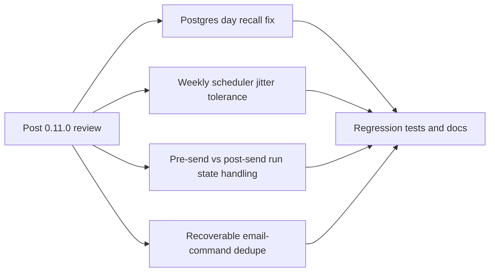

## req_019_day_captain_post_review_reliability_and_scheduler_recovery - Day Captain post-review reliability and scheduler recovery
> From version: 0.11.0
> Status: Ready
> Understanding: 99%
> Confidence: 99%
> Complexity: High
> Theme: Reliability
> Reminder: Update status/understanding/confidence and references when you edit this doc.

# Needs
- Close the newly reviewed defects that still leave hosted recall, weekly scheduling, and recovery behavior fragile after the `0.11.0` slice.
- Fix the hosted Postgres day-based recall path before it becomes a production regression.
- Make the Sunday `weekly-digest` scheduler tolerant to GitHub Actions scheduling jitter instead of relying on an exact minute match.
- Distinguish "delivery may already have happened" from "delivery never started" so `delivery_pending` does not block the product indefinitely after pre-send failures.
- Keep inbound `email-command-recall` replay-safe without turning pre-send failures into unrecoverable dead ends.

# Context
- A fresh review after the `task_023` implementation found four remaining operational risks:
  - the Postgres implementation of `get_latest_completed_run_for_day()` uses a broken local variable path, so day-based recall can crash on hosted Postgres even while tests stay green
  - the Sunday `weekly-digest` scheduler gate only accepts an exact local `20:30`, so a GitHub cron delay by one minute can skip the entire weekly digest run
  - the current `delivery_pending` state is written before Graph validation/send, so pre-send failures can leave later digest runs blocked even when no mail was actually accepted
  - `email-command-recall` currently persists its inbound dedupe receipt before Graph validation/send, so a pre-send failure can leave the same inbound command permanently stuck in "delivery reconciliation"
- These are all recovery and operator-trust issues rather than product redesign:
  - they do not require a new roadmap direction
  - they do require code, tests, and operator documentation updates so failure semantics are explicit and safe
- In scope for this request:
  - fix hosted Postgres day-based recall loading
  - harden Sunday weekly scheduler gating semantics against GitHub schedule jitter
  - refine run-state handling so pre-send failures are recoverable and only true post-send uncertainty enters reconciliation
  - refine email-command dedupe persistence so replay remains safe without blocking a command that never actually sent
  - add regression coverage for all four cases
  - update user-facing and operator-facing docs if runtime or scheduler recovery semantics change
- Out of scope for this request:
  - redesigning digest scoring, wording, or rendering
  - changing the weekly digest product time itself away from Sunday `20:30`
  - replacing GitHub Actions with another scheduler
  - replacing Power Automate or adding Graph webhooks

# Acceptance criteria
- AC1: In the hosted Postgres backend, `recall-digest` by day loads correctly and no longer crashes because of a broken local variable path in `get_latest_completed_run_for_day()`.
- AC2: The Sunday `weekly-digest` scheduler is tolerant to normal GitHub Actions schedule jitter and does not require an exact minute match to run the intended Sunday-evening digest once.
- AC3: If Graph validation or delivery fails before a digest is actually accepted, the affected run is not left in a blocking `delivery_pending` state that prevents later valid runs forever.
- AC4: If `email-command-recall` fails before delivery acceptance, replaying the same inbound command can recover safely instead of remaining permanently blocked behind a stale pending marker.
- AC5: If delivery may already have been accepted but post-send persistence remains uncertain, the system still preserves an explicit reconciliation path rather than silently duplicating sends.
- AC6: Automated tests cover:
  - Postgres day-based recall
  - weekly scheduler gating under delayed schedule execution
  - pre-send failure behavior for digest delivery state
  - pre-send failure behavior for email-command replay
- AC7: README and operator docs explain any changed recovery semantics or scheduler gate behavior before the slice is closed.

# Backlog traceability
- AC1 -> `item_019_day_captain_postgres_day_recall_fix`. Proof: this item explicitly fixes and validates the hosted Postgres day-based recall path.
- AC2 -> `item_020_day_captain_weekly_scheduler_jitter_tolerance`. Proof: this item explicitly hardens the Sunday scheduler gate against GitHub cron jitter while preserving the Sunday-evening contract.
- AC3 -> `item_021_day_captain_pre_send_delivery_state_recovery`. Proof: this item explicitly separates pre-send failures from blocking pending-state reconciliation.
- AC4 -> `item_022_day_captain_email_command_pre_send_recovery`. Proof: this item explicitly applies the same pre-send recovery rule to inbound email-command replay.
- AC5 -> `item_021_day_captain_pre_send_delivery_state_recovery`. Proof: this item explicitly preserves reconciliation when delivery may already have happened for digest runs.
- AC6 -> `item_019_day_captain_postgres_day_recall_fix`. Proof: this item explicitly requires regression coverage for Postgres day-based recall.
- AC7 -> `item_020_day_captain_weekly_scheduler_jitter_tolerance`. Proof: this item explicitly requires operator-facing explanation of the new scheduler gate semantics.

# Task traceability
- AC1 -> `task_024_day_captain_post_review_reliability_orchestration`. Proof: task `024` fixes the hosted Postgres day-recall defect first.
- AC2 -> `task_024_day_captain_post_review_reliability_orchestration`. Proof: task `024` explicitly hardens the Sunday weekly scheduler gate against jitter.
- AC3 -> `task_024_day_captain_post_review_reliability_orchestration`. Proof: task `024` explicitly separates pre-send recovery from blocking pending states.
- AC4 -> `task_024_day_captain_post_review_reliability_orchestration`. Proof: task `024` explicitly applies the same distinction to email-command replay.
- AC5 -> `task_024_day_captain_post_review_reliability_orchestration`. Proof: task `024` explicitly preserves reconciliation for uncertain post-send outcomes.
- AC6 -> `task_024_day_captain_post_review_reliability_orchestration`. Proof: task `024` explicitly requires regression tests for all four reviewed defects.
- AC7 -> `task_024_day_captain_post_review_reliability_orchestration`. Proof: task `024` blocks closure until README and operator docs are updated.

# Definition of Ready (DoR)
- [x] Problem statement is explicit and user impact is clear.
- [x] Scope boundaries (in/out) are explicit.
- [x] Acceptance criteria are testable.
- [x] Dependencies and known risks are listed.

# Backlog
- `item_019_day_captain_postgres_day_recall_fix` - Fix hosted Postgres day-based recall loading. Status: `Ready`.
- `item_020_day_captain_weekly_scheduler_jitter_tolerance` - Make Sunday weekly scheduling tolerant to GitHub cron jitter. Status: `Ready`.
- `item_021_day_captain_pre_send_delivery_state_recovery` - Refine digest run states so pre-send failures remain recoverable. Status: `Ready`.
- `item_022_day_captain_email_command_pre_send_recovery` - Refine email-command dedupe so pre-send failures do not become unrecoverable. Status: `Ready`.
- `task_024_day_captain_post_review_reliability_orchestration` - Orchestrate the full post-review hardening slice with README/docs closure required before `Done`. Status: `Ready`.
