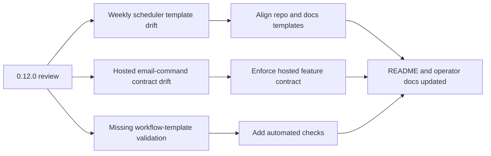

## req_020_day_captain_scheduler_template_and_hosted_email_command_contract_hardening - Day Captain scheduler template and hosted email-command contract hardening
> From version: 0.12.0
> Status: Done
> Understanding: 99%
> Confidence: 99%
> Complexity: High
> Theme: Reliability
> Reminder: Update status/understanding/confidence and references when you edit this doc.

# Needs
- Close the remaining gaps between the hardened production workflows and the copy-ready scheduler templates shipped in the repository.
- Prevent operators from reintroducing the old Sunday weekly exact-minute gate when bootstrapping a new private ops repository from `docs/` or `.github/workflows/`.
- Make the hosted `email-command-recall` feature contract explicit and safe so deployments do not boot "healthy" while that documented hosted surface is guaranteed to fail at runtime.
- Extend validation so workflow template drift and hosted feature-contract drift are caught before release.

# Context
- A new review after the `0.12.0` hardening slice found three remaining reliability gaps:
  - the real `day-captain-ops` weekly workflow now uses the helper-backed jitter-tolerant Sunday gate, but the copy-ready weekly scheduler templates in the application repo and in `docs/` still embed the old exact-minute gate
  - hosted config validation only enforces `graph_send` prerequisites when the global service delivery mode is `graph_send`, even though the documented hosted `email-command-recall` endpoint always executes through `graph_send`
  - CI currently validates Python behavior and Logics docs, but it does not protect the alignment between the real ops workflow and the shipped scheduler templates
- These are contract-alignment issues:
  - no product redesign is needed
  - the fix spans workflow templates, hosted validation semantics, tests, and docs
- In scope for this request:
  - align the weekly scheduler templates in the application repo and `docs/` with the jitter-tolerant Sunday gate already used in `day-captain-ops`
  - define and enforce the hosted feature contract for `email-command-recall`
  - add automated checks that keep scheduler templates aligned with the actual supported behavior
  - update README/operator docs if the hosted validation or template contract changes
- Out of scope for this request:
  - changing the Sunday weekly digest local time away from `20:30 Europe/Paris`
  - changing the product command vocabulary for inbound email-command recall
  - replacing GitHub Actions as the scheduler platform
  - redesigning the Power Automate bridge itself

# Acceptance criteria
- AC1: The weekly scheduler templates shipped in `.github/workflows/weekly-digest-scheduler.yml` and `docs/day_captain_ops_weekly_digest_scheduler.yml` use the same jitter-tolerant Sunday gate semantics as the supported `day-captain-ops` workflow.
- AC2: A hosted deployment cannot advertise a healthy `email-command-recall` surface while missing the required `graph_send` prerequisites for that feature.
- AC3: Automated validation protects against future drift between the weekly scheduler templates and the supported production workflow behavior.
- AC4: README and operator docs explain the final scheduler-template contract and the hosted `email-command-recall` prerequisites before the slice is closed.

# Backlog traceability
- AC1 -> `item_023_day_captain_weekly_scheduler_template_alignment`. Proof: this item explicitly aligns the repository and docs weekly templates with the supported ops workflow gate semantics.
- AC2 -> `item_024_day_captain_hosted_email_command_contract_enforcement`. Proof: this item explicitly enforces hosted prerequisites for `email-command-recall`.
- AC3 -> `item_025_day_captain_scheduler_template_drift_protection`. Proof: this item explicitly adds automated protection against weekly template drift.
- AC4 -> `item_024_day_captain_hosted_email_command_contract_enforcement` and `item_025_day_captain_scheduler_template_drift_protection`. Proof: the hosted-contract item explicitly requires README/operator updates for `email-command-recall`, and the drift-protection item explicitly requires the validation expectation to be documented.

# Task traceability
- AC1 -> `task_025_day_captain_scheduler_template_and_hosted_contract_orchestration`. Proof: task `025` explicitly aligns the shipped weekly scheduler templates.
- AC2 -> `task_025_day_captain_scheduler_template_and_hosted_contract_orchestration`. Proof: task `025` explicitly enforces the hosted `email-command-recall` contract.
- AC3 -> `task_025_day_captain_scheduler_template_and_hosted_contract_orchestration`. Proof: task `025` explicitly adds automated drift protection.
- AC4 -> `task_025_day_captain_scheduler_template_and_hosted_contract_orchestration`. Proof: task `025` explicitly requires README and operator docs before closure.

# Backlog
- `item_023_day_captain_weekly_scheduler_template_alignment` - Align weekly scheduler templates with the supported jitter-tolerant Sunday gate. Status: `Ready`.
- `item_023_day_captain_weekly_scheduler_template_alignment` - Align weekly scheduler templates with the supported jitter-tolerant Sunday gate. Status: `Done`.
- `item_024_day_captain_hosted_email_command_contract_enforcement` - Enforce hosted email-command recall prerequisites. Status: `Done`.
- `item_025_day_captain_scheduler_template_drift_protection` - Add automated protection against scheduler template drift. Status: `Done`.
- `task_025_day_captain_scheduler_template_and_hosted_contract_orchestration` - Orchestrate the full contract-alignment slice with docs closure required before `Done`. Status: `Done`.

# Definition of Ready (DoR)
- [x] Problem statement is explicit and user impact is clear.
- [x] Scope boundaries (in/out) are explicit.
- [x] Acceptance criteria are testable.
- [x] Dependencies and known risks are listed.

# Notes
- Derived from the latest project review after `0.12.0`.
