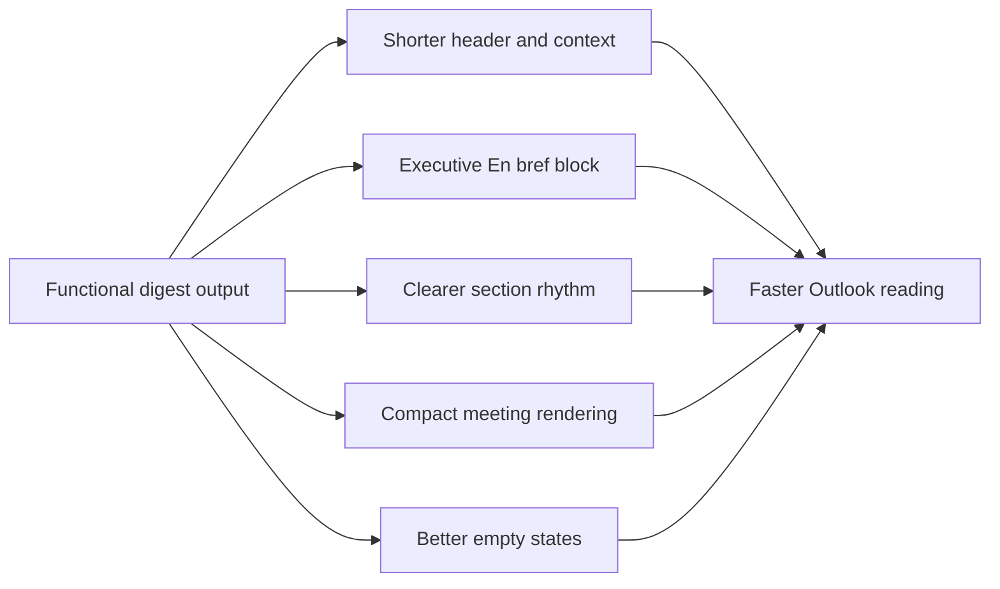

## req_021_day_captain_digest_email_readability_and_scannability_polish - Day Captain digest email readability and scannability polish
> From version: 1.0.0
> Status: In Progress
> Understanding: 99%
> Confidence: 98%
> Complexity: Medium
> Theme: UX
> Reminder: Update status/understanding/confidence and references when you edit this doc.

# Needs
- Make the Day Captain email digest materially easier to scan in Outlook without changing the core product behavior or transport.
- Reduce the cognitive load of the digest header and top summary so the mail feels like an assistant brief instead of an exported report.
- Improve section rhythm, empty states, and meeting rendering so the user can identify priorities, upcoming meetings, and watch items in a few seconds.

# Context
- The product flow is now functionally solid:
  - hosted delivery works
  - dedicated sender mailbox works
  - inbound `recall` via Power Automate now works
- The remaining gap is largely presentation quality inside the email itself.
- Recent operator feedback on the real Outlook rendering highlighted the same reading-friction points:
  - the top header is too verbose and repeats timing context
  - `En bref` is still too dense for an executive summary block
  - the visual rhythm between sections is uneven, so the digest still reads more like a long report than a short brief
  - meetings consume too much vertical space relative to their decision value
  - empty-state messages are correct but visually flat
- In scope for this request:
  - simplify the top header/context lines
  - redefine `En bref` as a true short executive summary
  - improve section hierarchy, spacing, and scannability
  - compact meeting rendering while preserving useful metadata
  - improve empty-state copy and presentation
  - adjust renderer/prompt/output structure as needed to support these reading improvements
  - update README and relevant docs if the digest structure contract changes
- Out of scope for this request:
  - changing the transport channel or Power Automate bridge
  - redesigning the scoring model or source selection logic
  - changing the command vocabulary (`recall`, `recall-week`, etc.)
  - building a fully new HTML visual design system outside the current email-compatible rendering model

# Acceptance criteria
- AC1: The digest header/context is shorter and avoids redundant timing/report phrasing while preserving the essential date and window information.
- AC2: `En bref` is rendered as a genuinely short executive summary that can be understood in a few seconds and does not simply restate downstream sections verbosely.
- AC3: The main digest sections (`Points critiques`, `Actions à mener`, `À surveiller`, `Réunions à venir`, and any equivalent blocks) have a more consistent visual rhythm and are easier to scan in Outlook.
- AC4: Meeting entries are more compact and emphasize time, title, and the most useful context without wasting vertical space.
- AC5: Empty states remain explicit but are visually lighter and less report-like.
- AC6: README and any operator or product docs impacted by the digest-structure contract are updated before the slice is closed.

# Backlog traceability
- AC1 -> `item_026_day_captain_digest_header_and_executive_summary_polish`. Proof: this item explicitly shortens the header/context and polishes the top executive-summary block.
- AC2 -> `item_026_day_captain_digest_header_and_executive_summary_polish`. Proof: this item explicitly redefines `En bref` as a short executive summary.
- AC3 -> `item_027_day_captain_digest_section_and_meeting_scannability_polish`. Proof: this item explicitly improves section rhythm and scan quality in Outlook.
- AC4 -> `item_027_day_captain_digest_section_and_meeting_scannability_polish`. Proof: this item explicitly compacts meeting rendering while preserving useful metadata.
- AC5 -> `item_028_day_captain_digest_empty_state_and_outlook_polish_validation`. Proof: this item explicitly lightens empty-state presentation.
- AC6 -> `item_028_day_captain_digest_empty_state_and_outlook_polish_validation`. Proof: this item explicitly requires README and impacted docs updates before closure.

# Task traceability
- AC1 -> `task_026_day_captain_digest_readability_and_scannability_orchestration`. Proof: task `026` explicitly shortens and simplifies the header/context.
- AC2 -> `task_026_day_captain_digest_readability_and_scannability_orchestration`. Proof: task `026` explicitly turns `En bref` into a true executive summary block.
- AC3 -> `task_026_day_captain_digest_readability_and_scannability_orchestration`. Proof: task `026` explicitly improves section rhythm and Outlook scan quality.
- AC4 -> `task_026_day_captain_digest_readability_and_scannability_orchestration`. Proof: task `026` explicitly compacts meeting rendering.
- AC5 -> `task_026_day_captain_digest_readability_and_scannability_orchestration`. Proof: task `026` explicitly lightens empty states and validates the final Outlook rendering.
- AC6 -> `task_026_day_captain_digest_readability_and_scannability_orchestration`. Proof: task `026` explicitly blocks closure until README and impacted docs are updated.

# Definition of Ready (DoR)
- [x] Problem statement is explicit and user impact is clear.
- [x] Scope boundaries (in/out) are explicit.
- [x] Acceptance criteria are testable.
- [x] Dependencies and known risks are listed.

# Backlog
- `item_026_day_captain_digest_header_and_executive_summary_polish` - Shorten the digest header and make `En bref` truly executive. Status: `In Progress`.
- `item_027_day_captain_digest_section_and_meeting_scannability_polish` - Improve section rhythm and compact meeting rendering. Status: `In Progress`.
- `item_028_day_captain_digest_empty_state_and_outlook_polish_validation` - Lighten empty states, validate Outlook rendering, and close docs. Status: `In Progress`.
- `task_026_day_captain_digest_readability_and_scannability_orchestration` - Orchestrate digest readability polish with README/docs closure required before `Done`. Status: `In Progress`.

# Notes
- Derived from direct review of the live Outlook rendering after the Power Automate inbound recall path was made operational.
- Implementation started on Sunday, March 8, 2026: renderer copy/layout, meeting compactness, and README contract updates are in progress; real Outlook validation remains the main closure gate.
