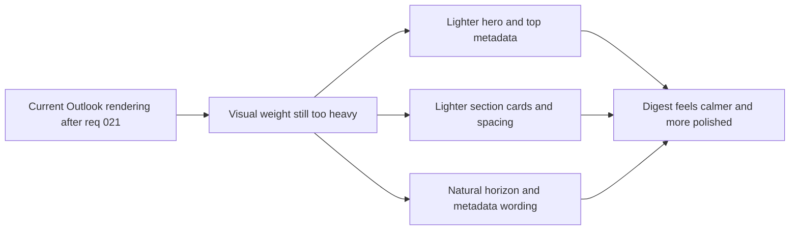

## req_022_day_captain_digest_visual_weight_and_header_polish - Day Captain digest visual weight and header polish
> From version: 1.1.0
> Status: Done
> Understanding: 100%
> Confidence: 100%
> Complexity: Medium
> Theme: UX
> Reminder: Update status/understanding/confidence and references when you edit this doc.

# Needs
- Reduce the visual heaviness of the delivered Day Captain digest in Outlook now that the first readability pass is live.
- Make the top header area feel lighter and more intentional without reopening the already-acceptable scope of `En bref`.
- Polish the remaining visual friction points so the mail reads like a concise assistant brief rather than a dense dark card stack.
- Give the coverage line (`Périmètre : ...`) a more polished treatment so it feels intentional instead of purely system-generated.
- Explore whether the footer can expose lightweight clickable quick actions, such as `mailto:` links that prefill Day Captain command subjects (`recall`, `recall-today`, `recall-week`).

# Context
- This request is a follow-up to `req_021_day_captain_digest_email_readability_and_scannability_polish`, based on review of the new live Outlook rendering after the first readability pass was deployed.
- The latest operator feedback is more specific than the previous request:
  - `En bref` is not the main problem and does not need a major rewrite
  - the large gray hero/background block is visually heavy and may not be necessary at all
  - section cards still feel darker and heavier than needed
  - `Périmètre : ven. 06 mars 2026 à 00:00 -> dim. 08 mars 2026 à 23:08 CET` still reads slightly too system-oriented and could be more styled/polished
  - some meeting-summary wording still feels awkward, such as broader “next week” phrasing when the intent is really Monday or tomorrow
- In scope for this request:
  - reduce or remove the heavy gray background treatment if Outlook rendering allows it
  - lighten the visual weight of the header/hero block
  - soften card contrast, borders, and spacing where the current rendering feels too dense or too dark
  - simplify system-like phrasing such as `Périmètre`
  - tighten meeting-summary wording so time horizon references feel natural in French and English
  - evaluate a small footer quick-action area with clickable `mailto:` command links if Outlook compatibility remains acceptable
  - preserve the current structural wins from `req_021` such as section cards, compact meetings, and bounded summary behavior
- Out of scope for this request:
  - reopening the entire digest architecture
  - turning `En bref` into a radically shorter or different feature unless required by the visual redesign
  - changing transport, scoring, recall, or delivery semantics
  - introducing a fully custom design system that breaks current Outlook-compatible rendering constraints

# Acceptance criteria
- AC1: The delivered digest no longer depends on a large heavy gray hero/background block; the top area feels materially lighter in Outlook.
- AC2: Section cards remain scannable but use lighter visual weight than the current dark-card stack.
- AC3: The digest metadata/header phrasing is less system-like, especially around the coverage/perimeter line.
- AC3 supporting expectation: the `Périmètre` / coverage line has a more intentional visual treatment than the current raw metadata rendering.
- AC4: Meeting-summary wording uses more natural time-horizon phrasing in the delivered language.
- AC4 supporting option: if a quick-action footer is introduced, it uses clickable `mailto:` links that prefill supported Day Captain command subjects without changing the underlying command contract.
- AC5: The improvements preserve Outlook compatibility and do not regress the scannability gains already delivered in `req_021`.

# Backlog traceability
- AC1 -> `item_029_day_captain_digest_hero_background_and_metadata_polish`. Proof: this item explicitly lightens or removes the heavy hero/background treatment.
- AC2 -> `item_030_day_captain_digest_card_weight_and_meeting_wording_polish`. Proof: this item explicitly reduces card visual weight while preserving scan quality.
- AC3 -> `item_029_day_captain_digest_hero_background_and_metadata_polish`. Proof: this item explicitly polishes the metadata/header treatment, especially the coverage line.
- AC4 -> `item_030_day_captain_digest_card_weight_and_meeting_wording_polish`. Proof: this item explicitly tightens meeting-summary horizon wording.
- AC4 supporting option -> `item_031_day_captain_digest_quick_actions_and_final_outlook_validation`. Proof: this item explicitly evaluates or implements footer `mailto:` quick actions.
- AC5 -> `item_031_day_captain_digest_quick_actions_and_final_outlook_validation`. Proof: this item explicitly requires final Outlook validation and closure-safe docs updates.

# Task traceability
- AC1 -> `task_027_day_captain_digest_visual_weight_and_quick_actions_orchestration`. Proof: task `027` explicitly lightens the hero/background treatment.
- AC2 -> `task_027_day_captain_digest_visual_weight_and_quick_actions_orchestration`. Proof: task `027` explicitly lightens section cards.
- AC3 -> `task_027_day_captain_digest_visual_weight_and_quick_actions_orchestration`. Proof: task `027` explicitly polishes the perimeter/coverage line treatment.
- AC4 -> `task_027_day_captain_digest_visual_weight_and_quick_actions_orchestration`. Proof: task `027` explicitly improves meeting wording.
- AC4 supporting option -> `task_027_day_captain_digest_visual_weight_and_quick_actions_orchestration`. Proof: task `027` explicitly evaluates footer `mailto:` quick actions.
- AC5 -> `task_027_day_captain_digest_visual_weight_and_quick_actions_orchestration`. Proof: task `027` explicitly requires live Outlook validation before closure.

# Definition of Ready (DoR)
- [x] Problem statement is explicit and user impact is clear.
- [x] Scope boundaries (in/out) are explicit.
- [x] Acceptance criteria are testable.
- [x] Dependencies and known risks are listed.

# Backlog
- `item_029_day_captain_digest_hero_background_and_metadata_polish` - Lighten the hero/background treatment and polish the top metadata line. Status: `Done`.
- `item_030_day_captain_digest_card_weight_and_meeting_wording_polish` - Reduce section-card visual weight and tighten meeting wording. Status: `Done`.
- `item_031_day_captain_digest_quick_actions_and_final_outlook_validation` - Evaluate footer quick actions and close the slice with real Outlook validation. Status: `Done`.
- `task_027_day_captain_digest_visual_weight_and_quick_actions_orchestration` - Orchestrate the visual-weight follow-up and optional quick-action footer. Status: `Done`.

# Notes
- Created on Sunday, March 8, 2026 after review of the live Outlook rendering showed that the main remaining issue is not summary length but visual weight and top-of-mail heaviness.
- Implementation started on Sunday, March 8, 2026: the renderer is now being lightened again, meeting horizon wording is being tightened, and a footer quick-action prototype is being added before final Outlook validation.
- Closed on Monday, March 9, 2026 after the visual-weight and quick-action goals were delivered, then validated in the later live Outlook review used to close the follow-up digest polish slices.
