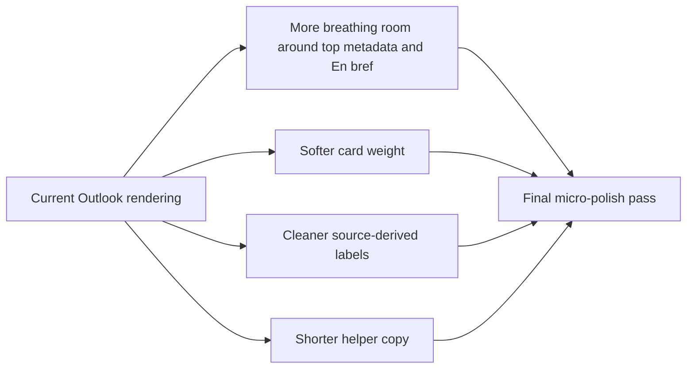

## req_023_day_captain_digest_spacing_and_content_cleanup_polish - Day Captain digest spacing and content cleanup polish
> From version: 1.2.0
> Status: Done
> Understanding: 100%
> Confidence: 100%
> Complexity: Low
> Theme: UX
> Reminder: Update status/understanding/confidence and references when you edit this doc.

# Needs
- Apply a final micro-polish pass to the delivered Day Captain digest now that the larger readability and visual-weight passes are live.
- Improve vertical rhythm in the top of the mail so the header, `Périmètre`, `En bref`, and the first section do not feel visually compressed.
- Clean up a few remaining raw or awkward content details so the digest feels more intentional and less like direct source text.
- Avoid self-reference wording mistakes where the digest can describe the target user as meeting with themselves.
- Add lightweight source-opening controls where the digest already knows enough to open the underlying Outlook mail or calendar context.

# Context
- This request is a follow-up to `req_022_day_captain_digest_visual_weight_and_header_polish`, after a new real Outlook review on Monday, March 9, 2026.
- The latest live rendering review indicates that the main remaining issues are no longer structural:
  - the digest is now broadly clean and product-grade
  - the footer quick actions work and look credible in Outlook
  - the top block is much lighter than before
- The remaining friction points are now smaller but visible:
  - there is not enough space between `Périmètre` and `En bref`
  - there is not enough space between the `En bref` paragraph and the next section header such as `Points critiques`
  - section cards still feel slightly heavy because the border contrast remains strong
  - the footer helper copy is useful but longer than necessary
  - some raw titles or labels still read awkwardly, such as `A imprimer` or `Bureau- Artois`
  - some source-derived summaries can still feel too literal or slightly rough when rendered directly
  - identity handling is still too naive in some meeting or summary wording, so the digest can sometimes imply that the target user has a meeting with themselves when the same person is recognized in several roles
  - once the digest highlights a useful mail or meeting, there is still no direct way to open that source context from the card itself
- After the next live review on Monday, March 9, 2026, the priority became more specific:
  - spacing is improved enough that it is no longer the main blocker
  - the remaining issues are now mostly wording quality rather than layout quality
  - `En bref` can still sound awkward or unfinished, such as vague phrasing around the “next” meeting
  - once self-reference is removed, some meeting summaries become too thin and need a better fallback than a bare time plus location
  - some section-card summaries still read too much like literal machine compression of source content
- In scope for this request:
  - tune vertical spacing between top-of-mail metadata and `En bref`
  - tune vertical spacing between the `En bref` block and the first downstream section
  - slightly soften card borders or card visual weight if Outlook rendering allows it
  - shorten the quick-action helper copy without losing clarity
  - normalize a few obvious source-derived labels or titles when the current rendering is visibly rough
  - add lightweight identity-aware wording rules so the digest recognizes when the referenced person is the target user and avoids awkward self-reference phrasing
  - improve `En bref` meeting wording so it stays natural and specific
  - improve meeting-summary fallback wording when organizer identity is suppressed
  - compress overly literal section-card summaries into cleaner bounded phrasing when a simple deterministic cleanup rule is enough
  - evaluate lightweight Outlook-compatible controls for opening the source mail or meeting when a stable source link is available
  - preserve the current layout, transport, and command contract
- Out of scope for this request:
  - reopening the digest architecture again
  - redesigning the footer command model
  - changing scoring, selection, or recall semantics
  - adding a broad content-rewriting system for all raw source text
  - introducing a new rich action system beyond lightweight deep-link controls

# Acceptance criteria
- AC1: The delivered digest has visibly more space between the `Périmètre` line and the `En bref` label/block in Outlook.
- AC2: The delivered digest has visibly more space between the `En bref` body text and the next section header such as `Points critiques`.
- AC3: Section cards remain readable but use slightly softer visual weight than the current strong white-outline treatment.
- AC4: The footer helper copy remains clear but is shorter and less visually dominant.
- AC5: Obvious awkward labels or raw source-derived titles are normalized when a lightweight cleanup rule can improve readability without changing product meaning.
- AC6: Meeting and summary wording no longer describe the target user as meeting with themselves when the same identity appears in the event metadata.
- AC7: `En bref` and meeting fallback wording remain natural after identity-aware cleanup and do not degrade into vague or thin phrasing.
- AC8: The improvements preserve the current Outlook-compatible layout and do not regress the gains already shipped in `req_021` and `req_022`.
- AC9: When a stable source link is available, the digest can expose a lightweight Outlook-compatible control to open the underlying mail or calendar context without changing scoring or delivery behavior.

# Backlog traceability
- AC1 -> `item_032_day_captain_digest_top_spacing_and_summary_rhythm_polish`. Proof: this item explicitly adds breathing room around `Périmètre`, `En bref`, and the first section transition.
- AC2 -> `item_032_day_captain_digest_top_spacing_and_summary_rhythm_polish`. Proof: this item explicitly improves the summary-to-sections spacing rhythm.
- AC3 -> `item_033_day_captain_digest_card_weight_and_footer_microcopy_polish`. Proof: this item explicitly softens card visual weight.
- AC4 -> `item_033_day_captain_digest_card_weight_and_footer_microcopy_polish`. Proof: this item explicitly shortens the footer helper copy.
- AC5 -> `item_034_day_captain_digest_identity_aware_wording_and_label_cleanup`. Proof: this item explicitly normalizes rough labels and source-derived titles.
- AC6 -> `item_034_day_captain_digest_identity_aware_wording_and_label_cleanup`. Proof: this item explicitly adds identity-aware wording guards.
- AC7 -> `item_034_day_captain_digest_identity_aware_wording_and_label_cleanup`. Proof: this item explicitly improves overview and meeting fallback phrasing after identity cleanup.
- AC8 -> `item_034_day_captain_digest_identity_aware_wording_and_label_cleanup`. Proof: this item explicitly keeps the cleanup bounded rather than architectural.
- AC9 -> `item_035_day_captain_digest_source_open_controls`. Proof: this item explicitly evaluates or implements lightweight source-opening controls for mail and meeting cards.

# Task traceability
- AC1 -> `task_028_day_captain_digest_spacing_and_content_cleanup_orchestration`. Proof: task `028` explicitly improves spacing around `En bref`.
- AC2 -> `task_028_day_captain_digest_spacing_and_content_cleanup_orchestration`. Proof: task `028` explicitly improves the summary-to-sections transition.
- AC3 -> `task_028_day_captain_digest_spacing_and_content_cleanup_orchestration`. Proof: task `028` explicitly softens card weight.
- AC4 -> `task_028_day_captain_digest_spacing_and_content_cleanup_orchestration`. Proof: task `028` explicitly shortens footer helper copy.
- AC5 -> `task_028_day_captain_digest_spacing_and_content_cleanup_orchestration`. Proof: task `028` explicitly adds bounded cleanup rules.
- AC6 -> `task_028_day_captain_digest_spacing_and_content_cleanup_orchestration`. Proof: task `028` explicitly prevents self-reference meeting wording.
- AC7 -> `task_028_day_captain_digest_spacing_and_content_cleanup_orchestration`. Proof: task `028` explicitly improves overview and meeting fallback wording after self-reference cleanup.
- AC8 -> `task_028_day_captain_digest_spacing_and_content_cleanup_orchestration`. Proof: task `028` explicitly requires regression-safe final validation.
- AC9 -> `task_028_day_captain_digest_spacing_and_content_cleanup_orchestration`. Proof: task `028` explicitly evaluates or implements bounded open-source controls alongside the remaining wording polish.

# Definition of Ready (DoR)
- [x] Problem statement is explicit and user impact is clear.
- [x] Scope boundaries (in/out) are explicit.
- [x] Acceptance criteria are testable.
- [x] Dependencies and known risks are listed.

# Backlog
- `item_032_day_captain_digest_top_spacing_and_summary_rhythm_polish` - Improve the spacing rhythm around `Périmètre`, `En bref`, and the first section. Status: `Done`.
- `item_033_day_captain_digest_card_weight_and_footer_microcopy_polish` - Soften card weight and shorten footer helper copy. Status: `Done`.
- `item_034_day_captain_digest_identity_aware_wording_and_label_cleanup` - Clean rough labels, improve overview/meeting fallback copy, and prevent self-reference meeting wording. Status: `Done`.
- `item_035_day_captain_digest_source_open_controls` - Evaluate lightweight controls to open the underlying Outlook mail or calendar context from digest cards. Status: `Done`.
- `task_028_day_captain_digest_spacing_and_content_cleanup_orchestration` - Orchestrate the final micro-polish follow-up. Status: `Done`.

# Notes
- Created on Monday, March 9, 2026 after another real Outlook review showed that the remaining gaps are now mostly spacing and cleanup polish rather than structural layout issues.
- This request intentionally treats the current digest as already strong enough to use, and focuses only on the final visible rough edges.
- Implementation started on Monday, March 9, 2026: the top-of-mail spacing is being loosened, card borders and footer microcopy are being softened, and bounded cleanup rules are being added for rough labels plus self-reference meeting wording.
- The latest live Outlook review confirms that the next development slice should focus primarily on copy heuristics: `En bref`, meeting-summary fallbacks, and card-summary compression are now the main issues.
- That copy-heuristic slice is now underway locally: the LLM prompts are being tightened, redundant title prefixes are being stripped from rewritten summaries, and meeting fallbacks are starting to prefer a real counterparty when the organizer is the target user.
- The request now also captures a new UX follow-up: once a digest card is useful enough to act on, it should ideally offer a bounded “open in Outlook” style control for the underlying mail or meeting when the source link is already known and Outlook compatibility remains acceptable.
- Final validation completed on Monday, March 9, 2026: the live `1.2.2` digest on Render was reviewed in Outlook, the final polish pass was accepted, and the new source-opening controls were confirmed acceptable for closure.
