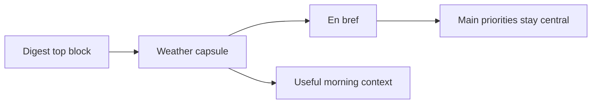

## req_024_day_captain_digest_daily_weather_capsule - Day Captain digest daily weather capsule
> From version: 1.3.0
> Status: Draft
> Understanding: 97%
> Confidence: 94%
> Complexity: Medium
> Theme: UX
> Reminder: Update status/understanding/confidence and references when you edit this doc.

# Needs
- Add a small daily weather capsule near the top of the digest so the brief feels more useful as a real morning companion.
- Place that weather signal before `En bref`, not lower in the digest where it would compete with action-oriented content.
- Keep the weather wording short and scannable, including a quick indication of whether the day is warmer or cooler than the previous day.

# Context
- The digest top area is now materially cleaner after the readability, visual-weight, and wording-polish passes.
- That leaves room for one bounded contextual signal above `En bref` without reintroducing a heavy header block.
- The requested user experience is specific:
  - show the weather for the current day
  - keep it brief
  - indicate whether it is warmer or colder than the previous day
  - render it before `En bref`
- This should remain a compact utility layer, not a new large forecast section.
- The main open design constraints are:
  - where the weather location comes from for a given digest target
  - what weather source/provider is used
  - how the capsule behaves when weather data is unavailable

# In scope
- add one lightweight weather capsule above `En bref`
- summarize the day with short weather copy
- include a simple warmer/cooler comparison versus the previous local day
- keep the capsule visually subordinate to the digest title and main action summary
- preserve Outlook-compatible rendering
- document any required config if a weather location or provider setting is introduced

# Out of scope
- adding a full hourly forecast
- adding a multi-day forecast section
- turning the digest into a travel or commute planner
- introducing rich weather graphics that are likely to render poorly in Outlook
- blocking digest delivery when weather data is unavailable

# Acceptance criteria
- AC1: The delivered digest can render a small weather capsule before `En bref`.
- AC2: The weather capsule states the day’s weather in brief assistant-style wording rather than a dense raw weather report.
- AC3: The weather capsule includes a short warmer/cooler signal relative to the previous local day when both days are available.
- AC4: If weather data is unavailable, the digest still renders cleanly without breaking the top layout.
- AC5: The capsule remains visually light and does not reintroduce the heavy header feel removed in earlier digest-polish slices.
- AC6: Any new weather dependency or location-setting contract is documented before closure.

# Delivery notes
- Preferred placement: between the as-of/perimeter metadata and `En bref`.
- Preferred tone:
  - short
  - useful
  - non-technical
- Example shape in French:
  - `Météo du jour: ciel couvert, 14°C. Un peu plus frais qu'hier.`
- Example shape in English:
  - `Today's weather: overcast, 57F. Slightly cooler than yesterday.`

# Risks and dependencies
- Weather is a time-sensitive external dependency, so provider behavior and response shape must be treated as unstable.
- A location contract may be needed if the digest user base is not tied to one fixed city.
- The comparison logic should remain bounded; a simple warmer/cooler delta is enough and avoids false precision.

# Definition of Ready (DoR)
- [x] Problem statement is explicit and user impact is clear.
- [x] Scope boundaries (in/out) are explicit.
- [x] Acceptance criteria are testable.
- [x] Known risks and dependency questions are listed.

# Backlog
- Pending decomposition into backlog items and an orchestration task.

# Notes
- Created on Monday, March 9, 2026 from direct product feedback after the digest top block reached an acceptable polish level.
- This request intentionally treats weather as a bounded contextual enhancement, not as a new core decision section.
