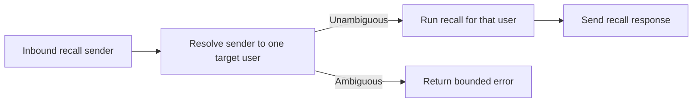

## req_025_day_captain_multi_user_email_command_recall - Day Captain multi-user email-command recall
> From version: 1.3.0
> Status: Done
> Understanding: 100%
> Confidence: 99%
> Complexity: Medium
> Theme: Operations
> Reminder: Update status/understanding/confidence and references when you edit this doc.

# Needs
- Support hosted multi-user deployments where more than one `DAY_CAPTAIN_TARGET_USERS` entry is configured without having to disable email-command recall entirely.
- Remove the current operational dead-end where enabling several hosted target users forces `DAY_CAPTAIN_EMAIL_COMMAND_ALLOWED_SENDERS` to be emptied just to let the service boot.
- Keep inbound email-command recall safe and unambiguous when several target users share the same Day Captain service.

# Context
- Day Captain already supports hosted multi-user digest delivery by requiring an explicit `target_user_id` per scheduled run.
- The current hosted email-command recall contract is intentionally limited to a single configured target user.
- That limitation is enforced in `validate_hosted()`, which currently raises:
  - `DAY_CAPTAIN_EMAIL_COMMAND_ALLOWED_SENDERS requires exactly one hosted target user.`
- In practice, this means:
  - scheduled multi-user digests can run correctly
  - but inbound email-command recall must be disabled as soon as several users are configured
- This is now a product/ops gap rather than a rendering issue.

# In scope
- define a safe multi-user contract for inbound email-command recall
- decide how a sender is mapped to exactly one target user in hosted mode
- preserve explicit rejection when the sender-to-target mapping is ambiguous
- update validation rules so multi-user hosting plus bounded email-command recall becomes possible
- document the hosted env/operator contract needed for this mode

# Out of scope
- redesigning the recall command syntax from scratch unless strictly needed for ambiguity resolution
- broad mailbox delegation features beyond bounded recall commands
- turning one inbound command mailbox into a general multi-tenant routing engine
- relaxing safety constraints just to make configuration easier

# Acceptance criteria
- AC1: Hosted Day Captain can boot with several configured target users and a bounded email-command recall contract enabled.
- AC2: One inbound email-command sender can be mapped to exactly one target user using an explicit, documented contract.
- AC3: Ambiguous sender-to-user mappings are rejected safely rather than guessed.
- AC4: Existing single-user email-command behavior remains supported.
- AC5: Hosted configuration and operator docs are updated to explain the multi-user email-command contract and limits.

# Backlog traceability
- AC1 -> `item_040_day_captain_multi_user_email_command_validation_and_runtime`. Proof: this item explicitly removes the current startup dead-end and enables valid hosted multi-user boot/runtime behavior.
- AC2 -> `item_039_day_captain_multi_user_email_command_mapping_contract`. Proof: this item explicitly defines how one sender maps to exactly one target user.
- AC3 -> `item_039_day_captain_multi_user_email_command_mapping_contract`. Proof: this item explicitly requires safe rejection of ambiguous sender mappings.
- AC4 -> `item_040_day_captain_multi_user_email_command_validation_and_runtime`. Proof: this item explicitly preserves the single-user contract while extending hosted multi-user support.
- AC5 -> `item_041_day_captain_multi_user_email_command_ops_docs_and_validation`. Proof: this item explicitly updates operator docs and validation notes for the new hosted contract.

# Task traceability
- AC1 -> `task_030_day_captain_multi_user_email_command_recall_orchestration`. Proof: task `030` explicitly enables valid hosted multi-user email-command recall.
- AC2 -> `task_030_day_captain_multi_user_email_command_recall_orchestration`. Proof: task `030` explicitly defines one unambiguous sender-to-target routing contract.
- AC3 -> `task_030_day_captain_multi_user_email_command_recall_orchestration`. Proof: task `030` explicitly rejects ambiguous mappings rather than guessing.
- AC4 -> `task_030_day_captain_multi_user_email_command_recall_orchestration`. Proof: task `030` explicitly keeps the single-user path supported.
- AC5 -> `task_030_day_captain_multi_user_email_command_recall_orchestration`. Proof: task `030` explicitly blocks closure until hosted docs/config guidance are updated.

# Delivery notes
- Likely valid solution directions:
  - explicit sender-to-target mapping config such as `sender=email,user=email`
  - default “self-service” mapping where the sender address must exactly match one configured target user
  - optional helper senders only if they can be bound to one unique target user
- Preferred behavior:
  - explicit and predictable
  - no silent fallback to “first user”
  - no startup failure when the config is valid but multi-user

# Risks and dependencies
- The main risk is ambiguity: the same sender mailbox must never be able to trigger recall for the wrong target user.
- Backward compatibility matters because single-user hosted recall already exists and should not regress.
- Operator ergonomics matter: the config must stay understandable enough to maintain in Render and the private ops repo.

# Definition of Ready (DoR)
- [x] Problem statement is explicit and operationally grounded.
- [x] Scope boundaries (in/out) are explicit.
- [x] Acceptance criteria are testable.
- [x] Safety and ambiguity risks are listed.

# Backlog
- `item_039_day_captain_multi_user_email_command_mapping_contract` - Define the sender-to-target mapping contract for hosted multi-user email-command recall. Status: `Done`.
- `item_040_day_captain_multi_user_email_command_validation_and_runtime` - Enable valid hosted multi-user email-command recall at validation/runtime without regressing single-user behavior. Status: `Done`.
- `item_041_day_captain_multi_user_email_command_ops_docs_and_validation` - Update docs and validate the hosted multi-user email-command operator flow. Status: `Done`.
- `task_030_day_captain_multi_user_email_command_recall_orchestration` - Orchestrate the hosted multi-user email-command recall slice end to end. Status: `Done`.

# Notes
- Created on Monday, March 9, 2026 after a live hosted failure exposed the current incompatibility between multi-user hosted delivery and `DAY_CAPTAIN_EMAIL_COMMAND_ALLOWED_SENDERS`.
- This request is intentionally about hosted contract/safety and should reuse the existing multi-user delivery model where possible.
- Closed on Monday, March 9, 2026 after the hosted contract was extended to support explicit `sender=target` helper mappings, self-sender resolution for configured target users, and updated operator docs.
