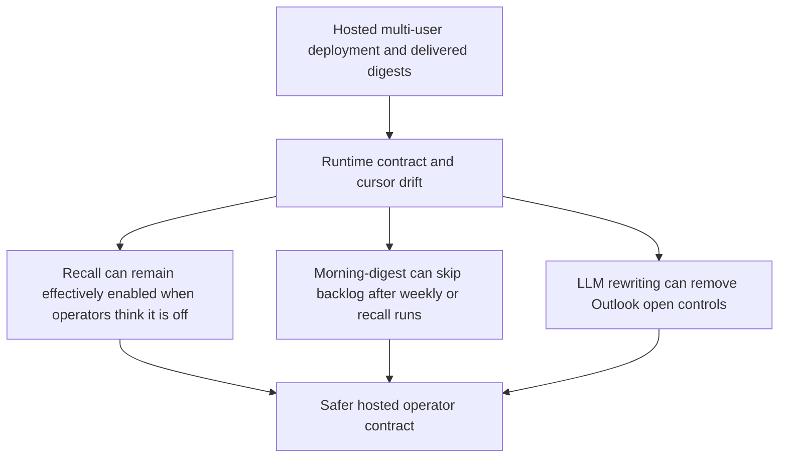

## req_026_day_captain_runtime_contract_and_digest_cursor_reliability - Day Captain runtime contract and digest cursor reliability
> From version: 1.3.1
> Status: Ready
> Understanding: 99%
> Confidence: 97%
> Complexity: Medium
> Theme: Reliability
> Reminder: Update status/understanding/confidence and references when you edit this doc.

# Needs
- Align the hosted email-command runtime contract with the documented operator contract so recall is truly disabled when `DAY_CAPTAIN_EMAIL_COMMAND_ALLOWED_SENDERS` is empty.
- Prevent non-morning runs such as `weekly-digest` or `recall-digest` from advancing the incremental cursor used by `morning-digest`.
- Preserve digest card source-open controls when the LLM wording layer rewrites item summaries.

# Context
- The current hosted docs say inbound `email-command-recall` should be treated as enabled only when `DAY_CAPTAIN_EMAIL_COMMAND_ALLOWED_SENDERS` is configured.
- The current runtime does not fully respect that contract:
  - `resolved_email_command_sender_routes()` seeds self-routes for every configured target user even when the env var is empty.
  - `process_email_command_recall()` then accepts any sender that matches a configured target user.
- The current `morning-digest` cursor also advances from the latest completed run regardless of `run_type`.
  - A Sunday `weekly-digest` can therefore cause Monday morning to skip part of the intended Friday-through-Monday backlog.
  - A `recall-digest` can also interfere with the next normal morning run even though recall should be read-only from an operator point of view.
- The LLM wording path currently rebuilds `DigestEntry` objects without carrying `source_url`.
  - This silently drops the Outlook source-open controls on rewritten items even though the renderer supports them.

# In scope
- make the hosted email-command enablement contract explicit and enforce it consistently at validation/runtime
- define which run types are allowed to move the incremental `morning-digest` cursor
- preserve `DigestEntry.source_url` and any equivalent source-open metadata across wording/overview rewrite paths
- update docs and validation notes if the operator contract changes

# Out of scope
- redesigning the email-command feature surface beyond the enable/disable contract
- changing the weekly digest business scope itself
- broad UI redesign of digest cards or open controls
- replacing the LLM provider model

# Acceptance criteria
- AC1: Hosted email-command recall is disabled when `DAY_CAPTAIN_EMAIL_COMMAND_ALLOWED_SENDERS` is empty, unless an explicit documented contract says otherwise.
- AC2: The hosted runtime, validation summary, and docs all describe the same email-command enablement behavior.
- AC3: `morning-digest` advances incrementally only from the intended run types and does not let `weekly-digest` or `recall-digest` suppress the Monday/first-run backlog window.
- AC4: LLM-rewritten digest items preserve `source_url` so Outlook open controls remain available after rewriting.
- AC5: Tests cover the fixed hosted email-command contract, the corrected `morning-digest` cursor behavior, and source-open preservation through the LLM path.

# Risks and dependencies
- Email-command contract changes can affect currently working operator flows if the code and env expectations are not migrated together.
- Cursor changes must preserve the intended behavior for repeated same-day `morning-digest` runs while stopping unrelated run types from moving the window.
- Source-open control preservation must not accidentally leak unsafe URLs or break existing renderer fallbacks.

# Definition of Ready (DoR)
- [x] Problem statement is explicit and user impact is clear.
- [x] Scope boundaries (in/out) are explicit.
- [x] Acceptance criteria are testable.
- [x] Dependencies and known risks are listed.

# Backlog
- `item_042_day_captain_email_command_enablement_contract_alignment` - Align hosted email-command enablement with the documented contract. Status: `Ready`.
- `item_043_day_captain_morning_digest_cursor_run_type_isolation` - Isolate the morning-digest incremental cursor from unrelated run types. Status: `Ready`.
- `item_044_day_captain_llm_source_open_control_preservation` - Preserve source-open controls through LLM rewriting. Status: `Ready`.
- `task_031_day_captain_runtime_contract_and_digest_cursor_reliability_orchestration` - Orchestrate runtime contract and digest cursor reliability fixes. Status: `Ready`.

# Notes
- Created on Monday, March 9, 2026 from the project-wide review findings after the `1.3.1` multi-user recall slice landed.
- This request is intentionally about correctness and operator trust, not about new product surface.
