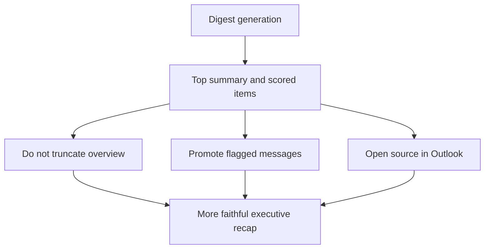

## req_027_day_captain_overview_flagged_signal_and_desktop_opening - Day Captain overview length, flagged signal, and Outlook opening behavior
> From version: 1.3.1
> Status: Ready
> Understanding: 99%
> Confidence: 97%
> Complexity: Medium
> Theme: Product
> Reminder: Update status/understanding/confidence and references when you edit this doc.

# Needs
- Stop truncating `En bref` / `In brief` so the top summary can stay complete even when it is longer than the current bounded policy.
- Make flagged emails visibly more prominent in the digest so a flagged message is easier to spot than a normal scored message.
- Evaluate whether digest source-open controls can open Outlook desktop when available, while keeping a safe and reliable fallback behavior.

# Context
- The current digest intentionally bounds the top summary to keep the header compact.
- That policy now conflicts with the desired product behavior: if the summary is long but still useful, it should remain complete rather than be forcibly shortened.
- Flagged messages currently flow through the normal scoring pipeline and do not yet get a distinct presentation or prominence treatment.
- The current source-open controls are web-oriented (`webLink` / meeting link) and already work for Outlook web contexts.
- Opening Outlook desktop directly may be possible through platform-specific or protocol-based links, but that behavior is less universal and needs a clear fallback story.

# In scope
- redefine the top-summary length policy so `En bref` / `In brief` is not forcibly truncated
- detect and promote flagged mail as a stronger digest signal
- evaluate desktop Outlook opening behavior and define the supported fallback contract
- update docs and acceptance notes if the opening behavior or summary policy changes

# Out of scope
- broad redesign of the full digest layout
- changing the recall command model
- guaranteeing desktop-protocol support on every Outlook client/platform combination without fallback
- expanding source-open controls beyond Outlook/mail/calendar contexts already present in the digest

# Acceptance criteria
- AC1: `En bref` / `In brief` is no longer forcibly truncated by the application policy.
- AC2: Flagged emails are promoted more clearly than ordinary messages in scoring and/or rendering.
- AC3: The source-open behavior explicitly defines what happens for Outlook web versus Outlook desktop, including fallback behavior when desktop opening is not available.
- AC4: Tests and docs are updated to reflect the new overview-length policy, flagged-message treatment, and supported opening behavior.

# Risks and dependencies
- Removing the top-summary cap can reintroduce very long or noisy summaries if upstream wording quality regresses.
- Flagged-message promotion must stay bounded so a noisy mailbox does not let flags dominate the digest unfairly.
- Desktop Outlook opening may require platform-specific behavior that is not uniformly supported from email HTML clients.

# Definition of Ready (DoR)
- [x] Problem statement is explicit and user impact is clear.
- [x] Scope boundaries (in/out) are explicit.
- [x] Acceptance criteria are testable.
- [x] Dependencies and known risks are listed.

# Backlog
- `item_045_day_captain_overview_length_policy_without_truncation` - Remove forced top-summary truncation and define the new overview-length contract. Status: `Ready`.
- `item_046_day_captain_flagged_mail_signal_and_rendering_prominence` - Promote flagged emails more clearly in scoring and rendering. Status: `Ready`.
- `item_047_day_captain_outlook_desktop_opening_behavior_and_fallbacks` - Define and validate Outlook desktop opening behavior with reliable fallback. Status: `Ready`.
- `task_032_day_captain_overview_flagged_signal_and_desktop_opening_orchestration` - Orchestrate the overview/flagged/opening follow-up slice. Status: `Ready`.

# Notes
- Created on Monday, March 9, 2026 from product feedback on the delivered digest behavior after the `1.3.x` reliability and multi-user slices.
- This request is intentionally about digest usefulness and operator-visible behavior, not a broad visual redesign.
