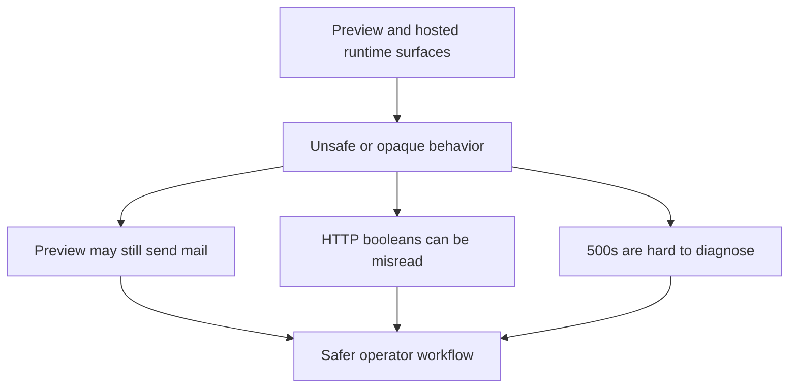

## req_028_day_captain_preview_safety_and_web_runtime_observability - Day Captain preview safety and web runtime observability
> From version: 1.4.0
> Status: Done
> Understanding: 100%
> Confidence: 99%
> Complexity: Medium
> Theme: Reliability
> Reminder: Update status/understanding/confidence and references when you edit this doc.

# Needs
- Make local digest preview safe and explicit so operators can render HTML/text output without risking a real Graph send.
- Harden the hosted HTTP input contract so boolean fields such as `force` are parsed deterministically instead of relying on Python truthiness.
- Improve runtime observability on the web surface so unexpected 500s are diagnosable instead of failing silently.

# Context
- The current CLI supports `--output-html` and `--output-text`, but those flags only export after the selected command has already executed.
- That means a user can reasonably think they are running a harmless preview while the app still sends the digest if `delivery_mode` resolves to `graph_send`.
- The current hosted HTTP layer also coerces `force` through `bool(payload.get("force", False))`, so a JSON string such as `"false"` becomes truthy and can trigger an unintended forced run.
- The web app catches unexpected exceptions and returns `{"error":"internal_error"}` without logging the root cause, which weakens production diagnostics.

# In scope
- define and implement a real preview-safe contract for digest rendering without unintended send side effects
- harden HTTP payload parsing for boolean inputs on hosted job endpoints
- add minimal but reliable exception logging/observability for unexpected web runtime failures
- update docs and validation notes to match the corrected preview/runtime contract

# Out of scope
- broad redesign of the CLI surface beyond what is needed for safe preview behavior
- replacing the current hosted HTTP transport model
- adding a full external monitoring platform or complex structured logging stack
- unrelated digest content or UI changes

# Acceptance criteria
- AC1: Operators can generate a local digest preview without sending mail, even when the configured delivery mode is `graph_send`.
- AC2: The CLI/docs clearly describe the preview contract and no longer imply that `--output-html` / `--output-text` alone suppress delivery when they do not.
- AC3: Hosted boolean fields such as `force` are parsed deterministically from JSON payloads and do not treat `"false"` or `"0"` as truthy.
- AC4: Unexpected 500s on the web surface emit actionable runtime logs while preserving the bounded HTTP error response.
- AC5: Tests cover the preview-safe path, the hardened boolean parsing, and the new web runtime observability behavior.

# Risks and dependencies
- Changing preview behavior may affect existing local workflows that currently rely on the configured delivery mode without noticing it.
- Boolean parsing changes must stay backwards compatible for valid JSON booleans while rejecting or normalizing loose string payloads safely.
- Logging improvements should avoid leaking secrets or full payload contents in hosted environments.

# Definition of Ready (DoR)
- [x] Problem statement is explicit and user impact is clear.
- [x] Scope boundaries (in/out) are explicit.
- [x] Acceptance criteria are testable.
- [x] Dependencies and known risks are listed.

# Backlog
- `item_048_day_captain_preview_safe_rendering_contract` - Introduce a true preview-safe rendering path without unintended Graph send. Status: `Done`.
- `item_049_day_captain_hosted_http_boolean_input_hardening` - Parse hosted HTTP boolean inputs deterministically instead of relying on Python truthiness. Status: `Done`.
- `item_050_day_captain_web_runtime_error_logging_and_docs_alignment` - Add bounded web runtime error logging and align operator docs with the new preview/runtime contract. Status: `Done`.
- `task_033_day_captain_preview_safety_and_web_runtime_observability_orchestration` - Orchestrate preview safety, hosted input hardening, and web observability fixes. Status: `Done`.

# Notes
- Created on Monday, March 9, 2026 from a project review covering preview safety, hosted payload parsing, and runtime observability.
- This request is intentionally focused on operator safety and production diagnosability rather than new end-user features.
- Closed on Monday, March 9, 2026 after adding an explicit no-send preview path, deterministic hosted boolean parsing, bounded web error logging, and aligned docs/tests.
