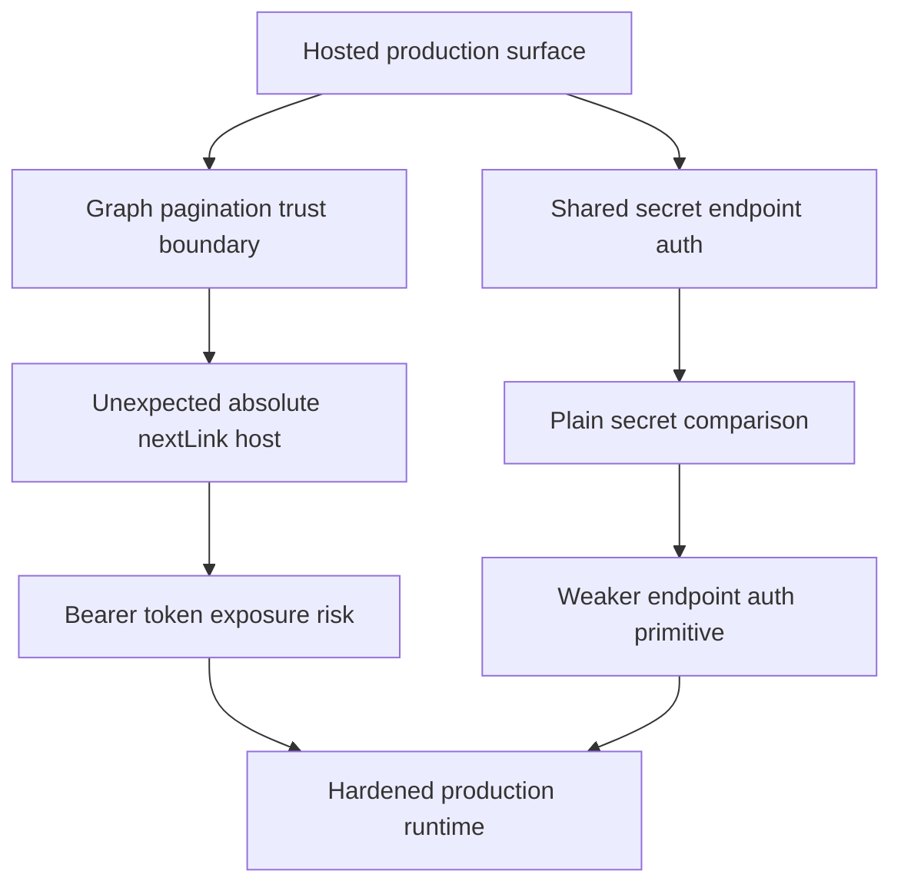

## req_029_day_captain_hosted_graph_boundary_and_job_secret_hardening - Day Captain hosted Graph boundary and job secret hardening
> From version: 1.4.1
> Status: Done
> Understanding: 100%
> Confidence: 99%
> Complexity: Medium
> Theme: Security
> Reminder: Update status/understanding/confidence and references when you edit this doc.

# Needs
- Harden the production Graph collection path so a hosted run never forwards a Microsoft Graph bearer token to an unexpected absolute `nextLink` host.
- Strengthen hosted job endpoint authentication so shared-secret comparison is done with a constant-time primitive instead of a plain string equality check.
- Keep the scope focused on production-facing exposure rather than local delegated token cache hygiene.

# Context
- The current Graph adapter accepts absolute URLs in `_build_url()` and follows `@odata.nextLink` values without constraining the host boundary.
- In practice, that means a malicious or corrupted paginated Graph response could cause the app to replay the `Authorization: Bearer ...` header to an unexpected HTTPS origin.
- The hosted web surface is protected by `X-Day-Captain-Secret`, but the current comparison is a direct `candidate == configured_secret`.
- The project owner’s current priority is production hardening, not local delegated token cache redesign.

# In scope
- define and implement a host-boundary policy for Graph collection pagination in hosted and local runtime paths
- reject or safely constrain absolute `@odata.nextLink` URLs that do not belong to the expected Graph origin
- harden `X-Day-Captain-Secret` validation with a constant-time comparison primitive
- update docs and tests to reflect the production hardening contract

# Out of scope
- redesign of delegated token cache storage on local developer machines
- broader API auth redesign beyond the existing shared-secret model
- migration to OAuth-protected job endpoints, mTLS, or signed request envelopes
- unrelated digest rendering, scoring, or UX changes

# Acceptance criteria
- AC1: Graph collection pagination never forwards the Graph bearer token to an unexpected host outside the configured Graph origin.
- AC2: Absolute `@odata.nextLink` values are either safely constrained to the trusted Graph base URL or rejected explicitly with a bounded error.
- AC3: Hosted job secret validation uses a constant-time comparison primitive instead of raw string equality.
- AC4: Tests cover trusted and untrusted `nextLink` behavior plus secret validation hardening.
- AC5: Operator-facing docs describe the new trust-boundary behavior without overstating the security model.

# AC Traceability
- AC1 -> `item_051_day_captain_graph_nextlink_trust_boundary_enforcement`. Proof: this item defines the trusted-origin policy that prevents bearer-token forwarding to unexpected hosts.
- AC2 -> `item_051_day_captain_graph_nextlink_trust_boundary_enforcement`. Proof: this item explicitly covers bounded allow/reject behavior for absolute `@odata.nextLink` values.
- AC3 -> `item_052_day_captain_hosted_job_secret_constant_time_validation`. Proof: this item hardens `X-Day-Captain-Secret` comparison without changing the hosted endpoint contract.
- AC4 -> `item_051_day_captain_graph_nextlink_trust_boundary_enforcement`, `item_052_day_captain_hosted_job_secret_constant_time_validation`, and `item_053_day_captain_hosted_security_docs_and_validation_alignment`. Proof: automated coverage spans both runtime hardening slices and is closed through the docs/tests alignment item.
- AC5 -> `item_053_day_captain_hosted_security_docs_and_validation_alignment`. Proof: this item exists specifically to align operator-facing documentation with the final hosted security contract.

# Risks and dependencies
- Microsoft Graph pagination can legitimately return absolute links, so the hardening must allow valid same-origin pagination without breaking normal collection flows.
- Overly strict URL checks could break collection against sovereign or custom Graph base URLs if they are not normalized consistently.
- Secret-comparison hardening improves the primitive but does not replace the need for strong secret rotation and TLS on hosted deployments.

# Definition of Ready (DoR)
- [x] Problem statement is explicit and production impact is clear.
- [x] Scope boundaries (in/out) are explicit.
- [x] Acceptance criteria are testable.
- [x] Dependencies and known risks are listed.

# Backlog
- `item_051_day_captain_graph_nextlink_trust_boundary_enforcement` - Prevent Graph pagination from forwarding bearer tokens to unexpected absolute hosts. Status: `Done`.
- `item_052_day_captain_hosted_job_secret_constant_time_validation` - Harden hosted `X-Day-Captain-Secret` validation with a constant-time comparison primitive. Status: `Done`.
- `item_053_day_captain_hosted_security_docs_and_validation_alignment` - Align operator docs and tests with the new hosted Graph boundary and secret-hardening contract. Status: `Done`.
- `task_034_day_captain_hosted_graph_boundary_and_job_secret_hardening_orchestration` - Orchestrate hosted Graph trust-boundary enforcement, job-secret hardening, and validation closure. Status: `Done`.

# Notes
- Created on Monday, March 9, 2026 from a production-priority security review.
- This request intentionally excludes local delegated token cache encryption because the immediate priority is the hosted runtime boundary.
- Closed on Monday, March 9, 2026 after enforcing same-origin Graph pagination, switching hosted secret checks to a constant-time comparison, and aligning docs/tests with the hardened production contract.
