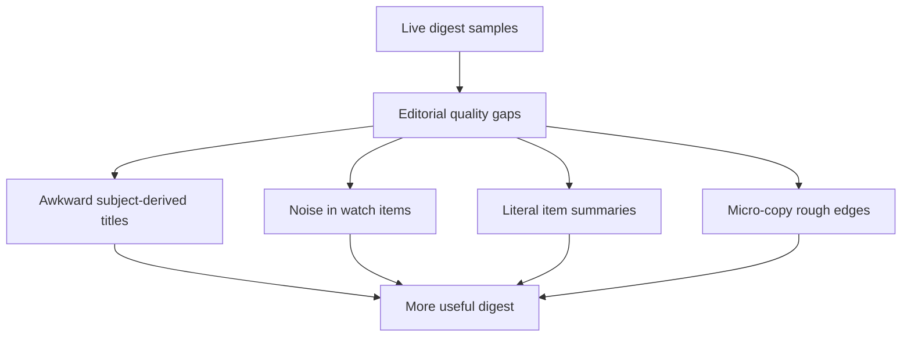

## req_030_day_captain_digest_editorial_relevance_and_copy_quality - Day Captain digest editorial relevance and copy quality
> From version: 1.4.1
> Status: Done
> Understanding: 99%
> Confidence: 98%
> Complexity: Medium
> Theme: Product Quality
> Reminder: Update status/understanding/confidence and references when you edit this doc.

# Needs
- Improve digest usefulness by cleaning up awkward card titles derived from raw email subjects.
- Reduce obvious noise in `À surveiller` / `Watch items` so the section feels curated rather than pass-through.
- Make item summaries more decision-oriented and less like lightly trimmed email excerpts.
- Apply a bounded copy polish pass to labels and CTAs without reopening a visual redesign project.

# Context
- The Outlook rendering is now good enough to produce, and the main remaining weakness is the perceived editorial quality of the digest.
- Recent live samples still show awkward or overly literal titles such as `RE: A imprimer`.
- `À surveiller` can still surface noisy or low-value messages that look weakly filtered.
- Several item summaries still read like copied mail body text rather than assistant-style action framing.
- Small product-copy issues remain visible in the live digest, such as `METEO DU JOUR` styling/casing and repetitive CTA wording.

# In scope
- title cleanup heuristics for digest cards derived from raw mail subjects
- stronger relevance heuristics for `watch_items`
- better wording rules and/or bounded LLM guidance for more decision-oriented summaries
- small copy polish on section labels, badges, and CTA wording where it improves clarity

# Out of scope
- broader visual redesign of the digest layout
- large changes to the overall section structure
- interactive in-mail feedback controls
- infrastructure, auth, or hosted runtime security work

# Acceptance criteria
- AC1: Digest card titles no longer surface obvious raw-email awkwardness such as noisy reply prefixes or unnatural subject carry-over when a cleaner title can be inferred safely.
- AC2: `À surveiller` / `Watch items` is visibly less noisy on representative live or preview samples, with low-signal items more consistently excluded or deprioritized.
- AC3: Item summaries read more like assistant guidance and less like literal email excerpts, especially for action-oriented and watch-item cards.
- AC4: Micro-copy polish improves visible labels/CTAs without regressing Outlook rendering stability.
- AC5: Tests and docs are updated to reflect the refined editorial heuristics and copy behavior.

# Risks and dependencies
- More aggressive title cleanup can erase useful context if heuristics are too eager.
- Tightening `watch_items` may hide borderline-useful messages if the scoring threshold changes are not well bounded.
- Stronger wording cleanup must not fabricate intent or lose the actionable core of the source message.
- CTA copy changes must remain stable in Outlook and should not create ambiguity about what opens web Outlook versus a meeting link.

# AC Traceability
- AC1 -> `item_054_day_captain_digest_card_title_cleanup_heuristics`. Proof: this item exists to clean awkward subject-derived titles while preserving safe context.
- AC2 -> `item_055_day_captain_digest_watch_item_noise_reduction`. Proof: this item focuses specifically on `watch_items` relevance and noise reduction.
- AC3 -> `item_056_day_captain_digest_decision_oriented_summary_wording`. Proof: this item targets more assistant-style summaries and less literal excerpt carry-over.
- AC4 -> `item_057_day_captain_digest_microcopy_and_cta_polish`. Proof: this item covers the bounded product-copy polish surface without reopening layout work.
- AC5 -> `item_055_day_captain_digest_watch_item_noise_reduction`, `item_056_day_captain_digest_decision_oriented_summary_wording`, and `item_057_day_captain_digest_microcopy_and_cta_polish`. Proof: closure depends on updated coverage and aligned docs across the scoring/writing/copy slices.

# Definition of Ready (DoR)
- [x] Problem statement is explicit and user impact is clear.
- [x] Scope boundaries (in/out) are explicit.
- [x] Acceptance criteria are testable.
- [x] Dependencies and known risks are listed.

# Backlog
- `item_054_day_captain_digest_card_title_cleanup_heuristics` - Clean awkward subject-derived digest card titles while preserving useful context. Status: `Done`.
- `item_055_day_captain_digest_watch_item_noise_reduction` - Reduce low-signal noise in `watch_items` / `À surveiller`. Status: `Done`.
- `item_056_day_captain_digest_decision_oriented_summary_wording` - Make digest summaries more decision-oriented and less literal. Status: `Done`.
- `item_057_day_captain_digest_microcopy_and_cta_polish` - Polish labels, badges, and CTA wording without reopening layout work. Status: `Done`.
- `task_035_day_captain_digest_editorial_relevance_and_copy_quality_orchestration` - Orchestrate title cleanup, watch-item filtering, summary wording, and micro-copy polish. Status: `Done`.

# Notes
- Created on Monday, March 9, 2026 from live Outlook review of the `1.4.x` digest rendering.
- This request intentionally targets editorial usefulness and digest credibility rather than CSS/layout work.
- Closed on Monday, March 9, 2026 after shipping stricter watch-item filtering, editorial title cleanup, decision-oriented summaries, and micro-copy polish in `1.4.2`.
