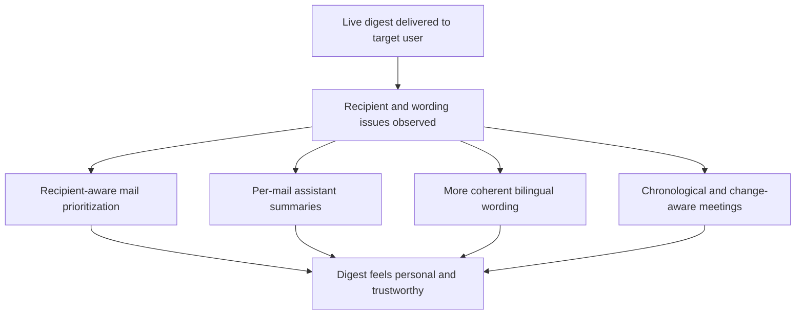

## req_031_day_captain_recipient_aware_digest_identity_mail_summaries_language_coherence_and_meeting_chronology - Day Captain recipient-aware digest identity, mail summaries, language coherence, and meeting chronology
> From version: 1.4.2
> Status: Done
> Understanding: 100%
> Confidence: 98%
> Complexity: Medium
> Theme: Product Quality
> Reminder: Update status/understanding/confidence and references when you edit this doc.

# Needs
- Make the digest explicitly aware of the target recipient identity so it speaks to the correct person without requiring per-user manual reminders and can better surface items directly addressed to that user.
- Add a short, useful summary for every surfaced mail card instead of relying mainly on lightly cleaned body excerpts.
- Keep the digest language more coherent when source emails are in English, especially inside `En bref`, so translation does not reduce comprehension.
- Restore trustworthy chronological ordering and clearer change visibility for upcoming meetings.

# Context
- Fresh user feedback from a target digest user shows that the digest still mixes product polish issues with correctness issues in the assistant layer.
- The delivered export demonstrates a gap between the mailbox owner identity and the wording surfaced in the digest: the brief can still mention the recipient inside content, but the system does not reliably behave as if it knows it is writing to the target digest user from the existing target-user context alone.
- The current French rendering can translate or paraphrase English mail content in a way that makes the original meaning harder to understand, especially in `En bref`.
- The user expects stronger anchors in the digest cards, such as the supplier name or internal topic title, plus a short assistant-style summary for each email.
- The upcoming meetings section currently breaks a core trust signal because the list is not strictly chronological; the sample shows a 10:00 meeting rendered after an 11:00 meeting.
- The same feedback also suggests higher visibility for overnight meeting changes such as `cancelled`, `moved`, or `new meeting`, especially in the top summary.

# In scope
- recipient-aware identity resolution for the target digest user from the existing digest target context, including display-name awareness where available
- bounded prioritization or wording improvements for emails clearly addressed to the target user
- per-mail brief summaries that stay grounded in the source message and can use the LLM layer when configured
- language-policy adjustments so English-source meaning remains understandable in French digests, including deliberate FR-English terminology when safer than forced translation
- strict chronological ordering for upcoming meetings
- clearer emphasis for overnight meeting state changes when they affect the day plan

# Out of scope
- a broad redesign of the digest visual layout
- multilingual translation beyond the bounded French/English product behavior already present in the digest
- contact resolution from external directories beyond the identity data already available to Day Captain
- deeper calendar workflow changes such as RSVP management or meeting rescheduling actions

# Acceptance criteria
- AC1: The digest reliably knows which target user it is addressing from the existing target-user context and can use that identity to improve wording and relevance, including better handling of emails directly addressed to that user.
- AC2: Each surfaced mail card contains a short assistant-style summary that is more informative than a raw excerpt and remains grounded in the mail source.
- AC3: French digest wording no longer harms comprehension of English-source content; `En bref` and related summaries preserve key English terms or mixed FR-English wording when that is clearer than forced translation.
- AC4: Upcoming meetings are rendered in strict chronological order, and relevant overnight changes such as cancelled, moved, or newly added meetings are made clearly visible.
- AC5: Tests and docs are updated to reflect recipient-aware behavior, summary generation expectations, language-coherence rules, and meeting ordering guarantees.

# Risks and dependencies
- Recipient-aware heuristics can overfit to one user identity if the multi-user contract is not kept explicit and mailbox-scoped.
- Per-mail summaries can become repetitive or hallucinated if the LLM layer is not tightly bounded by deterministic source inputs and fallback rules.
- Preserving mixed FR-English terminology can feel inconsistent if the policy is not explicit and stable across sections.
- Meeting change prominence must remain helpful without overwhelming the digest on busy calendar days.

# AC Traceability
- AC1 -> `item_058_day_captain_recipient_aware_digest_identity_and_direct_address_relevance`. Proof: this item explicitly targets mailbox-target identity awareness and emails addressed to the digest recipient.
- AC2 -> `item_059_day_captain_per_mail_assistant_summaries`. Proof: this item explicitly requires a short assistant-style summary on every surfaced mail card.
- AC3 -> `item_060_day_captain_french_digest_bilingual_term_preservation`. Proof: this item explicitly targets translation quality and mixed terminology safety.
- AC4 -> `item_061_day_captain_meeting_chronology_and_overnight_change_highlighting`. Proof: this item explicitly targets meeting ordering correctness and overnight change visibility.
- AC5 -> `item_058_day_captain_recipient_aware_digest_identity_and_direct_address_relevance`, `item_059_day_captain_per_mail_assistant_summaries`, `item_060_day_captain_french_digest_bilingual_term_preservation`, and `item_061_day_captain_meeting_chronology_and_overnight_change_highlighting`. Proof: closure requires aligned tests and docs across the full slice.

# Definition of Ready (DoR)
- [x] Problem statement is explicit and user impact is clear.
- [x] Scope boundaries (in/out) are explicit.
- [x] Acceptance criteria are testable.
- [x] Dependencies and known risks are listed.

# Backlog
- `item_058_day_captain_recipient_aware_digest_identity_and_direct_address_relevance` - Make the digest recipient-aware and improve direct-address relevance. Status: `Done`.
- `item_059_day_captain_per_mail_assistant_summaries` - Add short assistant-style summaries for every surfaced mail card. Status: `Done`.
- `item_060_day_captain_french_digest_bilingual_term_preservation` - Preserve key English terms and bilingual coherence in French digests. Status: `Done`.
- `item_061_day_captain_meeting_chronology_and_overnight_change_highlighting` - Render meetings in chronological order and highlight overnight changes. Status: `Done`.
- `task_036_day_captain_recipient_aware_digest_logic_and_meeting_correctness_orchestration` - Orchestrate recipient-aware digest identity, per-mail summaries, bilingual wording, and meeting correctness. Status: `Done`.

# Notes
- Created on Tuesday, March 10, 2026 from direct user feedback on the delivered morning digest for the target digest user.
- The main product issue is no longer raw rendering quality; it is trust in the assistant wording and the correctness of who the digest is for.
- This request intentionally keeps the scope on digest logic and editorial behavior rather than email layout redesign.
- Synchronization note: the newer `req_033_day_captain_per_thread_and_per_meeting_assistant_briefings_with_confidence_scoring` now carries the primary execution path for replacing the mechanical summary system, including thread-centric mail briefings, richer meeting briefings, confidence signals, `En bref` regeneration, and all-day presence-event handling.
- Synchronization note: `req_031` remains the originating user-feedback umbrella for recipient-aware identity and bilingual wording needs, while overlapping mail-summary and meeting-interpretation work should be executed through `task_038_day_captain_assistant_briefings_confidence_and_overview_orchestration` rather than duplicated independently.
- Completed on Tuesday, March 10, 2026 after the synchronized implementation path delivered recipient-aware wording, grounded assistant mail summaries, bounded bilingual coherence for English-source content, and corrected meeting chronology/change visibility.
