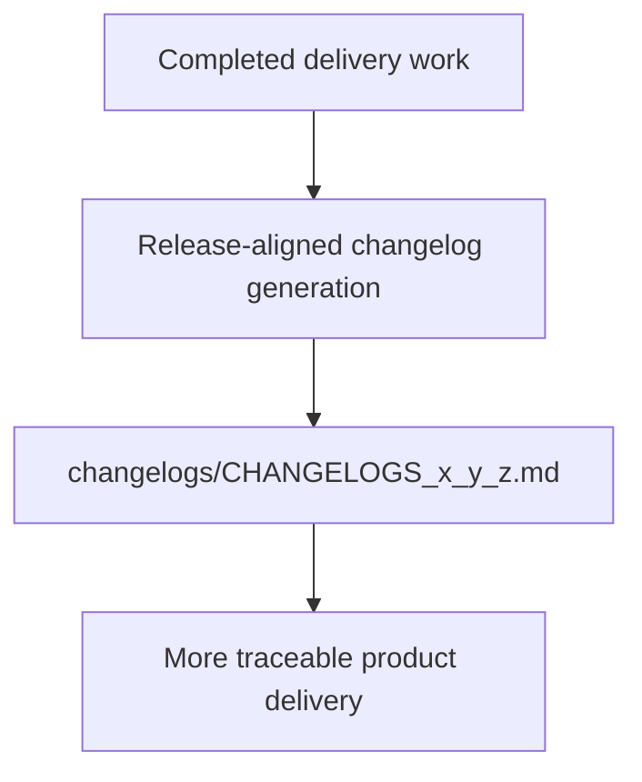

## req_032_day_captain_versioned_changelog_generation_and_delivery_closure_alignment - Day Captain versioned changelog generation and delivery closure alignment
> From version: 1.4.2
> Status: Draft
> Understanding: 96%
> Confidence: 94%
> Complexity: Medium
> Theme: Delivery Quality
> Reminder: Update status/understanding/confidence and references when you edit this doc.

# Needs
- Introduce a repository-level `changelogs/` folder for versioned changelog artifacts.
- Define a consistent changelog generation contract aligned with Day Captain delivery workflow, similar to the pattern already used in `electrical-plan-editor`.
- Make changelog generation part of delivery closure so completed work produces a user-facing release artifact tied to the real project version at completion time.

# Context
- Day Captain currently has Logics request/backlog/task documentation, but it does not yet keep versioned changelog artifacts under a dedicated `changelogs/` folder.
- The reference project `electrical-plan-editor` already uses a clear versioned changelog convention at repository root with files such as `changelogs/CHANGELOGS_1_4_1.md`.
- In that project, delivery tasks explicitly include changelog generation at closure time using the project version current when the task is finished, which avoids pre-guessing the release number.
- Day Captain already exposes its current version in `pyproject.toml` (`1.4.2` at the time this request was created), so the repo has a clear local source of truth for versioned changelog naming.
- The goal here is changelog artifact generation and process alignment, not yet a UI feed or in-product changelog reader.

# In scope
- add a root-level `changelogs/` convention for versioned Markdown changelog files
- define the Day Captain changelog filename pattern and source-of-truth version strategy
- align delivery tasks so changelog generation happens at closure time using the actual current project version
- update Logics/docs/process notes where needed so changelog generation is part of normal release-quality closure

# Out of scope
- building an in-app changelog feed or UI surface
- external changelog publishing to GitHub Releases, docs sites, or remote APIs
- backfilling the entire historical changelog archive unless explicitly requested later
- changing the existing request/backlog/task document model itself

# Acceptance criteria
- AC1: Day Captain defines a repository-level changelog artifact convention under `changelogs/` with a stable versioned filename format.
- AC2: The changelog version is derived from the real current project version at closure time rather than guessed in advance.
- AC3: Delivery orchestration/task guidance explicitly includes changelog generation as part of closure for shipped work.
- AC4: Tests or process validation cover the changelog contract where appropriate, and docs are updated to reflect the new workflow.

# Risks and dependencies
- If version resolution is not tied to a single source of truth, changelog filenames can drift from the shipped package version.
- If changelog generation is required too early, teams may create stale or incorrectly versioned artifacts before delivery is actually complete.
- Over-scoping this request into UI rendering or remote publishing would dilute the immediate delivery-value goal.

# AC Traceability
- AC1 -> `item_062_day_captain_versioned_changelog_artifact_contract`. Proof: this item explicitly defines the `changelogs/` artifact contract and filename convention.
- AC2 -> `item_062_day_captain_versioned_changelog_artifact_contract`. Proof: this item explicitly ties changelog naming to the real current project version.
- AC3 -> `item_063_day_captain_changelog_generation_delivery_closure_process_alignment`. Proof: this item explicitly adds changelog generation to delivery closure guidance.
- AC4 -> `item_062_day_captain_versioned_changelog_artifact_contract` and `item_063_day_captain_changelog_generation_delivery_closure_process_alignment`. Proof: closure requires both contract validation and workflow/documentation alignment.

# Definition of Ready (DoR)
- [x] Problem statement is explicit and user impact is clear.
- [x] Scope boundaries (in/out) are explicit.
- [x] Acceptance criteria are testable.
- [x] Dependencies and known risks are listed.

# Backlog
- `item_062_day_captain_versioned_changelog_artifact_contract` - Define the `changelogs/` artifact contract and versioned filename strategy. Status: `Draft`.
- `item_063_day_captain_changelog_generation_delivery_closure_process_alignment` - Align delivery closure workflow and docs with changelog generation. Status: `Draft`.
- `task_037_day_captain_versioned_changelog_generation_and_delivery_alignment` - Orchestrate changelog artifact conventions and delivery-closure alignment. Status: `Draft`.

# Notes
- Created on Tuesday, March 10, 2026 from product/process direction to add versioned changelog generation to Day Captain.
- This request intentionally mirrors the useful parts of the `electrical-plan-editor` pattern without assuming a changelog UI surface in Day Captain.
