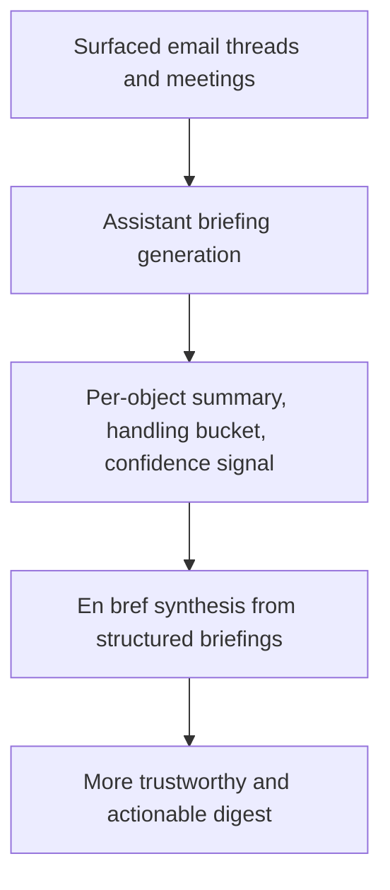

## req_033_day_captain_per_thread_and_per_meeting_assistant_briefings_with_confidence_scoring - Day Captain per-thread and per-meeting assistant briefings with confidence scoring
> From version: 1.4.2
> Status: Done
> Understanding: 100%
> Confidence: 98%
> Complexity: High
> Theme: Product Quality
> Reminder: Update status/understanding/confidence and references when you edit this doc.

# Needs
- Replace the current overly mechanical digest-summary behavior with assistant-style briefings for each surfaced email thread and each surfaced meeting.
- For each surfaced email thread, synthesize the message plus prior replies into a short account of what the thread is about and what the user should do with it.
- For each surfaced meeting, generate a short assistant briefing explaining why it matters now and what, if anything, the user should do or prepare.
- Keep an explicit bounded handling outcome for each object, such as `action_to_take`, `watch`, `noise`, or equivalent finalized bucket labels.
- Add a confidence signal per mail-thread and per meeting briefing so the user can see whether the generated account looks reliable or should be treated cautiously.
- Make `En bref` derive from these structured assistant briefings instead of from the older excerpt-oriented summary path.

# Context
- The current digest has improved visually, but parts of the summary layer still read like cleaned excerpts or lightweight mechanical rewrites rather than a true assistant account of what happened.
- Recent product direction now favors sending richer source context to the LLM for each surfaced object, especially the full email thread/reply chain when available, so the system can explain the conversation instead of merely trimming it.
- The same expectation now applies to meetings listed in the digest: the user wants a useful short briefing rather than a thin agenda line or title-derived summary.
- Some calendar entries carry domain-specific meaning that the system cannot infer safely without an explicit rule. In this product context, all-day agenda entries such as `Site- Horizon`, `Télétravail`, and similar cases can indicate the person’s physical location or day-presence status rather than a meeting.
- This shift is larger than a wording polish pass because it changes the core digest contract from excerpt cleanup to structured per-object interpretation.
- Confidence must not look like a fake scientific probability. If a numeric score is shown, it should be accompanied by a bounded label and a short reason grounded in observable factors such as thread completeness, action explicitness, ambiguity, or thin meeting context.
- The project already contains bounded LLM behavior and deterministic fallback patterns; this request should extend that model rather than replacing it with unbounded freeform prompting over the full mailbox.
- Product direction for the first implementation pass is to preserve the existing high-level handling logic rather than invent a broader taxonomy, so the generated outputs should still map back to the current buckets such as action-oriented items, watch items, and noise.
- Product direction for confidence presentation is to show a score together with a label and a short reason, because the confidence signal should be legible and explainable to the user.
- Product direction for thread context is to start by using the full available surfaced thread when possible, while still allowing an explicit maximum-size safeguard if very large threads prove costly or slow in practice.
- Product direction for meeting briefings is to use extra related context when available, not only the bare calendar event, because that should produce more useful briefings than agenda metadata alone.
- Product direction for all-day agenda entries that encode presence or physical location is to isolate them as daily presence events rather than treating them like ordinary meetings.
- Product direction for low-confidence outputs is to keep the assistant briefing visible with an explicit warning or explanation, and only fall back to a more mechanical rendering when the generated result is unusable.
- Product direction for `En bref` is to synthesize only the important surfaced briefings rather than recapping every single mail and meeting equally.

# In scope
- per-thread assistant briefings for surfaced mail cards using the selected email plus available prior replies/context
- per-meeting assistant briefings for surfaced upcoming meetings
- classification of qualifying all-day agenda entries as daily presence events rather than ordinary meetings
- a bounded per-object output contract including summary, recommended handling, bucket, and confidence metadata
- confidence presentation with at least a score and a short explanation/reason
- confidence presentation with a score, a label, and a short reason
- replacing the existing excerpt-oriented summary path where these new briefings are available
- generating `En bref` from the important structured mail and meeting briefings rather than from older mechanical summaries
- deterministic fallback behavior when LLM usage is disabled, bounded out, or unusable

# Out of scope
- sending arbitrary full-mailbox history or all unsurfaced messages to the LLM
- autonomous email or calendar actions
- a broad visual redesign of the digest layout
- hidden or opaque confidence math that cannot be explained in product terms
- new meeting-management features such as RSVP changes, rescheduling, or note-taking workflows
- a generalized workplace-presence platform beyond the explicit all-day agenda rules needed by the digest

# Acceptance criteria
- AC1: Each surfaced email card can include a short assistant-style briefing derived from the email thread context, describing what the thread is about and what the user should do with it.
- AC2: Each surfaced meeting entry can include a short assistant-style briefing describing why the meeting matters now and whether any preparation, follow-up, or monitoring is needed.
- AC2 supporting rule: qualifying all-day agenda entries that represent presence or location signals are isolated as daily presence events rather than summarized as ordinary meetings.
- AC3: Each generated mail-thread or meeting briefing includes a bounded handling outcome mapped to the current digest logic rather than a newly expanded open-ended taxonomy.
- AC4: Each generated mail-thread or meeting briefing includes a confidence signal with a bounded score, a label, and a short reason, and the confidence signal is presented as guidance rather than as unexplained certainty.
- AC5: When a generated briefing is low-confidence but still usable, the digest keeps it visible with its confidence signal rather than silently hiding it; when generation is unusable, deterministic fallback remains available.
- AC6: `En bref` is generated from the important structured per-thread and per-meeting briefings instead of primarily from excerpt-like summaries or older mechanical wording paths.
- AC7: The implementation remains bounded in cost and scope: only surfaced objects and limited thread/meeting context are sent to the LLM, with deterministic fallback behavior when generation fails or is disabled, even if the first pass aims to include the full available surfaced thread when practical.
- AC8: Tests and docs are updated to cover representative per-thread summaries, per-meeting summaries with extra related context, daily presence-event classification, handling-bucket outcomes, confidence metadata behavior, low-confidence rendering, and `En bref` synthesis from the new structured inputs.

# Risks and dependencies
- Sending too much thread history can create avoidable cost and latency if the per-object context window is not explicitly bounded.
- A generated recommended handling can become misleading if the model is allowed to infer actions that are not actually supported by the mail or meeting source.
- Confidence scoring can undermine trust if it looks arbitrary, overly precise, or inconsistent across similar cases.
- Meeting briefings may be thin or low-confidence when calendar metadata is sparse, so fallback rules must remain useful even with weak source detail.
- This request depends on preserving the existing safety model where structured deterministic behavior remains available when LLM output is absent or invalid.

# Notes
- Created on Tuesday, March 10, 2026 from product direction to replace the current mechanical summary system with per-object assistant briefings.
- This request intentionally goes beyond the narrower per-mail-summary request because it also covers meeting briefings, explicit handling outcomes, confidence signals, and `En bref` regeneration from those structured outputs.
- Synchronization note: `req_033` is now the primary execution path for the summary-system replacement. Older overlapping draft work from `req_031` should be synchronized here rather than implemented in parallel.

# Definition of Ready (DoR)
- [x] Problem statement is explicit and user impact is clear.
- [x] Scope boundaries (in/out) are explicit.
- [x] Acceptance criteria are testable.
- [x] Dependencies and known risks are listed.

# Backlog
- `item_064_day_captain_per_thread_assistant_briefings_and_handling_contract` - Add structured assistant briefings and mapped handling outcomes for surfaced email threads. Status: `Done`.
- `item_065_day_captain_per_meeting_assistant_briefings_with_related_context` - Add assistant briefings for surfaced meetings using related context when available. Status: `Done`.
- `item_066_day_captain_digest_confidence_signals_and_low_confidence_fallback_behavior` - Add score, label, reason confidence signals plus low-confidence/fallback behavior. Status: `Done`.
- `item_067_day_captain_overview_synthesis_from_structured_assistant_briefings` - Rebuild `En bref` from important structured assistant briefings. Status: `Done`.
- `item_068_day_captain_all_day_presence_event_classification_and_rendering` - Isolate qualifying all-day agenda entries as daily presence events rather than ordinary meetings. Status: `Done`.
- `task_038_day_captain_assistant_briefings_confidence_and_overview_orchestration` - Orchestrate mail-thread briefings, meeting briefings, confidence behavior, and overview regeneration. Status: `Done`.
