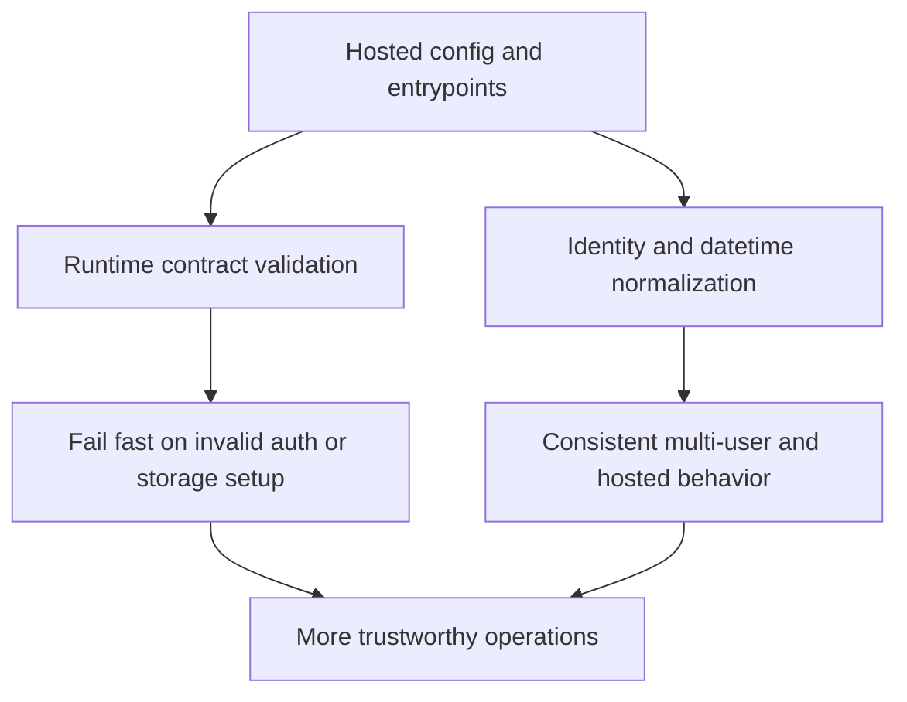

## req_034_day_captain_hosted_runtime_fail_fast_and_identity_normalization - Day Captain hosted runtime fail-fast, durable execution, and identity normalization
> From version: 1.5.0
> Status: Ready
> Understanding: 97%
> Confidence: 95%
> Complexity: High
> Theme: Reliability
> Reminder: Update status/understanding/confidence and references when you edit this doc.

# Needs
- Make hosted Day Captain fail fast when Graph/runtime prerequisites are not actually satisfied, instead of silently falling back to stub collectors or fake-empty execution paths.
- Prevent delegated Graph auth from reusing expired cached access tokens when refresh is unavailable or fails, so auth errors stay explicit and diagnosable.
- Tighten hosted runtime prerequisites so deployments that are expected to be durable do not quietly run on ephemeral local storage or file-based token cache behavior.
- Normalize target-user identity handling consistently across config, runtime, hosted jobs, and email-command routing so mailbox identifiers behave predictably regardless of casing.
- Unify ISO datetime parsing behavior across model, CLI, and web entrypoints so standard `Z`-suffixed timestamps do not succeed in one layer and fail in another.

# Context
- The current codebase is already materially stronger on digest rendering and digest usefulness, but the latest review surfaced several runtime-contract weaknesses that are more likely to fail in production than in local happy-path tests.
- Hosted execution still allows configuration shapes where the app can assemble with `StubAuthProvider`, `StaticMailCollector`, or `StaticCalendarCollector` instead of failing explicitly when Graph access is expected but not really configured.
- Delegated auth currently has a branch where an expired cached token can still be reused if no refresh path is available, which moves the failure later into Graph calls and makes the root cause harder to understand.
- Hosted execution supports durable backends such as Postgres and database-backed token cache, but the current contract still permits operationally weak configurations that can lose run history, feedback, or auth state on restart.
- Multi-user and email-command routing logic already normalize some mailbox identifiers to lowercase, but target-user validation and resolution remain case-sensitive in places, which creates avoidable mismatches.
- The project already has a shared datetime parser in the domain model that accepts common Graph-style `Z` timestamps, yet the CLI and hosted web surface still use raw `datetime.fromisoformat()` parsing in their own entrypoints.
- These issues are not primarily product-polish work; they are runtime-trust issues because they can make the system appear healthy while behaving incorrectly, inconsistently, or opaquely under real conditions.

# In scope
- fail-fast runtime rules for hosted environments when Graph auth prerequisites are missing or incompatible with the selected execution mode
- eliminating silent fallback to stub auth/mail/calendar behavior in hosted execution paths that are expected to use Microsoft Graph
- stricter delegated-auth handling so expired cached tokens are not reused when refresh cannot succeed
- clarifying or enforcing durable hosted storage expectations for run history, feedback, and token cache persistence
- normalization of configured target users and runtime target-user comparisons so case-only differences do not cause false mismatches
- alignment of email-command sender routing and target-user resolution with the same normalization policy
- shared datetime parsing behavior across model, CLI, and web entrypoints for standard ISO inputs including `Z`
- tests and docs for these runtime-contract guarantees

# Out of scope
- a redesign of digest content, ranking, or briefing quality
- new calendar or mail product features beyond the runtime-contract issues above
- rewriting the separate `logics/skills` submodule
- changing the existing high-level hosted HTTP surface or introducing a new web framework
- broad secret-management or vault integration beyond the current environment-variable model

# Acceptance criteria
- AC1: In hosted environments, if Graph-backed execution is expected but required auth/runtime prerequisites are missing, the app fails explicitly during validation or bootstrap instead of silently falling back to stub collectors/providers.
- AC2: Delegated auth never reuses an expired cached access token when refresh is unavailable or unsuccessful; the failure remains explicit and points to re-authentication or config repair.
- AC3: Hosted runtime validation clearly enforces or documents durable storage expectations so production-like deployments do not quietly run on ephemeral local state when durable behavior is required.
- AC4: Target-user resolution and validation are normalized consistently enough that mailbox identifiers differing only by case do not cause false rejections in multi-user or email-command flows.
- AC5: CLI and hosted web entrypoints accept the same standard ISO datetime inputs as the shared model layer, including `Z`-suffixed UTC timestamps.
- AC6: Tests cover representative hosted misconfiguration, expired delegated token, case-normalized target-user resolution, email-command routing, and datetime parsing scenarios.
- AC7: Docs and operational guidance reflect the stricter hosted runtime contract and the normalization behavior.

# Risks and dependencies
- Tightening hosted validation can intentionally break previously tolerated but weak configurations, so operator-facing guidance must be updated alongside the code.
- Removing silent fallback paths may surface setup problems earlier in environments that currently “appear to work” with empty or stubbed output.
- Identity normalization must remain mailbox-safe and should not accidentally conflate distinct non-email identifiers if the product ever supports them.
- Stricter durable-storage expectations may require explicit deployment decisions for environments that currently rely on SQLite or file cache for convenience.

# AC Traceability
- AC1 -> `item_069_day_captain_hosted_fail_fast_and_durable_runtime_contract`. Proof: this item explicitly removes misleading hosted fallback behavior and tightens runtime prerequisites.
- AC2 -> `item_070_day_captain_delegated_token_freshness_and_explicit_auth_failures`. Proof: this item is dedicated to delegated token freshness and explicit auth failure behavior.
- AC3 -> `item_069_day_captain_hosted_fail_fast_and_durable_runtime_contract`. Proof: durable hosted storage expectations are part of the hosted runtime contract slice.
- AC4 -> `item_071_day_captain_target_user_normalization_and_entrypoint_datetime_alignment`. Proof: this item explicitly targets mailbox-identifier normalization across runtime paths.
- AC5 -> `item_071_day_captain_target_user_normalization_and_entrypoint_datetime_alignment`. Proof: this item explicitly targets parser alignment across model, CLI, and web entrypoints.
- AC6 -> `item_069_day_captain_hosted_fail_fast_and_durable_runtime_contract`, `item_070_day_captain_delegated_token_freshness_and_explicit_auth_failures`, and `item_071_day_captain_target_user_normalization_and_entrypoint_datetime_alignment`. Proof: the required tests are distributed across the three implementation slices.
- AC7 -> `item_069_day_captain_hosted_fail_fast_and_durable_runtime_contract`, `item_070_day_captain_delegated_token_freshness_and_explicit_auth_failures`, and `item_071_day_captain_target_user_normalization_and_entrypoint_datetime_alignment`. Proof: docs and operational guidance must stay aligned across the hosted/runtime/auth/entrypoint slices.

# Notes
- Created on Tuesday, March 10, 2026 from a project-wide review focused on runtime trust, operational safety, and cross-entrypoint consistency.
- This request is intentionally reliability-oriented: the goal is to make failures explicit, configuration safer, and behavior consistent across hosted, CLI, and multi-user paths.
- The expected implementation slice should stay bounded and pragmatic: tighten contracts, remove misleading fallback behavior, normalize identity parsing, and add regression coverage rather than redesigning the product surface.

# Definition of Ready (DoR)
- [x] Problem statement is explicit and user impact is clear.
- [x] Scope boundaries (in/out) are explicit.
- [x] Acceptance criteria are testable.
- [x] Dependencies and known risks are listed.

# Backlog
- `item_069_day_captain_hosted_fail_fast_and_durable_runtime_contract` - Make hosted runtime fail fast and tighten durable execution prerequisites. Status: `Ready`.
- `item_070_day_captain_delegated_token_freshness_and_explicit_auth_failures` - Prevent expired delegated token reuse and keep auth failures explicit. Status: `Ready`.
- `item_071_day_captain_target_user_normalization_and_entrypoint_datetime_alignment` - Normalize target-user identity and align datetime parsing across entrypoints. Status: `Ready`.
- `task_039_day_captain_hosted_runtime_reliability_and_normalization_orchestration` - Orchestrate hosted runtime fail-fast behavior, auth freshness, identity normalization, and parser alignment. Status: `Ready`.
