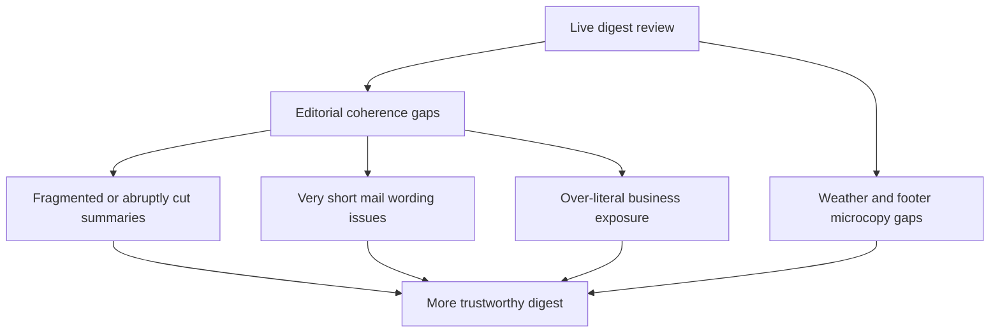

## req_035_day_captain_digest_summary_coherence_privacy_weather_and_footer_polish - Day Captain digest summary coherence, privacy-safe wording, weather rain signal, and footer polish
> From version: 1.5.1
> Status: Ready
> Understanding: 100%
> Confidence: 97%
> Complexity: Medium
> Theme: Product Quality
> Reminder: Update status/understanding/confidence and references when you edit this doc.

# Needs
- Prevent digest summaries from starting mid-sentence, cutting off awkwardly, or reading like raw pasted mail fragments.
- Let item summaries stay long enough to remain coherent when important context needs a full phrase, instead of stopping abruptly after a location or clause.
- Use a more generous but still bounded summary length policy, with limits that can vary by item type instead of one rigid cap for every card.
- Improve handling of very short direct emails so lines such as `Voici !` do not produce weak or unnatural assistant wording.
- Ensure that surfaced mail summaries systematically use older thread context to strengthen the synthesis, not only as a fallback for very short last replies.
- Make `En bref` more action-oriented and reduce repetitive confidence verbosity on every card.
- Ensure the digest wording does not expose business-sensitive raw content more literally than needed; assistant outputs should abstract and summarize rather than echo source fragments too directly.
- Keep repository fixtures and implementation artifacts synthetic: business-sensitive mail/content fragments should not be copied into code, tests, or docs in the repo.
- Extend the weather line so the user can also see whether rain is expected.
- Show when an upcoming meeting is part of a recurrence, so repeated rituals are distinguishable from one-off meetings.
- Replace the quick-actions intro copy with wording that explains what the buttons do, then add a small Day Captain copyright footer.

# Context
- The current digest structure is now solid, but live samples still expose editorial weaknesses that reduce product credibility.
- Some summaries visibly begin in the middle of a sentence or stop too early, which makes them feel like partially cleaned excerpts rather than assistant briefings.
- Recent live samples also show that a short direct message like `Voici !` is not enough on its own to support a natural sentence such as `Vous êtes attendu sur ce point : Voici !`.
- More broadly, the summarization path should not treat the latest reply as the only meaningful input. Older thread content should routinely reinforce the visible synthesis, while staying bounded and abstract enough for digest use.
- The digest is useful precisely because it condenses mailbox and calendar information; if it starts surfacing raw business fragments too literally, it can feel noisy and can expose more operational detail than necessary.
- The same caution applies to implementation artifacts: improving wording quality must not lead to real business mail fragments being embedded into tests, fixtures, prompts, or docs in the repository.
- The weather capsule is already present and useful, but the live digest would benefit from a clearer rain signal because that is often the practical decision input the user cares about.
- Upcoming meetings are readable, but the digest still does not explicitly tell the user when a meeting is a recurrence, which reduces context on whether an event is a routine ritual or a one-off.
- The bottom quick-actions currently function correctly, but the intro micro-copy does not explain the purpose of each button, and the mail lacks a small branded closing line.

# In scope
- summary-cleanup rules or bounded wording logic that avoid mid-sentence starts and abrupt hard stops
- relaxing the current summary-length cap enough to preserve coherent phrasing when needed
- allowing visibly longer summaries when needed, as long as they remain bounded and readable
- variable summary-length limits by item type such as mail cards, meeting cards, and `En bref`
- better handling of very short direct messages in assistant-style summaries
- systematic use of older thread context to reinforce surfaced thread synthesis, while keeping the prompt bounded
- more action-oriented `En bref` wording and lighter confidence copy on cards
- privacy-safe digest wording that prefers abstraction over raw business-fragment carry-over
- weather copy that indicates rain expectation when the weather data supports it
- nuanced weather copy that can distinguish a dry day from rain risk or likely showers when the data supports that level of wording
- meeting-copy or rendering support for a visible recurrence indicator when calendar metadata supports it
- quick-actions intro copy that explains the purpose of the recall buttons
- a small Day Captain footer/copyright line in the mail rendering, with a hyperlink on the Day Captain text to the GitHub repository
- tests and docs for the refined wording and rendering behavior

# Out of scope
- a broad redesign of the digest layout or card structure
- hiding all business meaning from the digest; the goal is safer abstraction, not generic empty summaries
- a full privacy-classification or redaction platform
- changes to auth, hosted runtime, or delivery infrastructure
- replacing the weather provider or introducing a new external forecast dependency beyond the current weather contract
- deeper calendar-workflow features beyond exposing recurrence as a visible indicator

# Acceptance criteria
- AC1: Item summaries no longer start mid-sentence or stop at visibly awkward cut points on representative live-like cases, and the bounded summary length is relaxed enough to preserve a coherent phrase when needed.
- AC1 supporting rule: summary-length bounds can vary by item type when that improves coherence without making cards unreadably dense.
- AC2: Very short direct messages are rendered with more natural assistant wording than a literal `Vous êtes attendu sur ce point : Voici !` style output.
- AC2 supporting rule: surfaced mail summaries use older thread context by default to reinforce the synthesis when relevant, instead of summarizing the last visible reply in isolation.
- AC3: Digest wording remains useful without echoing raw business fragments more literally than necessary; representative summaries and `En bref` are more abstract, more action-oriented, and less excerpt-like.
- AC3 supporting rule: repository code, tests, prompts, fixtures, and docs use synthetic examples only and do not embed real business mail fragments as implementation material.
- AC4: Confidence presentation remains visible but lighter, with shorter reason copy that keeps card scanning easier.
- AC5: The weather line can indicate whether rain is expected when the configured forecast data supports that signal, with more nuance than a simple binary yes/no where the data allows it.
- AC6: Upcoming meetings can visibly indicate when they are part of a recurrence, when the available calendar data supports that distinction.
- AC6 supporting rule: the recurrence indicator stays discreet, and can use a short frequency-aware label when the metadata supports it.
- AC7: The quick-actions area explains what the buttons do, and the digest includes a small `Day Captain © YEAR` footer line with the Day Captain text linked to the GitHub repository.
- AC8: Tests and docs are updated to cover summary coherence, short-message handling, privacy-safe abstraction, repository fixture hygiene, nuanced rain copy, recurrence indication, and footer/quick-actions wording.

# Risks and dependencies
- Relaxing summary length too much can make cards denser and less scannable if the new bounds are not still enforced carefully.
- More abstract wording can accidentally hide important specificity if heuristics overcorrect away from the source content.
- Rain wording must stay grounded in the actual weather payload and should not imply precision the provider does not expose.
- Footer and quick-actions copy changes must remain Outlook-safe and visually quiet.

# AC Traceability
- AC1 -> `item_072_day_captain_digest_summary_coherence_length_and_short_message_handling`. Proof: this item explicitly targets coherent summary boundaries, longer safe phrasing, and stronger use of thread context.
- AC1 supporting rule -> `item_072_day_captain_digest_summary_coherence_length_and_short_message_handling`. Proof: variable bounds by item type are part of the same summary-coherence contract.
- AC2 -> `item_072_day_captain_digest_summary_coherence_length_and_short_message_handling`. Proof: very short direct-mail handling belongs to the same summary-quality slice.
- AC2 supporting rule -> `item_072_day_captain_digest_summary_coherence_length_and_short_message_handling`. Proof: this item explicitly requires older thread context to reinforce visible synthesis by default.
- AC3 -> `item_073_day_captain_digest_privacy_safe_abstraction_and_action_oriented_overview`. Proof: this item explicitly covers privacy-safe abstraction and more action-oriented digest wording.
- AC3 supporting rule -> `item_073_day_captain_digest_privacy_safe_abstraction_and_action_oriented_overview`. Proof: repository fixture hygiene is part of the same privacy-safe output contract.
- AC4 -> `item_073_day_captain_digest_privacy_safe_abstraction_and_action_oriented_overview`. Proof: lighter confidence copy is part of the same editorial-output contract.
- AC5 -> `item_074_day_captain_digest_weather_rain_signal_copy`. Proof: this item exists to surface a rain expectation in the weather line when data allows it.
- AC6 -> `item_076_day_captain_digest_meeting_recurrence_indicator`. Proof: this item explicitly covers visible recurrence indication on meeting cards.
- AC6 supporting rule -> `item_076_day_captain_digest_meeting_recurrence_indicator`. Proof: the discreet badge/label behavior belongs to the same recurrence-indicator slice.
- AC7 -> `item_075_day_captain_digest_quick_actions_explainer_and_footer_microcopy`. Proof: this item explicitly covers the bottom helper copy and the new footer line.
- AC8 -> `item_072_day_captain_digest_summary_coherence_length_and_short_message_handling`, `item_073_day_captain_digest_privacy_safe_abstraction_and_action_oriented_overview`, `item_074_day_captain_digest_weather_rain_signal_copy`, `item_075_day_captain_digest_quick_actions_explainer_and_footer_microcopy`, and `item_076_day_captain_digest_meeting_recurrence_indicator`. Proof: closure requires aligned coverage across wording, weather, meeting metadata, and footer slices.

# Definition of Ready (DoR)
- [x] Problem statement is explicit and user impact is clear.
- [x] Scope boundaries (in/out) are explicit.
- [x] Acceptance criteria are testable.
- [x] Dependencies and known risks are listed.

# Backlog
- `item_072_day_captain_digest_summary_coherence_length_and_short_message_handling` - Fix fragmented summaries, relax hard stops, and improve short-message rendering. Status: `Ready`.
- `item_073_day_captain_digest_privacy_safe_abstraction_and_action_oriented_overview` - Reduce over-literal business carry-over and make overview/confidence wording more action-oriented. Status: `Ready`.
- `item_074_day_captain_digest_weather_rain_signal_copy` - Add a rain expectation signal to the weather line when forecast data supports it. Status: `Ready`.
- `item_075_day_captain_digest_quick_actions_explainer_and_footer_microcopy` - Explain the quick-action buttons and add a small Day Captain footer line. Status: `Ready`.
- `item_076_day_captain_digest_meeting_recurrence_indicator` - Expose a visible recurrence indicator on meeting cards when calendar metadata supports it. Status: `Ready`.
- `task_040_day_captain_digest_editorial_privacy_weather_and_footer_orchestration` - Orchestrate summary coherence, privacy-safe wording, weather rain copy, and footer microcopy. Status: `Ready`.

# Notes
- Created on Wednesday, March 11, 2026 from live Outlook review of the `1.5.1` digest.
- This request is a follow-up quality slice on top of the structured-briefing system: the structure is now solid, and the remaining work is about better editorial output, safer abstraction, and final visible polish.
- Privacy note: this request explicitly prefers summarization and abstraction over raw business-fragment carry-over in visible digest copy.
