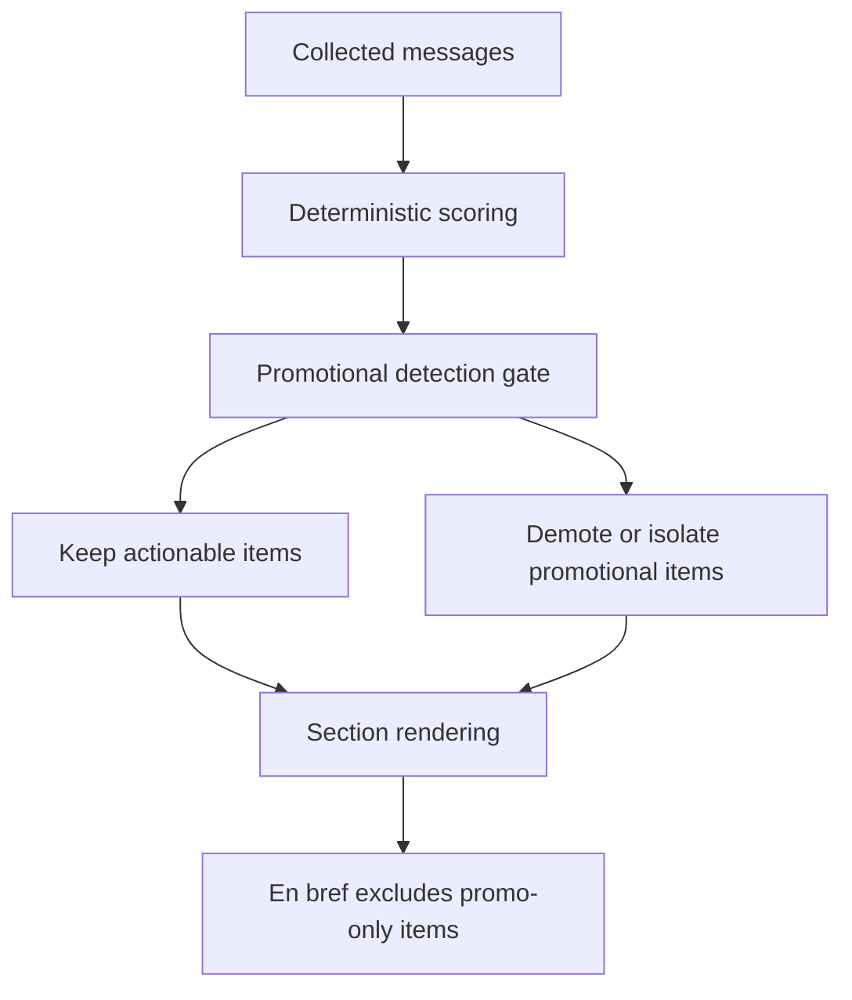

## req_036_day_captain_promotional_mail_detection_and_digest_deprioritization - Day Captain promotional mail detection and digest deprioritization
> From version: 1.5.2
> Status: Done
> Understanding: 100%
> Confidence: 98%
> Complexity: Medium
> Theme: Product Quality
> Reminder: Update status/understanding/confidence and references when you edit this doc.

# Needs
- Prevent clearly promotional or marketing-oriented emails from surfacing as `Actions à mener` / `Actions to take`.
- Prevent the same promotional items from being repeated in `En bref` / `In brief`.
- Add a bounded promotional-detection pass that can use the LLM when deterministic heuristics are not sufficient.
- Keep the product behavior explainable by demoting, isolating, or excluding promotional items rather than silently hallucinating a user action.

# Context
- A recent live digest surfaced a promotional email as an action item and then repeated it in the top summary, which reduced user trust in the digest.
- The current scoring pipeline already filters some obvious newsletter and cold-outreach noise, but targeted promotional mail can still pass when it contains action-like phrasing or looks directly addressed.
- The current LLM layer mainly rewrites already shortlisted items and synthesizes `En bref`; it does not currently provide a dedicated promotional classification step before section placement and overview synthesis.
- That means a bad candidate can first pass the deterministic scoring stage, then be made more credible by the wording layer, and finally be amplified again in `En bref`.
- Product direction is not to replace the current bounded deterministic system with an unbounded LLM inbox classifier. Promotional detection should stay explicitly bounded, explainable, and cheap enough for routine digest runs.
- Product direction also favors graceful handling over hard deletion: some commercial or vendor-originated emails may still be worth keeping visible at low prominence rather than pretending they are user actions.

# In scope
- a bounded promotional classification step for surfaced or borderline mail candidates
- combining deterministic heuristics with optional structured LLM classification when the heuristics alone are insufficient
- scoring and section-placement changes so promotional items are demoted, isolated in a low-prominence section, or excluded from the main action-oriented sections
- explicit protection so promotional items do not receive action-forward `À faire` / `Next step` wording by default
- explicit protection so promotional items do not feed `En bref` unless a stronger non-promotional signal overrides that decision
- tests and docs covering representative promotional false positives and bounded fallback behavior

# Out of scope
- broad spam filtering across the full mailbox
- autonomous unsubscribe or sender-blocking actions
- a fully general new inbox taxonomy beyond the bounded promotional handling needed by the digest
- unbounded LLM classification over all collected messages
- broad redesign of the digest layout outside the minimum rendering needed for lower-prominence promotional handling

# Acceptance criteria
- AC1: Representative promotional or marketing-style emails no longer surface in `Actions à mener` / `Actions to take` when they do not contain a genuine user-relevant operational action.
- AC2: Promotional items do not appear in `En bref` / `In brief` unless the item also carries a stronger validated non-promotional reason to be surfaced there.
- AC3: The implementation uses a bounded promotional-detection model that keeps deterministic heuristics as the first line and limits any LLM classification pass to surfaced or borderline candidates rather than the full mailbox.
- AC4: When an item is classified as promotional, the digest handles it safely and legibly: it is either excluded or rendered in a lower-prominence area with neutral wording rather than an action-forward recommendation.
- AC5: Deterministic fallback behavior remains available when LLM classification is disabled, unavailable, or returns unusable output.
- AC6: Tests and docs are updated to cover representative promotional false positives, scoring/section demotion behavior, overview exclusion, and fallback behavior.

# Risks and dependencies
- Over-aggressive promotional detection can demote legitimate vendor, partner, or commercial emails that really do need user action.
- A pure LLM-only approach would add avoidable cost, latency, and opacity; the implementation should preserve deterministic first-pass behavior.
- If promotional detection happens too late in the pipeline, the wording layer can continue to amplify bad candidates before they are corrected.
- A low-prominence promotional section can still become noisy if entry rules are too broad, so the rendering contract should stay bounded.
- This request depends on the existing structured-digest and overview-generation pipeline remaining explicitly controllable at the item and section level.

# AC Traceability
- AC1 -> `item_078_day_captain_promotional_digest_demotion_and_neutral_rendering`. Proof: this item owns the visible demotion of promotional mails out of action-oriented sections.
- AC2 -> `item_079_day_captain_promotional_overview_exclusion_and_fallbacks`. Proof: this item isolates the top-summary exclusion and override contract for promotional items.
- AC3 -> `item_077_day_captain_bounded_promotional_mail_classification`. Proof: this item defines the bounded heuristic-first plus optional LLM classification model.
- AC4 -> `item_078_day_captain_promotional_digest_demotion_and_neutral_rendering`. Proof: low-prominence rendering and neutral action wording belong to the same handling slice.
- AC5 -> `item_077_day_captain_bounded_promotional_mail_classification` and `item_079_day_captain_promotional_overview_exclusion_and_fallbacks`. Proof: both the classification fallback and the overview fallback contract must remain deterministic when LLM output is unavailable or unusable.
- AC6 -> `item_077_day_captain_bounded_promotional_mail_classification`, `item_078_day_captain_promotional_digest_demotion_and_neutral_rendering`, and `item_079_day_captain_promotional_overview_exclusion_and_fallbacks`. Proof: closure depends on aligned tests and docs across classification, rendering, and overview behavior.

# Definition of Ready (DoR)
- [x] Problem statement is explicit and user impact is clear.
- [x] Scope boundaries (in/out) are explicit.
- [x] Acceptance criteria are testable.
- [x] Dependencies and known risks are listed.

# Backlog
- `item_077_day_captain_bounded_promotional_mail_classification` - Add a bounded heuristic-first promotional classification step with optional structured LLM fallback for surfaced or borderline mail candidates. Status: `Ready`.
- `item_078_day_captain_promotional_digest_demotion_and_neutral_rendering` - Demote promotional items out of action-oriented digest sections and neutralize action-forward wording. Status: `Ready`.
- `item_079_day_captain_promotional_overview_exclusion_and_fallbacks` - Keep promotional items out of `En bref` unless a stronger validated non-promotional signal overrides that decision, with deterministic fallback behavior. Status: `Ready`.
- `task_041_day_captain_promotional_mail_handling_orchestration` - Orchestrate promotional classification, rendering demotion, overview exclusion, and regression coverage. Status: `Ready`.

# Notes
- Created on Wednesday, March 11, 2026 from live digest feedback where a promotional email was surfaced as an action item and repeated in `En bref`.
- The preferred implementation direction is heuristic-first with a bounded structured LLM pass for ambiguous surfaced candidates, not an unbounded mailbox-wide classifier.
- This request is intentionally about digest trust, ranking, and rendering behavior rather than a generic spam-filtering subsystem.
- Closed on Wednesday, March 11, 2026 after shipping bounded promotional detection, action-section demotion, neutral rendering, and overview exclusion with regression coverage.
