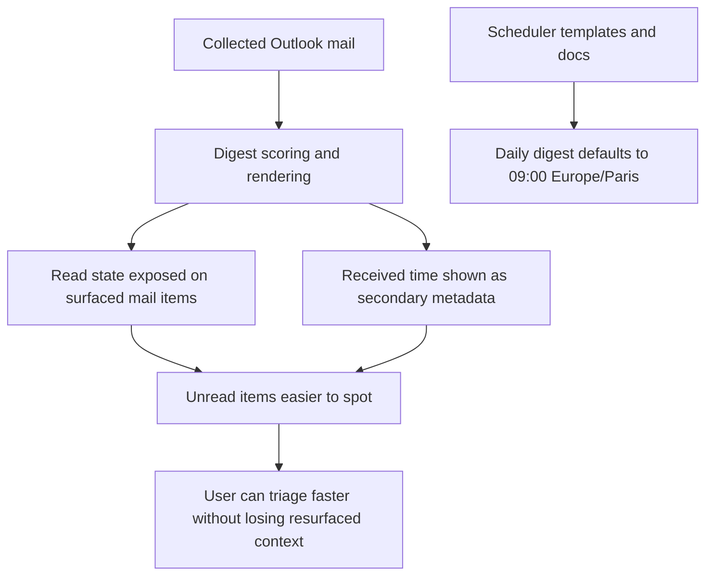

## req_037_day_captain_unread_mail_indicators_received_time_display_and_9am_daily_schedule - Day Captain unread mail indicators received time display and 9am daily schedule
> From version: 1.7.0
> Status: Ready
> Understanding: 95%
> Confidence: 92%
> Complexity: Medium
> Theme: UX
> Reminder: Update status/understanding/confidence and references when you edit this doc.

# Needs
- Make mail items in the digest easier to scan by showing whether the underlying message is still unread or has already been opened.
- Preserve the current benefit of resurfacing already opened emails, while making unread items immediately distinguishable through a visible indicator such as an `Unread` badge.
- Add the mail reception time as low-prominence metadata so the user can quickly judge message freshness without opening Outlook.
- Move the default daily digest schedule to `09:00 Europe/Paris`.

# Context
- Recent live usage highlighted a small but repeated friction point in the daily digest:
  - previously opened emails can still be valuable to resurface because they help the user rebuild context
  - however, the digest currently does not make it obvious whether a surfaced mail is still unread or has already been seen
  - that forces the user to infer freshness from memory instead of from an explicit visual cue
- The request is not to suppress already opened emails. Product direction is to keep them eligible when they remain relevant, but to expose their read state clearly enough that the user can prioritize unread content first.
- The request also asks for a lightweight reception-time hint on mail items. This should be secondary metadata, not a dominant visual element, because the main goal remains triage speed rather than detailed chronology.
- The daily digest scheduling expectation should shift from the current morning time to `09:00 Europe/Paris`, including the shipped scheduler defaults and operator-facing guidance that define the standard run time.
- This slice spans both user-visible digest rendering and the documented or templated scheduler contract.

# In scope
- mail-item rendering changes that expose whether a surfaced message is unread or already read
- a small secondary display of each surfaced mail item's reception time
- preserving the current ability to surface already opened but still relevant emails
- changing the standard daily digest schedule expectation to `09:00 Europe/Paris`
- updating operator-facing docs or scheduler templates if they define the supported default run time

# Out of scope
- removing already read emails from the digest by default
- redesigning the overall digest layout beyond the minimal metadata and badge changes needed here
- changing weekly digest scheduling
- changing timezone behavior away from the current configured display timezone model unless needed to keep the received-time display consistent
- changing manual or ad hoc trigger behavior outside the documented default daily schedule

# Acceptance criteria
- AC1: Surfaced mail items in the digest explicitly indicate read state so the user can distinguish unread from already opened mail at a glance.
- AC2: The unread/read-state cue remains compatible with the current product behavior where already opened but still relevant emails may continue to surface.
- AC3: Surfaced mail items display their reception time as low-prominence metadata using the digest's effective display timezone.
- AC4: The supported default daily digest schedule is updated to `09:00 Europe/Paris` wherever the repository defines or documents the standard scheduled run time.
- AC5: Tests and documentation are updated as needed to cover the new mail metadata contract and the scheduler-time change.

# Risks and dependencies
- The mail read-state indicator depends on the Graph message metadata used during digest ingestion remaining available and trustworthy at render time.
- If the unread badge is too visually strong, it can overpower the editorial ranking of the digest instead of simply helping triage.
- If the received-time formatting is too verbose, it can add noise and reduce scanability.
- The scheduler change may require coordinated updates across repository workflow templates, docs, and any private ops setup that mirrors the documented defaults.

# Definition of Ready (DoR)
- [x] Problem statement is explicit and user impact is clear.
- [x] Scope boundaries (in/out) are explicit.
- [x] Acceptance criteria are testable.
- [x] Dependencies and known risks are listed.

# Companion docs
- Product brief(s): (none yet)
- Architecture decision(s): (none yet)

# Task traceability
- AC1 -> `task_042_day_captain_unread_mail_indicators_received_time_display_and_9am_daily_schedule`. Proof: the task explicitly covers surfacing read-state metadata on digest mail items.
- AC2 -> `task_042_day_captain_unread_mail_indicators_received_time_display_and_9am_daily_schedule`. Proof: the task keeps resurfacing behavior intact while adding the new cue.
- AC3 -> `task_042_day_captain_unread_mail_indicators_received_time_display_and_9am_daily_schedule`. Proof: received-time metadata is part of the implementation plan.
- AC4 -> `task_042_day_captain_unread_mail_indicators_received_time_display_and_9am_daily_schedule`. Proof: the task includes the default schedule shift to `09:00 Europe/Paris`.
- AC5 -> `task_042_day_captain_unread_mail_indicators_received_time_display_and_9am_daily_schedule`. Proof: validation and doc updates are explicit task closure requirements.

# Backlog
- `item_080_day_captain_unread_mail_indicators_received_time_display_and_9am_daily_schedule` - Add the digest metadata and default scheduler-time changes needed for unread visibility, received-time display, and the `09:00 Europe/Paris` daily run. Status: `Ready`.
- `task_042_day_captain_unread_mail_indicators_received_time_display_and_9am_daily_schedule` - Orchestrate read-state metadata, received-time display, scheduler updates, and validation. Status: `Ready`.

# Notes
- Created on Wednesday, March 18, 2026 from user feedback requesting a visible unread indicator, a small received-time hint on mail items, and a later `09:00` daily digest.
