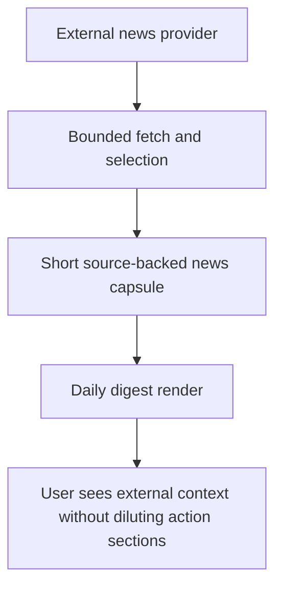

## req_038_day_captain_external_news_capsule_in_daily_digest - Day Captain external news capsule in daily digest
> From version: 1.8.0
> Status: Done
> Understanding: 99%
> Confidence: 96%
> Complexity: Medium
> Theme: UX
> Reminder: Update status/understanding/confidence and references when you edit this doc.

# Needs
- Add a short external-news capsule to the daily digest so the user gets a quick sense of relevant outside context alongside the existing mailbox and calendar brief.
- Keep that external-news capsule clearly separate from the current mail, meeting, and action-oriented digest sections.
- Ensure every rendered news item is source-backed, concise, and explicitly linked rather than presented as an ungrounded generated summary.
- Keep the feature bounded and low-noise: no generic infinite news feed, no long article rewrites, and no attempt to infer relevance from the user's private mailbox content.

# Context
- Current Day Captain digest structure is intentionally action-oriented: weather, `En bref` / `In brief`, then bounded mail and meeting sections derived from Outlook data.
- A short outside-context layer could improve the usefulness of the morning brief by giving the user a quick view of what is happening externally before they start the day.
- Product direction for this request is explicit: the news recap should come from external sources only, not from the mailbox, newsletter detection, or inferred mail context.
- That means the feature should behave like a compact external-context capsule, not like another scored digest section competing with `Critical topics` or `Actions to take`.
- Product direction is also to keep the block legible and honest:
  - it should be visibly labeled as external news
  - it should stay short, ideally two or three items
  - it should show source attribution and a link per item
  - it should disappear cleanly when there is no trustworthy result or the provider is unavailable
- This request is intentionally not about building a personalized media product. The goal is a bounded, low-friction external-context add-on inside the daily digest.

# In scope
- a dedicated external-news capsule in the daily digest
- a rendering position separate from the current mail/calendar sections, at the same presentation level as other top-of-digest context blocks
- a bounded item contract for each news entry such as headline, short recap, source name, and source URL
- an explicit rule that the capsule uses only external provider data rather than mailbox-derived content
- bounded selection rules such as a small maximum item count and a no-render fallback when the source is unavailable or the results are not usable
- configuration needed to enable, disable, or bound the external-news capsule in hosted and local runs
- documentation and tests covering rendering, source attribution, fallback behavior, and bounded output

# Out of scope
- deriving news relevance from private mailbox content, calendar content, or inferred user identity
- a full personalized recommendation engine or reader experience
- storing, searching, or browsing a large historical news archive inside Day Captain
- broad article extraction, long-form summarization, or copying article text into the digest
- replacing the current `En bref` / `In brief` summary with external news
- changing the existing mail and meeting ranking logic to treat external news as first-class action items

# Acceptance criteria
- AC1: The daily digest can render a clearly labeled external-news capsule that is visually separate from `Critical topics`, `Actions to take`, `Watch items`, `Daily presence`, and `Upcoming meetings`.
- AC2: The capsule remains bounded and low-noise by rendering at most a small fixed number of items, such as two or three short entries.
- AC3: Every rendered news item includes explicit source attribution and a source URL, and the product does not render ungrounded generated news text without a backing source.
- AC4: The capsule uses only external provider data and does not require mailbox-derived context or newsletter extraction to function.
- AC5: When the external-news provider is disabled, unavailable, slow, empty, or returns unusable results, the digest omits the capsule cleanly without degrading the rest of the digest flow.
- AC6: The implementation remains bounded in cost, latency, and output size, and avoids long article rewrites or excessive quoted source text.
- AC7: Tests and docs are updated to cover configuration, rendering order, item-count limits, source attribution, and fallback behavior.

# Risks and dependencies
- A generic external-news feed can reduce digest trust if it feels noisy, low-signal, or weakly relevant to the user's day.
- If the product summarizes articles too aggressively without explicit attribution, the capsule can look hallucinated or editorialized beyond what the source supports.
- External provider failures or latency spikes must not delay or break the core mailbox digest path.
- If the capsule is visually too prominent, it can compete with the action-oriented purpose of the existing digest instead of complementing it.
- This request depends on choosing or integrating a reliable external-news provider contract that supports bounded fetches and source attribution.

# Task traceability
- AC1 -> `task_043_day_captain_external_news_capsule_orchestration`. Proof: the task must own the separate rendering contract and its placement in the daily digest.
- AC2 -> `item_081_day_captain_bounded_external_news_capsule_contract`. Proof: the bounded item-count and low-noise contract belong to the capsule contract slice.
- AC3 -> `item_082_day_captain_external_news_source_attribution_and_linked_rendering`. Proof: explicit source labeling and per-item links are a rendering and contract concern.
- AC4 -> `item_081_day_captain_bounded_external_news_capsule_contract`. Proof: the contract explicitly limits the feature to external provider inputs rather than mailbox-derived data.
- AC5 -> `item_083_day_captain_external_news_provider_fallback_and_runtime_isolation`. Proof: fallback and failure isolation belong to the provider/runtime slice.
- AC6 -> `item_081_day_captain_bounded_external_news_capsule_contract` and `item_083_day_captain_external_news_provider_fallback_and_runtime_isolation`. Proof: bounded output plus runtime isolation together enforce the latency and cost guardrails.
- AC7 -> `task_043_day_captain_external_news_capsule_orchestration`. Proof: closure requires aligned docs and regression coverage across contract, rendering, and fallback behavior.

# Definition of Ready (DoR)
- [x] Problem statement is explicit and user impact is clear.
- [x] Scope boundaries (in/out) are explicit.
- [x] Acceptance criteria are testable.
- [x] Dependencies and known risks are listed.

# Backlog
- `item_081_day_captain_bounded_external_news_capsule_contract` - Define the bounded external-news capsule contract, item shape, placement, and configuration model. Status: `Ready`.
- `item_082_day_captain_external_news_source_attribution_and_linked_rendering` - Render short external news entries with source labels, links, and low-noise presentation separate from action sections. Status: `Ready`.
- `item_083_day_captain_external_news_provider_fallback_and_runtime_isolation` - Add provider integration, timeout/fallback behavior, and isolation so news failures never break the core digest. Status: `Ready`.
- `task_043_day_captain_external_news_capsule_orchestration` - Orchestrate external provider integration, capsule rendering, bounded selection, and regression coverage. Status: `Ready`.

# Notes
- Created on Monday, March 23, 2026 from product direction requesting a short external-news recap inside the daily digest.
- This request intentionally excludes mailbox-derived relevance or newsletter extraction; the capsule should stand on external sources alone.
- The preferred product shape is a small external-context block, not a new primary digest section competing with the user's own mail and meetings.
