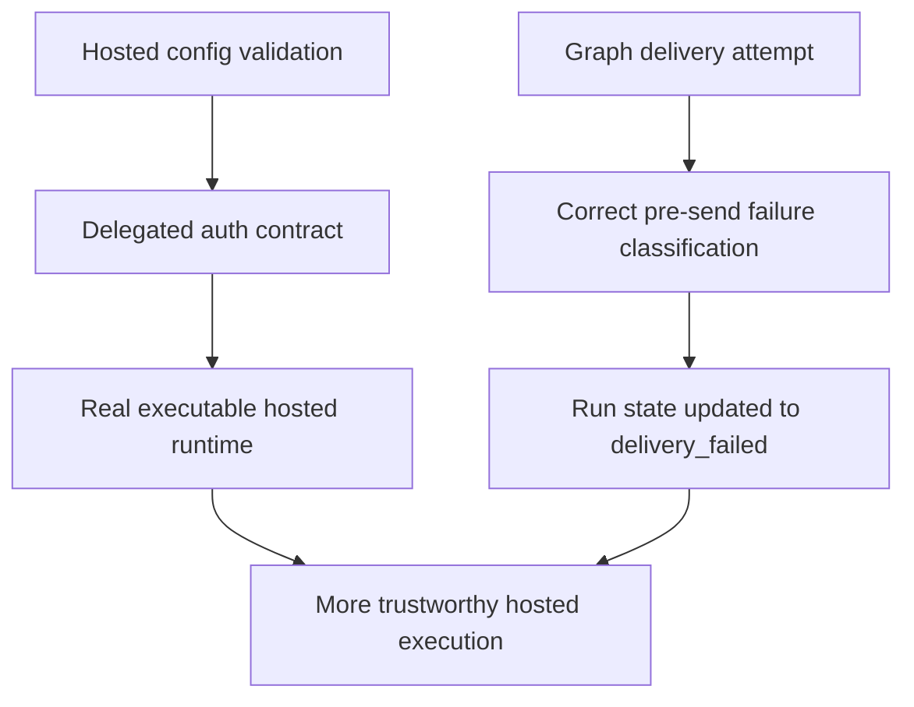

## req_039_day_captain_delivery_recovery_and_delegated_auth_contract_corrections - Day Captain delivery recovery and delegated auth contract corrections
> From version: 1.8.0
> Status: Ready
> Understanding: 100%
> Confidence: 97%
> Complexity: Medium
> Theme: Reliability
> Reminder: Update status/understanding/confidence and references when you edit this doc.

# Needs
- Fix the hosted delivery state machine so pre-send Graph delivery failures do not leave digest runs stuck in `delivery_pending`.
- Tighten hosted delegated-auth validation so production-like config checks do not accept shapes that cannot actually execute unattended.
- Make explicit delegated access tokens behave as the primary runtime source of truth instead of inheriting stale scope or identity metadata from an unrelated cached bundle.
- Add regression coverage for these runtime-contract paths because they can pass happy-path tests while still causing real production failures or operator confusion.

# Context
- A project audit found that the codebase is generally healthy and well-tested, but three runtime issues still create operational risk in real hosted usage.
- First, the current delivery state machine can leave a run in `delivery_pending` when Microsoft Graph delivery fails before any acceptance response is returned, for example on timeout or network failure.
- That is especially harmful because later digest runs are intentionally blocked when the latest run is still marked `delivery_pending`, so one bad pre-send failure can freeze routine delivery for that target user until someone intervenes.
- Second, hosted delegated-auth validation is currently too permissive: some production-like configurations pass `validate_hosted()` even though they do not provide a real unattended token path and will fail on first execution.
- That weakens operator trust because the project reports the config as valid while the runtime still lacks a usable delegated token or refresh route.
- Third, when an explicit delegated access token is provided through configuration, the runtime can still reuse cached scope and user metadata from a local token cache.
- That creates a subtle contract bug:
  - the real access token used at runtime can be correct
  - but the reported granted scopes or resolved user identity can come from stale cached data
  - which can produce false `Mail.Send` prerequisite failures or misleading target-user mismatches
- These are not product-polish issues; they are runtime correctness issues because they affect recovery, hosted operability, and auth trust.

# In scope
- correcting the run-status transition rules around hosted `graph_send` delivery failures before Graph acceptance
- explicitly classifying timeout, connection, and equivalent pre-send transport failures as safe `delivery_failed` outcomes rather than leaving the run pending forever
- tightening hosted delegated-auth validation so accepted configurations must include a real delegated execution path, not just partial identifiers
- clarifying or enforcing the expected relationship between explicit delegated access tokens, cached token bundles, resolved user identity, and granted scopes
- ensuring explicit env/config access tokens do not inherit stale user or scope metadata from cache unless that metadata is still valid and intentionally authoritative
- regression tests for delivery-state recovery, hosted delegated validation, and explicit-token-versus-cache precedence
- docs or operator notes where the runtime contract changes materially

# Out of scope
- redesigning digest content, ranking, or rendering
- changing app-only auth behavior beyond what is needed to preserve consistency with the delegated contract
- adding a new delivery transport or queue system
- building a generalized background retry worker for failed digest delivery
- changing the high-level hosted HTTP surface

# Acceptance criteria
- AC1: If Graph delivery fails before acceptance due to timeout, network reachability, or another clearly pre-send transport failure, the associated run is marked `delivery_failed` rather than being left in `delivery_pending`.
- AC2: A pre-send delivery failure no longer blocks the next routine digest run for the same tenant/user behind the pending-delivery reconciliation guard.
- AC3: Hosted delegated-auth validation no longer accepts production-like configurations that lack a real delegated token path, and the validation error remains explicit about what is missing.
- AC4: When an explicit delegated access token is provided, runtime scope and identity handling no longer inherit stale cached metadata in a way that can cause false `Mail.Send` failures or wrong-user checks.
- AC5: Deterministic runtime behavior remains explicit and explainable: token, scope, and identity resolution rules are documented or otherwise clear enough for operators to reason about.
- AC6: Tests cover representative Graph timeout or network failure before send acceptance, recovery of later digest runs after such failures, hosted delegated config rejection, and explicit-token precedence over stale cache metadata.

# Risks and dependencies
- Broadening the definition of pre-send failure too aggressively could misclassify an ambiguous post-send error as safely retryable when delivery might already have happened.
- Tightening delegated hosted validation may intentionally reject configurations that were previously tolerated, so operator guidance must stay aligned.
- Explicit-token precedence must be implemented carefully so the runtime does not silently overclaim scopes that are not actually granted by the provided token.
- This request depends on preserving the existing intent of `delivery_pending`: it should represent genuine post-send uncertainty, not every delivery exception.

# Task traceability
- AC1 -> `item_084_day_captain_pre_send_delivery_failure_state_recovery`. Proof: this item owns the run-state correction for pre-send Graph delivery failures.
- AC2 -> `item_084_day_captain_pre_send_delivery_failure_state_recovery`. Proof: once the status transition is corrected, later digest runs should no longer be blocked by a stale pending run.
- AC3 -> `item_085_day_captain_hosted_delegated_auth_validation_hardening`. Proof: this item tightens the hosted delegated validation contract.
- AC4 -> `item_086_day_captain_explicit_delegated_token_scope_and_identity_precedence`. Proof: this item owns the explicit-token versus cache precedence rules.
- AC5 -> `item_085_day_captain_hosted_delegated_auth_validation_hardening` and `item_086_day_captain_explicit_delegated_token_scope_and_identity_precedence`. Proof: both validation and precedence rules must be clear enough to explain operationally.
- AC6 -> `task_044_day_captain_delivery_recovery_and_delegated_auth_contract_orchestration`. Proof: closure requires aligned regression coverage across delivery recovery and delegated-auth contract fixes.

# Definition of Ready (DoR)
- [x] Problem statement is explicit and user impact is clear.
- [x] Scope boundaries (in/out) are explicit.
- [x] Acceptance criteria are testable.
- [x] Dependencies and known risks are listed.

# Backlog
- `item_084_day_captain_pre_send_delivery_failure_state_recovery` - Correct hosted run-state transitions so clearly pre-send Graph delivery failures become `delivery_failed` instead of remaining `delivery_pending`. Status: `Ready`.
- `item_085_day_captain_hosted_delegated_auth_validation_hardening` - Tighten hosted delegated validation so accepted production-like configs include a real executable delegated token path. Status: `Ready`.
- `item_086_day_captain_explicit_delegated_token_scope_and_identity_precedence` - Make explicit delegated access tokens authoritative enough that stale cache metadata cannot misreport granted scopes or user identity. Status: `Ready`.
- `task_044_day_captain_delivery_recovery_and_delegated_auth_contract_orchestration` - Orchestrate delivery-state recovery, hosted delegated-auth validation hardening, token/cache precedence fixes, and regression coverage. Status: `Ready`.

# Notes
- Created on Monday, March 23, 2026 from a project audit focused on hosted runtime correctness and recovery behavior.
- This request intentionally follows the earlier runtime-hardening work from `req_034` but addresses defects that still remain in the current codebase rather than reopening that broader finished slice.
- The preferred implementation should stay pragmatic: fix the delivery state machine, tighten hosted delegated validation, clarify token/cache precedence, and add focused regression tests.
