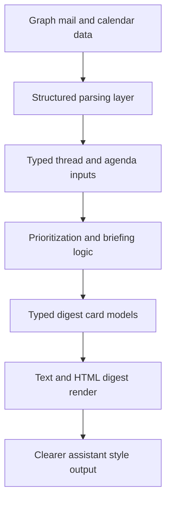

## req_040_day_captain_structured_mail_and_calendar_parsing_and_digest_presentation - Day Captain structured mail and calendar parsing and digest presentation
> From version: 1.8.0
> Schema version: 1.0
> Status: Done
> Understanding: 97%
> Confidence: 94%
> Complexity: High
> Theme: UX
> Reminder: Update status/understanding/confidence and references when you edit this doc.

# Needs
- Restructure Day Captain so mailbox and calendar ingestion no longer jumps almost directly from flat source records to scored digest entries.
- Make mail handling more thread-first and meeting handling more event-type-aware so the product explains what an exchange or agenda item means instead of mostly reflecting the last raw preview.
- Introduce a clearer typed intermediate contract between parsing, prioritization, wording, and rendering so behavior is easier to evolve without relying on ad hoc `context_metadata` keys.
- Improve digest presentation so surfaced items read like intentional assistant cards with explicit meaning, expected follow-up, and confidence rather than thin mailbox fragments.

# Context
- The current runtime is effective, but the core digest pipeline is still compressed: collect messages and meetings, score them, optionally rewrite them, and render them into the final digest.
- That keeps the implementation pragmatic, but it also means several responsibilities now live too close together:
  - source normalization
  - thread collapse logic
  - message and meeting classification
  - confidence generation
  - next-step wording
  - final card presentation
- Today the source models stay intentionally flat, especially `MessageRecord` and `MeetingRecord`, while richer behavior is reconstructed later through heuristics and free-form metadata.
- That creates three product and maintenance problems:
  - the mail path is still too message-oriented when the user really consumes conversations and decision threads
  - the calendar path still treats several agenda signals as ordinary meetings until late heuristics separate them
  - rendering depends on implicit metadata keys that couple parsers, scorers, wording, and presentation too tightly
- Product direction for this request is to make the pipeline more structured without turning Day Captain into a heavyweight mailbox product.
- The intended shape is still a bounded daily assistant:
  - concise
  - action-oriented
  - explainable
  - safe to evolve incrementally

# In scope
- introducing a clearer pipeline separation between raw collection, structured parsing, prioritization, wording, and rendering
- adding typed intermediate models for digest-oriented mail and calendar data instead of relying mainly on flat records plus free-form metadata
- moving the mail flow toward thread-first digestion so surfaced items represent a conversation or actionable exchange rather than mainly a single message preview
- moving the calendar flow toward earlier event typing such as ordinary meeting, all-day presence signal, or noteworthy schedule change
- defining a stronger digest-card presentation contract with fields such as meaning, expected follow-up, surfaced reason, confidence, and source links
- reducing renderer dependence on implicit `context_metadata` keys when a typed contract can carry the same information more safely
- preserving the current bounded product behavior while making the internal model easier to extend
- regression tests and docs covering the new parsing and presentation contracts

# Out of scope
- building a full mailbox UI, inbox client, or conversation explorer
- autonomous reply drafting or autonomous calendar edits
- broad changes to Microsoft Graph auth, delivery, or hosted scheduling behavior
- replacing the digest with a real-time copilot across the whole mailbox
- redesigning unrelated sections such as weather, hosted jobs, or delivery transport contracts unless the new structured model requires small integration adjustments

# Acceptance criteria
- AC1: The codebase exposes an explicit structured parsing layer that transforms raw `MessageRecord` and `MeetingRecord` inputs into typed digest-oriented inputs before final prioritization and rendering.
- AC2: The mail path can represent surfaced mail primarily at thread level, including bounded thread context, participant signal, and latest actionable state, rather than relying mainly on one selected raw message preview.
- AC3: The calendar path can classify qualifying agenda entries earlier and more explicitly, including a bounded distinction between ordinary meetings and all-day presence or location signals.
- AC4: The digest pipeline uses a clearer typed contract between parsing and presentation so renderers no longer depend mainly on ad hoc `context_metadata` keys for core item semantics.
- AC5: Surfaced digest items render with a more explicit assistant-card shape that clearly communicates what the item means, what is expected next when relevant, why it was surfaced, and how confident the system is.
- AC6: The refactor remains incremental and backward-safe: existing digest behavior stays bounded, existing delivery modes still work, and migration does not require a big-bang rewrite of the whole application.
- AC7: Tests and documentation are updated to cover the structured parsing contract, thread-first mail behavior, agenda classification behavior, and the new digest presentation expectations.

# Risks and dependencies
- A structural refactor in the middle of a working digest pipeline can easily introduce subtle regressions in ranking, wording, or rendering if migration is not staged carefully.
- Overdesign is a real risk: the new typed model should support Day Captain's bounded assistant use case, not become a generic enterprise mail domain model.
- Thread-first mail handling must stay pragmatic because Microsoft Graph thread data and preview quality can still be noisy or incomplete.
- Earlier agenda typing must avoid over-classifying ordinary events as presence signals.
- This request depends on keeping a clean compatibility path from the current `DigestEntry` based pipeline toward a more explicit intermediate model.

# Companion docs
- Product brief(s): None yet.
- Architecture decision(s): Recommended during promotion if the typed intermediate model becomes a non-trivial architectural contract.

# AI Context
- Summary: Refactor Day Captain toward structured digest-oriented parsing for mail and calendar inputs, then render clearer assistant cards from typed intermediate models.
- Keywords: day captain, mail parsing, calendar parsing, thread first, digest cards, structured metadata, presentation contract, assistant briefings
- Use when: The need is to improve how mailbox and agenda content is interpreted, classified, and surfaced in the digest without changing the product into a full mail client.
- Skip when: The work is only about copy polish, score tuning, delivery reliability, or isolated rendering tweaks that do not require a structural parsing contract.

# References
- Current source models: [src/day_captain/models.py](/Users/alexandreagostini/Documents/day-captain/src/day_captain/models.py)
- Current scoring and rendering concentration: [src/day_captain/services.py](/Users/alexandreagostini/Documents/day-captain/src/day_captain/services.py)
- Current digest orchestration pipeline: [src/day_captain/app.py](/Users/alexandreagostini/Documents/day-captain/src/day_captain/app.py)
- Existing direction on per-thread and per-meeting briefings with confidence: [logics/request/req_033_day_captain_per_thread_and_per_meeting_assistant_briefings_with_confidence_scoring.md](/Users/alexandreagostini/Documents/day-captain/logics/request/req_033_day_captain_per_thread_and_per_meeting_assistant_briefings_with_confidence_scoring.md)

# AC Traceability
- AC1 -> `item_087_day_captain_structured_mail_thread_and_agenda_parsing_foundations`. Proof: this item introduces the explicit structured parsing layer between raw records and downstream digest behavior.
- AC2 -> `item_087_day_captain_structured_mail_thread_and_agenda_parsing_foundations`. Proof: this item moves surfaced mail toward thread-level representation with bounded context and latest actionable state.
- AC3 -> `item_087_day_captain_structured_mail_thread_and_agenda_parsing_foundations`. Proof: this item adds earlier agenda typing, including bounded presence-versus-meeting distinction.
- AC4 -> `item_088_day_captain_typed_digest_card_contract_and_renderer_migration`. Proof: this item replaces renderer-critical ad hoc metadata with a clearer typed digest-card contract.
- AC5 -> `item_088_day_captain_typed_digest_card_contract_and_renderer_migration`. Proof: clearer assistant-card rendering semantics depend on the new typed presentation contract.
- AC6 -> `item_087_day_captain_structured_mail_thread_and_agenda_parsing_foundations`, `item_088_day_captain_typed_digest_card_contract_and_renderer_migration`, and `item_089_day_captain_digest_services_decomposition_and_pipeline_seams`. Proof: incremental and backward-safe migration requires staging the parsing foundations, the contract migration, and the regression-safe seam extraction together.
- AC7 -> `task_045_day_captain_mail_intelligence_and_runtime_clarity_orchestration`. Proof: closure requires aligned tests and documentation across the parsing, contract, and decomposition slices.

# Definition of Ready (DoR)
- [x] Problem statement is explicit and user impact is clear.
- [x] Scope boundaries (in/out) are explicit.
- [x] Acceptance criteria are testable.
- [x] Dependencies and known risks are listed.

# Backlog
- `item_087_day_captain_structured_mail_thread_and_agenda_parsing_foundations` - Introduce a structured parsing layer with thread-first mail inputs and earlier agenda typing. Status: `Ready`.
- `item_088_day_captain_typed_digest_card_contract_and_renderer_migration` - Replace ad hoc digest metadata with a typed digest card contract for renderer-critical semantics. Status: `Ready`.
- `item_089_day_captain_digest_services_decomposition_and_pipeline_seams` - Decompose the digest services concentration along coherent pipeline seams. Status: `Ready`.
- `task_045_day_captain_mail_intelligence_and_runtime_clarity_orchestration` - Orchestrate the structured parsing, typed digest contract, decomposition, recent memory, ownership, suspicious-mail, and runtime-clarity waves. Status: `Ready`.

# Notes
- Created on Saturday, March 28, 2026 from product and implementation review of how Day Captain currently parses mailbox and calendar content and turns it into digest sections.
- The preferred implementation path is incremental: land parsing foundations first, then migrate digest-card contracts and module seams in bounded slices.
- This request is intentionally about internal structure and digest clarity together; the goal is not a purely technical refactor detached from user-facing output quality.
