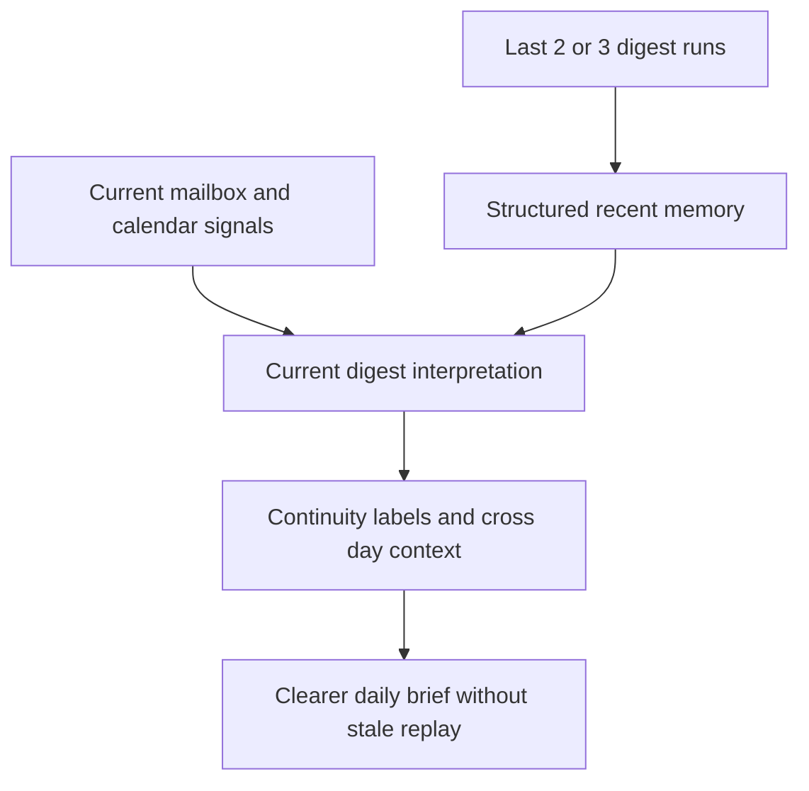

## req_041_day_captain_recent_digest_memory_for_cross_day_context - Day Captain recent digest memory for cross-day context
> From version: 1.8.0
> Schema version: 1.0
> Status: Ready
> Understanding: 98%
> Confidence: 95%
> Complexity: Medium
> Theme: UX
> Reminder: Update status/understanding/confidence and references when you edit this doc.

# Needs
- Add a short-term memory of the last 2 to 3 digest runs so Day Captain can keep bounded cross-day context instead of treating each new brief as if it started from zero.
- Use that recent digest memory to detect continuity signals such as already surfaced, still open, changed since yesterday, or no longer present.
- Keep the current mailbox and calendar data as the source of truth while using prior digests only as structured secondary context.
- Avoid the common failure mode of summarizing old summaries as free text; the feature should work from bounded structured signals rather than recursively reusing whole narrative briefs.

# Context
- The current product already stores digest runs and can recall them, which means Day Captain has a natural base for short-term continuity across days.
- Today that stored history is mainly used for recall and audit purposes, not as a structured memory that helps interpret new mail and agenda signals.
- That leaves a product gap:
  - a topic surfaced yesterday is treated too much like a brand new topic today
  - a follow-up that remains unresolved is not explicitly framed as ongoing
  - the digest does not clearly say when an item is new, persistent, changed, or disappeared from the recent surface
- The operator need is not a long-term knowledge base. It is a bounded short-term context window, ideally the last 2 or 3 daily briefs.
- The product should stay conservative:
  - prior digest memory should not override current mailbox or calendar evidence
  - prior digest memory should not become a free-text retrieval layer
  - prior digest memory should not cause stale or hallucinated continuity wording when the current source data does not support it
- The intended model is a structured memory derived from recent `DigestPayload` or digest-item fields such as:
  - source kind
  - source id
  - section
  - score
  - recommended action
  - confidence
  - surfaced date
- This enables bounded continuity labels without turning Day Captain into a generic historical workspace.

# In scope
- reading the most recent 2 or 3 completed digest runs for the same tenant and user as bounded secondary context
- extracting structured memory from recent digest outputs rather than reusing whole narrative digest text as raw context
- using that recent memory to add bounded continuity signals such as new today, already surfaced, still open, changed, or cleared
- defining conservative matching rules between current surfaced items and recent digest memory, using available stable identifiers and bounded fallbacks
- keeping the current mailbox and calendar ingestion as the primary source of truth when recent memory and current signals disagree
- exposing recent-memory derived context in digest presentation only when the system has enough support to do so safely
- tests and docs covering short-term memory loading, matching behavior, bounded memory depth, and safe fallback behavior

# Out of scope
- a long-term knowledge base over weeks or months of digest history
- retrieval over arbitrary free-text digest bodies
- replacing mailbox or calendar data with prior digest content when current source evidence is missing
- autonomous task tracking or workflow management outside the digest surface
- building a generic timeline UI for historical digests
- cross-user memory sharing in multi-user deployments

# Acceptance criteria
- AC1: Day Captain can load a bounded recent-memory window of the last 2 or 3 completed digest runs for the same scoped tenant and user.
- AC2: The recent-memory feature works from structured prior digest data rather than re-injecting full previous digest prose as free-form prompt or rendering context.
- AC3: When a current surfaced item matches a recent prior surfaced item with enough confidence, the digest can expose a bounded continuity signal such as already surfaced, still pending, changed, or resolved since the earlier brief.
- AC4: Current mailbox and calendar evidence remains authoritative; recent digest memory cannot on its own invent or keep alive an item that is not supported by the current run.
- AC5: When no safe match exists, the system falls back cleanly without speculative continuity wording.
- AC6: The memory window remains bounded in depth, cost, and output impact, and does not materially bloat the digest or degrade runtime behavior.
- AC7: Tests and documentation cover memory-window selection, scoped loading, matching behavior, continuity labeling, and safe fallback rules.

# Risks and dependencies
- If the feature relies too much on old rendered prose, the product can drift into summarizing summaries and amplify earlier interpretation mistakes.
- Matching current items to older surfaced items can be noisy when source identifiers change or when thread and meeting identity is imperfect.
- Continuity wording can erode trust if it overstates certainty about whether something is truly still open or truly resolved.
- The feature depends on existing stored digest runs remaining available and scoped correctly per tenant and user.
- This request should stay aligned with any concurrent structured parsing work so recent memory can attach to stable typed item contracts rather than fragile presentation details.

# Companion docs
- Product brief(s): None yet.
- Architecture decision(s): May be useful during promotion if recent memory becomes a reusable runtime contract shared by parsing, scoring, and rendering.

# AI Context
- Summary: Add a bounded short-term memory from the last 2 or 3 digest runs so Day Captain can express cross-day continuity without treating old digest prose as a source of truth.
- Keywords: day captain, digest memory, recent runs, cross day context, continuity signals, short term memory, digest payload history
- Use when: The goal is to improve continuity across daily briefs by reusing recent structured digest state in a bounded and safe way.
- Skip when: The work is only about recall, historical browsing, or a general purpose long-term memory system over old digests.

# References
- Stored digest run model: [src/day_captain/models.py](/Users/alexandreagostini/Documents/day-captain/src/day_captain/models.py)
- Digest run storage and scoped persistence: [src/day_captain/adapters/storage.py](/Users/alexandreagostini/Documents/day-captain/src/day_captain/adapters/storage.py)
- Current run orchestration and persistence path: [src/day_captain/app.py](/Users/alexandreagostini/Documents/day-captain/src/day_captain/app.py)
- Existing structured parsing direction: [logics/request/req_040_day_captain_structured_mail_and_calendar_parsing_and_digest_presentation.md](/Users/alexandreagostini/Documents/day-captain/logics/request/req_040_day_captain_structured_mail_and_calendar_parsing_and_digest_presentation.md)

# AC Traceability
- AC1 -> `item_090_day_captain_recent_digest_memory_and_cross_day_continuity_signals`. Proof: this item adds the bounded recent-memory window for the same tenant and user scope.
- AC2 -> `item_090_day_captain_recent_digest_memory_and_cross_day_continuity_signals`. Proof: this item explicitly uses structured prior digest state rather than replaying full previous prose.
- AC3 -> `item_090_day_captain_recent_digest_memory_and_cross_day_continuity_signals`. Proof: continuity labels such as already surfaced, still open, changed, or cleared belong to the same memory slice.
- AC4 -> `item_090_day_captain_recent_digest_memory_and_cross_day_continuity_signals`. Proof: the item explicitly preserves current mailbox and calendar data as the source of truth.
- AC5 -> `item_090_day_captain_recent_digest_memory_and_cross_day_continuity_signals`. Proof: conservative fallback when no safe match exists is part of the same bounded matching contract.
- AC6 -> `item_090_day_captain_recent_digest_memory_and_cross_day_continuity_signals`. Proof: bounded window depth, bounded cost, and bounded output impact are explicit constraints of the recent-memory item.
- AC7 -> `task_045_day_captain_mail_intelligence_and_runtime_clarity_orchestration`. Proof: closure requires tests and documentation aligned with the broader mail-intelligence orchestration.

# Definition of Ready (DoR)
- [x] Problem statement is explicit and user impact is clear.
- [x] Scope boundaries (in/out) are explicit.
- [x] Acceptance criteria are testable.
- [x] Dependencies and known risks are listed.

# Backlog
- `item_090_day_captain_recent_digest_memory_and_cross_day_continuity_signals` - Add bounded recent digest memory and continuity labels such as already surfaced, still open, changed, or cleared. Status: `Ready`.
- `task_045_day_captain_mail_intelligence_and_runtime_clarity_orchestration` - Orchestrate the new mail-intelligence and runtime-clarity backlog waves, including recent digest memory. Status: `Ready`.

# Notes
- Created on Saturday, March 28, 2026 from product direction to retain bounded cross-day context from the last 2 or 3 briefs.
- The preferred implementation is memory-as-structured-signals, not memory-as-full-previous-text.
- This request should remain conservative: continuity is useful only if the current digest still feels grounded in today's mailbox and agenda rather than in stale historical output.
