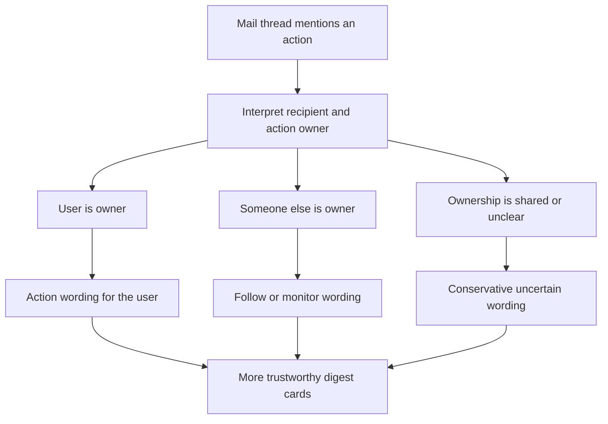

## req_042_day_captain_mail_action_ownership_and_non_owner_handling - Day Captain mail action ownership and non-owner handling
> From version: 1.8.0
> Schema version: 1.0
> Status: Done
> Understanding: 98%
> Confidence: 95%
> Complexity: Medium
> Theme: Product Quality
> Reminder: Update status/understanding/confidence and references when you edit this doc.

# Needs
- Improve mail interpretation so Day Captain does not confuse `this topic concerns the user` with `the user is expected to act on this point`.
- Distinguish more reliably between action requested from the digest target user, action requested from someone else, shared ownership, and unclear ownership.
- Prevent digest wording from telling the user `you are expected on this point` when the message actually assigns the next step to another participant.
- Render non-owner but still relevant items with more accurate assistant language such as follow, monitor, relay, or context-only instead of action-owner phrasing.

# Context
- Recent work improved recipient-aware behavior and direct-address relevance, but a remaining trust gap still appears in real mailbox interpretation.
- The system is getting better at detecting when the digest target user is addressed in a mail, although even that remains imperfect in some LLM rewrites.
- A second and separate problem remains: many messages mention an action, request, or deadline without that action actually belonging to the digest target user.
- In practice, the current digest can still over-assign responsibility to the mailbox owner in situations such as:
  - the user is copied for visibility while another person is asked to act
  - the thread discusses a task owned by someone else but relevant to the user
  - the message asks the user only to relay or observe rather than to perform the primary business action
  - the thread contains several people and the latest request is aimed at another named participant
- This is a product correctness issue, not just a wording issue, because incorrect action ownership directly affects digest trust and prioritization.
- Product direction for this request is to make action ownership explicit and bounded, not to build a full task-assignment engine.
- The digest should be able to separate at least these dimensions:
  - relevance to the user
  - whether action is expected from the user now
  - who appears to own the next action
  - how certain the system is about that interpretation

# In scope
- adding a bounded action-ownership interpretation layer for surfaced mail items
- distinguishing between relevance-to-user and action-expected-from-user instead of treating them as the same signal
- detecting representative cases where the primary requested action appears assigned to another participant rather than the digest target user
- supporting bounded ownership states such as user-owned, other-owned, shared, relay-only, and unclear when the signal is strong enough
- updating digest wording and handling so non-owner items are not rendered as if the user must personally act unless the evidence supports that reading
- allowing action ownership to influence section placement, recommended action wording, or confidence where appropriate
- tests and docs covering representative owner, non-owner, shared, and unclear cases

# Out of scope
- a generic enterprise task-management engine
- extracting or enforcing formal task state from every mail thread
- directory-wide people resolution beyond the bounded identity information already available in messages and target-user context
- autonomous delegation, reassignment, or reply drafting
- broad redesign of digest layout unrelated to ownership semantics

# Acceptance criteria
- AC1: Day Captain can distinguish between `relevant to the target user` and `action expected from the target user` for surfaced mail items.
- AC2: When the strongest available signal indicates that another participant owns the next action, the digest does not render the item as if the target user is personally expected to act.
- AC3: The system supports bounded ownership outcomes for surfaced mail such as user-owned, other-owned, shared, relay-only, or unclear, with conservative fallback when the signal is weak.
- AC4: Recommended action wording and section behavior remain aligned with ownership: owner wording is reserved for user-owned cases, while non-owner cases use more appropriate follow, monitor, or context wording.
- AC5: Confidence or rationale signals make it explicit when ownership attribution is uncertain enough that the digest should stay conservative.
- AC6: Tests and documentation cover representative examples including direct request to the user, another named person owning the action, user in copy only, relay-style requests, and ambiguous multi-party threads.

# Risks and dependencies
- Ownership inference in email is inherently noisy because natural language requests are often implicit, fragmented, or spread across several replies.
- Overconfident ownership assignment can hurt trust more than a conservative fallback, so uncertain cases must remain explicitly bounded.
- If ownership logic is bolted onto the current pipeline only through ad hoc metadata, the behavior may become hard to maintain or explain.
- This request overlaps with recipient-aware and structured parsing work, so execution should stay synchronized with those contracts rather than duplicating identity heuristics in several places.

# Companion docs
- Product brief(s): None yet.
- Architecture decision(s): May be useful during promotion if action ownership becomes a reusable typed contract in the mail parsing pipeline.

# AI Context
- Summary: Add bounded mail action-ownership interpretation so Day Captain can tell whether the digest target user actually owns the next step or is only informed, monitoring, or relaying.
- Keywords: day captain, mail ownership, action owner, recipient aware, non owner handling, follow wording, shared ownership, relay only
- Use when: The need is to prevent the digest from assigning action responsibility to the target user when the mail actually expects someone else to act.
- Skip when: The work is only about direct-recipient detection, generic mail scoring, or broad UI redesign without ownership semantics.

# References
- Existing recipient-aware umbrella request: [logics/request/req_031_day_captain_recipient_aware_digest_identity_mail_summaries_language_coherence_and_meeting_chronology.md](/Users/alexandreagostini/Documents/day-captain/logics/request/req_031_day_captain_recipient_aware_digest_identity_mail_summaries_language_coherence_and_meeting_chronology.md)
- Existing direct-address relevance item: [logics/backlog/item_058_day_captain_recipient_aware_digest_identity_and_direct_address_relevance.md](/Users/alexandreagostini/Documents/day-captain/logics/backlog/item_058_day_captain_recipient_aware_digest_identity_and_direct_address_relevance.md)
- Current structured parsing direction: [logics/request/req_040_day_captain_structured_mail_and_calendar_parsing_and_digest_presentation.md](/Users/alexandreagostini/Documents/day-captain/logics/request/req_040_day_captain_structured_mail_and_calendar_parsing_and_digest_presentation.md)
- Current scoring and wording implementation concentration: [src/day_captain/services.py](/Users/alexandreagostini/Documents/day-captain/src/day_captain/services.py)

# Definition of Ready (DoR)
- [x] Problem statement is explicit and user impact is clear.
- [x] Scope boundaries (in/out) are explicit.
- [x] Acceptance criteria are testable.
- [x] Dependencies and known risks are listed.

# Backlog
- `item_091_day_captain_mail_action_ownership_and_non_owner_wording` - Distinguish action ownership from generic relevance and stop rendering non-owner items as if the target user must act. Status: `Ready`.

# Notes
- Created on Saturday, March 28, 2026 from product feedback that the digest still over-assigns action responsibility to the mailbox owner in some mail threads.
- This request is intentionally separate from simple recipient-awareness: the core need is action ownership attribution, not only identity matching.
- The preferred behavior is conservative. When ownership is weak or ambiguous, the digest should avoid definitive `you need to act` wording.
