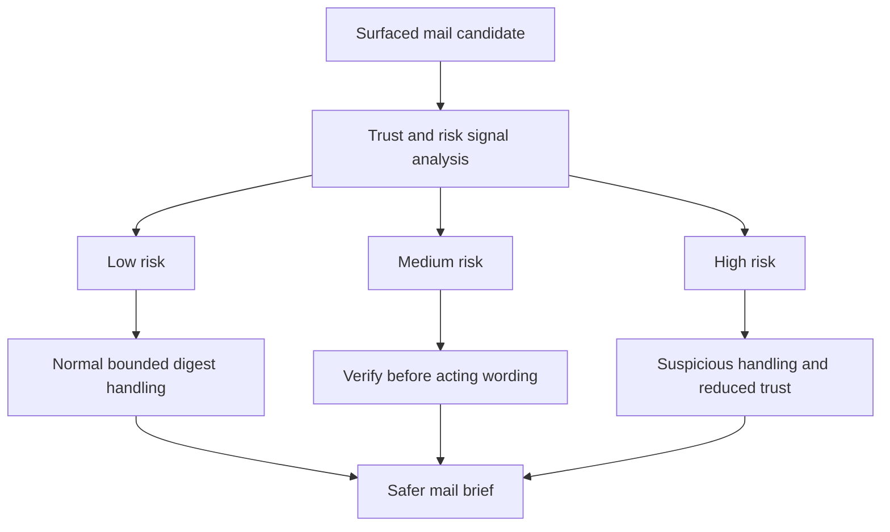

## req_043_day_captain_mail_anti_scam_and_phishing_risk_signals - Day Captain mail anti-scam and phishing risk signals
> From version: 1.8.0
> Schema version: 1.0
> Status: Ready
> Understanding: 98%
> Confidence: 95%
> Complexity: Medium
> Theme: Security
> Reminder: Update status/understanding/confidence and references when you edit this doc.

# Needs
- Add a bounded anti-scam and anti-phishing analysis layer for surfaced mail so Day Captain can flag suspicious messages before presenting them as trustworthy operational items.
- Represent mail trust as explicit risk and trust signals rather than a binary verdict such as `reliable` or `safe`.
- Reduce the chance that suspicious messages receive action-forward wording or high-confidence assistant summaries without warning.
- Give the user a practical handling recommendation such as safe to read, verify before acting, or do not trust without manual verification.

# Context
- Day Captain already applies bounded mail heuristics for relevance, noise filtering, and promotional handling, but it does not yet expose a dedicated suspicious-mail risk model.
- That creates a product gap: the digest can still summarize a mail fluently even when the sender, intent, or request pattern looks questionable.
- The user need is not a full secure-email gateway or malware scanner. It is an assistant-level risk signal inside the digest so obviously suspicious or socially engineered messages are not treated like routine trusted work.
- Product direction for this request is to stay conservative and explainable:
  - avoid a hard claim that a mail is definitively safe
  - avoid a hard claim that a mail is definitively malicious unless the available evidence is overwhelming
  - show why a message looks suspicious or comparatively trustworthy
  - influence digest handling when risk is meaningfully elevated
- Useful suspicious signals may include:
  - unusual or mismatched sender identity
  - urgency or pressure cues
  - requests for sensitive action such as payment, credentials, account change, or confidential data
  - suspicious link or attachment context
  - inconsistent thread or participant pattern
  - social-engineering style wording
- Useful trust signals may include:
  - known internal sender or expected partner domain
  - continuity with a recent thread
  - coherent participants and topic history
  - expected mailbox targeting and ordinary operational wording
- The intended product contract is a bounded risk model, not a false-security badge.

# In scope
- adding a bounded suspicious-mail risk analysis step for surfaced or borderline mail candidates
- producing explicit risk and trust signals rather than a binary safe or unsafe outcome
- supporting bounded risk levels such as low, medium, and high with explainable reasons
- allowing suspicious-mail risk to influence section placement, confidence, recommendation wording, or badge rendering where appropriate
- rendering a practical caution signal such as suspicious, verify sender, or verify before acting when risk is elevated
- keeping the feature explainable and cheap enough for routine digest runs
- tests and docs covering representative suspicious and trustworthy mail patterns plus fallback behavior

# Out of scope
- a full secure-email gateway, attachment malware sandbox, or enterprise anti-phishing platform
- automatic blocking, deletion, quarantine, or mailbox mutation
- definitive legal or security claims that a message is safe or malicious
- a mailbox-wide forensic analyzer over every message regardless of digest relevance
- broad identity-directory enrichment beyond the bounded sender and thread signals already available to Day Captain

# Acceptance criteria
- AC1: Surfaced or borderline mail items can receive an explicit bounded anti-scam or phishing risk signal rather than being treated only through generic relevance heuristics.
- AC2: The feature exposes explainable output such as risk level, risk reasons, trust signals, or handling recommendation instead of a binary `reliable` verdict.
- AC3: When a message is assessed as medium or high risk, the digest does not present it with the same trust posture as an ordinary operational item; wording, confidence, or placement becomes more conservative.
- AC4: Elevated-risk messages can render an explicit caution signal such as suspicious or verify before acting, together with bounded rationale that helps the user understand why.
- AC5: When the available evidence is weak or ambiguous, the system falls back conservatively and avoids overstating that a mail is either safe or malicious.
- AC6: The implementation remains bounded in cost and scope, with deterministic heuristics first and any optional LLM assistance limited to surfaced or borderline candidates.
- AC7: Tests and documentation cover representative suspicious cases, representative trustworthy cases, risk-level behavior, rendering behavior, and fallback behavior.

# Risks and dependencies
- A false sense of safety is a core product risk, so the feature must avoid claiming more certainty than the available mail evidence supports.
- Over-aggressive suspicious detection can demote legitimate urgent operational mail, especially from new senders or unusual domains.
- If the signal is introduced too late in the pipeline, the digest may already have amplified the message with confident assistant wording before the risk correction appears.
- Some high-value scam indicators may require headers or message fields that are not always available in the current Graph collection contract.
- This request should stay aligned with structured parsing and action-ownership work so trust and risk signals become part of a coherent mail interpretation model rather than another isolated metadata patch.

# Companion docs
- Product brief(s): None yet.
- Architecture decision(s): May be useful during promotion if suspicious-mail analysis introduces a reusable typed trust contract or requires new Graph fields.

# AI Context
- Summary: Add bounded anti-scam and anti-phishing risk signals for surfaced mail so Day Captain can warn the user and adopt a more conservative digest posture on suspicious messages.
- Keywords: day captain, phishing, scam, suspicious mail, trust signals, risk level, verify sender, mail safety
- Use when: The goal is to prevent suspicious emails from being summarized or surfaced as if they were fully trustworthy operational messages.
- Skip when: The work is only about promotional mail, generic noise filtering, or enterprise-grade mail security controls outside the digest product.

# References
- Existing promotional-mail detection direction: [logics/request/req_036_day_captain_promotional_mail_detection_and_digest_deprioritization.md](/Users/alexandreagostini/Documents/day-captain/logics/request/req_036_day_captain_promotional_mail_detection_and_digest_deprioritization.md)
- Current mail scoring and heuristics: [src/day_captain/services.py](/Users/alexandreagostini/Documents/day-captain/src/day_captain/services.py)
- Current Graph mail normalization contract: [src/day_captain/adapters/graph.py](/Users/alexandreagostini/Documents/day-captain/src/day_captain/adapters/graph.py)
- Current structured parsing direction: [logics/request/req_040_day_captain_structured_mail_and_calendar_parsing_and_digest_presentation.md](/Users/alexandreagostini/Documents/day-captain/logics/request/req_040_day_captain_structured_mail_and_calendar_parsing_and_digest_presentation.md)

# AC Traceability
- AC1 -> `item_092_day_captain_mail_suspicion_risk_signals_and_conservative_rendering`. Proof: this item adds explicit suspicious-mail risk signaling for surfaced or borderline candidates.
- AC2 -> `item_092_day_captain_mail_suspicion_risk_signals_and_conservative_rendering`. Proof: explainable output such as risk level, reasons, trust signals, and handling guidance is core to the item.
- AC3 -> `item_092_day_captain_mail_suspicion_risk_signals_and_conservative_rendering`. Proof: more conservative wording, confidence, or placement for elevated-risk mail belongs to the same handling slice.
- AC4 -> `item_092_day_captain_mail_suspicion_risk_signals_and_conservative_rendering`. Proof: visible caution signals and bounded rationale are part of the renderer-facing contract of this item.
- AC5 -> `item_092_day_captain_mail_suspicion_risk_signals_and_conservative_rendering`. Proof: conservative fallback under ambiguity is an explicit scope rule of the item.
- AC6 -> `item_092_day_captain_mail_suspicion_risk_signals_and_conservative_rendering`. Proof: bounded cost and heuristic-first implementation are part of the item's product and runtime constraints.
- AC7 -> `task_045_day_captain_mail_intelligence_and_runtime_clarity_orchestration`. Proof: closure requires representative tests and documentation aligned with the wider mail-intelligence workstream.

# Definition of Ready (DoR)
- [x] Problem statement is explicit and user impact is clear.
- [x] Scope boundaries (in/out) are explicit.
- [x] Acceptance criteria are testable.
- [x] Dependencies and known risks are listed.

# Backlog
- `item_092_day_captain_mail_suspicion_risk_signals_and_conservative_rendering` - Add bounded suspicious-mail risk signals and make digest handling more conservative for elevated-risk messages. Status: `Ready`.
- `task_045_day_captain_mail_intelligence_and_runtime_clarity_orchestration` - Orchestrate the structured mail-intelligence waves, including suspicious-mail handling and conservative rendering. Status: `Ready`.

# Notes
- Created on Saturday, March 28, 2026 from product direction to add a bounded anti-scam and anti-phishing signal to the digest.
- The preferred framing is risk-based and explainable, not a binary safe or unsafe certification layer.
- This request should remain conservative: the digest should help the user notice suspicious patterns and avoid over-trusting them, not claim stronger security guarantees than the product can actually provide.
