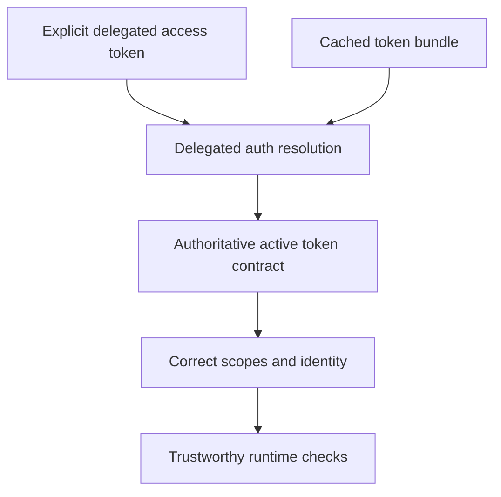

## req_044_day_captain_explicit_delegated_token_authority_over_stale_cache_metadata - Day Captain explicit delegated token authority over stale cache metadata
> From version: 1.8.0
> Schema version: 1.0
> Status: Ready
> Understanding: 98%
> Confidence: 96%
> Complexity: Medium
> Theme: Reliability
> Reminder: Update status/understanding/confidence and references when you edit this doc.

# Needs
- Ensure that when an explicit delegated Graph access token is supplied at runtime, Day Captain treats that token as the authoritative execution source rather than inheriting stale scope or identity metadata from an unrelated cached bundle.
- Prevent false `Mail.Send` prerequisite failures, wrong-user mismatches, or misleading runtime summaries caused by mixing an explicit token with stale cached metadata.
- Make delegated token precedence explicit enough that operators can reason about which token, identity, and scope set the app is actually using.

# Context
- The delegated auth path already supports several sources of truth: explicit configured access token, cached token bundle, refresh-based renewal, and live `/me` profile lookup.
- A subtle contract defect remains when an explicit delegated access token is present at the same time as a stale cached bundle.
- In that situation, the runtime can still carry forward cached scope or user metadata even though the explicit token is the token actually used for Graph calls.
- That creates a correctness risk:
  - the token used on the wire can be valid
  - but the reported `granted_scopes` can still come from stale cache
  - the resolved user identity can still come from stale cache
  - downstream validation such as `Mail.Send` checks or target-user checks can therefore become false negatives
- This is not merely an implementation detail. It is an auth contract problem because the runtime can claim facts about the active delegated token that it has not actually verified for that token.

# In scope
- making explicit delegated access tokens authoritative over stale cached identity and scope metadata
- clarifying when cache metadata may still be reused and when it must be ignored or refreshed
- ensuring scope and identity reporting align with the token actually used for Graph calls
- preventing false downstream validation failures caused by stale cache precedence
- tests and docs covering explicit-token-plus-cache interactions

# Out of scope
- redesigning app-only auth behavior
- broad auth UX changes outside delegated runtime precedence
- new secret-management systems
- unrelated delivery-state recovery work

# Acceptance criteria
- AC1: When an explicit delegated access token is supplied, stale cached scope or user metadata cannot override the runtime contract for the active token.
- AC2: Runtime scope and identity checks no longer fail falsely because of unrelated cached-bundle metadata when the explicit token is the active token.
- AC3: Any remaining cache reuse behavior is explicit, bounded, and documented so operators can explain the precedence rules.
- AC4: Tests cover representative cases where an explicit token is combined with stale cached scope and identity metadata.

# Risks and dependencies
- Overcorrecting precedence rules could discard useful cache metadata in cases where it still matches the active token and is the only available identity hint.
- The runtime must not silently overclaim scopes that have not actually been verified for the active token.
- This request overlaps with the broader delegated-auth hardening work and should stay synchronized with that contract rather than diverging from it.

# Companion docs
- Product brief(s): None yet.
- Architecture decision(s): None yet.

# AI Context
- Summary: Make explicit delegated Graph access tokens authoritative enough that stale cache metadata cannot misreport scopes or user identity.
- Keywords: delegated auth, access token precedence, stale cache, granted scopes, user identity, graph auth
- Use when: The problem is incorrect delegated runtime behavior caused by mixing explicit tokens with cached metadata.
- Skip when: The issue is only app-only auth, delivery transport, or general hosted validation unrelated to token precedence.

# References
- Delegated auth implementation: [src/day_captain/adapters/graph.py](/Users/alexandreagostini/Documents/day-captain/src/day_captain/adapters/graph.py)
- Existing broader auth/runtime correction request: [logics/request/req_039_day_captain_delivery_recovery_and_delegated_auth_contract_corrections.md](/Users/alexandreagostini/Documents/day-captain/logics/request/req_039_day_captain_delivery_recovery_and_delegated_auth_contract_corrections.md)

# Definition of Ready (DoR)
- [x] Problem statement is explicit and user impact is clear.
- [x] Scope boundaries (in/out) are explicit.
- [x] Acceptance criteria are testable.
- [x] Dependencies and known risks are listed.

# Backlog
- `item_086_day_captain_explicit_delegated_token_scope_and_identity_precedence` - Make explicit delegated tokens authoritative over stale cached identity and scope metadata. Status: `Ready`.

# Notes
- Created on Saturday, March 28, 2026 from audit findings about delegated token precedence and stale cache metadata.
- This request intentionally narrows one auth defect into a standalone contract and consolidates onto the already-open backlog item `item_086`.
