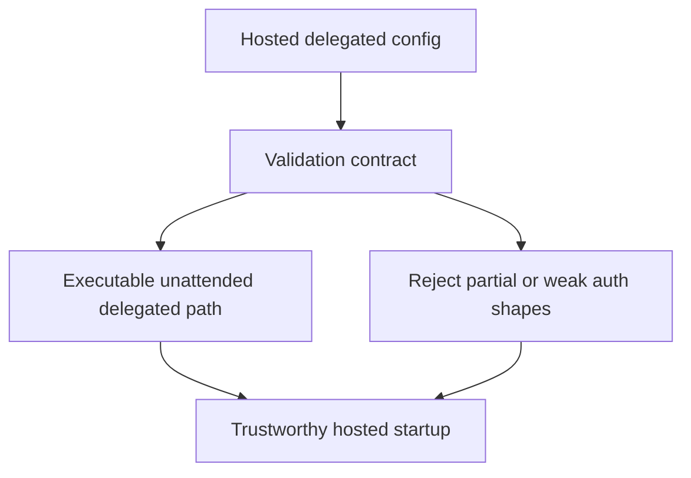

## req_045_day_captain_hosted_delegated_auth_validation_for_true_unattended_execution - Day Captain hosted delegated auth validation for true unattended execution
> From version: 1.8.0
> Schema version: 1.0
> Status: Ready
> Understanding: 98%
> Confidence: 96%
> Complexity: Medium
> Theme: Reliability
> Reminder: Update status/understanding/confidence and references when you edit this doc.

# Needs
- Tighten hosted delegated-auth validation so production-like config checks only pass when the delegated execution path is actually unattended and usable at runtime.
- Prevent startup validation from accepting shapes that contain only partial delegated auth inputs, such as a client ID or one-off access token, while still lacking a durable hosted execution path.
- Keep validation errors explicit enough that operators understand what is missing and why the hosted configuration is not really executable.

# Context
- Hosted validation currently aims to catch obviously invalid production configurations before the service begins to operate.
- A remaining gap is that delegated hosted validation can still accept configurations that are not truly unattended.
- In practice, a production-like environment can pass validation with a delegated auth shape that still depends on brittle local state or a non-durable token situation.
- That creates an operator-trust problem:
  - config is reported as valid
  - startup succeeds
  - the first real hosted execution later fails because the delegated token path is not actually durable or renewable
- This is a validation-contract defect rather than a feature gap. The hosted runtime should not claim delegated executability unless the unattended path is real.

# In scope
- tightening hosted delegated validation for unattended execution
- rejecting production-like delegated auth shapes that are only partially configured
- clarifying what counts as a real hosted delegated token path
- making validation errors explicit and operator-readable
- tests and docs covering accepted and rejected hosted delegated shapes

# Out of scope
- redesigning app-only auth
- delivery recovery behavior
- local development ergonomics unrelated to hosted validation
- broad auth UX changes outside the hosted validation contract

# Acceptance criteria
- AC1: Hosted delegated validation no longer accepts production-like configurations that lack a real unattended delegated execution path.
- AC2: Partial delegated auth shapes such as bare client identifiers or brittle one-off token-only setups are rejected when they do not satisfy the hosted runtime contract.
- AC3: Validation failures remain explicit enough for operators to understand what is missing and what remediation is expected.
- AC4: Tests cover representative accepted and rejected hosted delegated-auth configurations.

# Risks and dependencies
- Tightening validation will intentionally reject configurations that previously passed, so documentation and ops guidance must stay aligned.
- The contract must remain strict without becoming so rigid that it blocks legitimate hosted delegated setups.
- This request overlaps with existing hosted runtime hardening work and should stay synchronized with those contracts.

# Companion docs
- Product brief(s): None yet.
- Architecture decision(s): None yet.

# AI Context
- Summary: Tighten hosted delegated-auth validation so startup only passes when the delegated path is truly unattended and executable.
- Keywords: hosted validation, delegated auth, unattended execution, runtime contract, token path
- Use when: The problem is that hosted validation accepts delegated auth configurations that still fail in real unattended use.
- Skip when: The issue is only explicit-token precedence, app-only auth, or runtime delivery behavior.

# References
- Hosted validation implementation: [src/day_captain/config.py](/Users/alexandreagostini/Documents/day-captain/src/day_captain/config.py)
- Existing broader auth/runtime correction request: [logics/request/req_039_day_captain_delivery_recovery_and_delegated_auth_contract_corrections.md](/Users/alexandreagostini/Documents/day-captain/logics/request/req_039_day_captain_delivery_recovery_and_delegated_auth_contract_corrections.md)

# Definition of Ready (DoR)
- [x] Problem statement is explicit and user impact is clear.
- [x] Scope boundaries (in/out) are explicit.
- [x] Acceptance criteria are testable.
- [x] Dependencies and known risks are listed.

# Backlog
- `item_085_day_captain_hosted_delegated_auth_validation_hardening` - Tighten hosted delegated-auth validation so only real unattended delegated paths pass startup checks. Status: `Ready`.

# Notes
- Created on Saturday, March 28, 2026 from audit findings about permissive hosted delegated-auth validation.
- This request intentionally isolates the validation contract and consolidates onto the already-open backlog item `item_085`.
