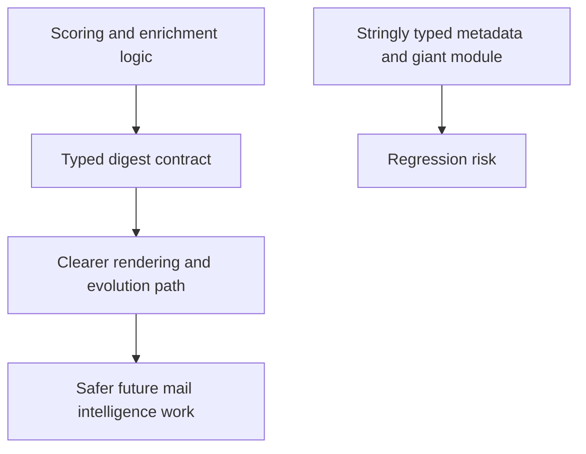

## req_046_day_captain_typed_digest_contract_and_services_decomposition - Day Captain typed digest contract and services decomposition
> From version: 1.8.0
> Schema version: 1.0
> Status: Done
> Understanding: 97%
> Confidence: 94%
> Complexity: High
> Theme: Architecture
> Reminder: Update status/understanding/confidence and references when you edit this doc.

# Needs
- Reduce the concentration of digest semantics in `services.py` by introducing clearer module boundaries and typed contracts between scoring, wording, and rendering.
- Replace core renderer dependencies on ad hoc `context_metadata` keys with more explicit typed digest-oriented models for mail and meeting presentation.
- Lower the regression risk of future product work by making the digest pipeline easier to reason about, test, and extend without hidden stringly typed coupling.

# Context
- The project is well tested, but a large share of business logic still lives in one module and crosses several responsibilities:
  - message and meeting scoring
  - thread and meeting enrichment
  - confidence and recommendation generation
  - digest rendering
  - overview synthesis
- At the same time, renderers and downstream logic currently depend on free-form `context_metadata` keys to recover meaning that is not encoded as a first-class type.
- This has become the main maintainability risk in the codebase:
  - behavior is harder to audit
  - new features tend to add more implicit metadata keys
  - changes in one stage can silently break assumptions in another
- The project now has a growing set of mail-intelligence and digest-quality requests, so the current concentration will become a delivery bottleneck if it remains unchanged.

# In scope
- identifying and extracting coherent seams from the current digest logic concentration
- introducing typed contracts for core digest semantics currently carried through free-form metadata
- reducing renderer dependence on ad hoc `context_metadata` keys for first-class behavior
- keeping orchestration explicit while making modules smaller and more cohesive
- tests and docs for the new contracts and extracted boundaries

# Out of scope
- a full product redesign
- rewriting the whole application in one step
- changing delivery, storage, or auth behavior except where needed to preserve the new contracts
- unrelated UI polish work

# Acceptance criteria
- AC1: Core digest semantics currently passed through ad hoc metadata are promoted into clearer typed contracts where they drive first-class behavior.
- AC2: `services.py` is decomposed along coherent seams so scoring, rendering, and related digest logic are no longer concentrated in one oversized module.
- AC3: Renderer behavior no longer depends mainly on implicit string keys for critical semantics such as sender display, read state, recurrence, or similar first-class digest fields.
- AC4: The refactor remains incremental and regression-safe, with tests covering the new boundaries and typed contracts.

# Risks and dependencies
- Large refactors can create more churn than value if the new seams are not chosen carefully.
- Over-abstracting too early could make the codebase more complex rather than simpler.
- This request overlaps with the structured parsing direction and should stay aligned with that product evolution rather than creating a conflicting intermediate model.

# Companion docs
- Product brief(s): None yet.
- Architecture decision(s): Recommended during promotion because this request is primarily architectural.

# AI Context
- Summary: Decompose the giant digest services module and replace stringly typed metadata coupling with clearer typed digest contracts.
- Keywords: services.py, typed contract, context_metadata, digest renderer, scoring engine, architecture, refactor
- Use when: The problem is maintainability and hidden coupling in the digest pipeline.
- Skip when: The work is only a small feature, wording tweak, or isolated bug fix that does not require structural change.

# References
- Main concentrated module: [src/day_captain/services.py](/Users/alexandreagostini/Documents/day-captain/src/day_captain/services.py)
- Current protocol boundaries: [src/day_captain/ports.py](/Users/alexandreagostini/Documents/day-captain/src/day_captain/ports.py)
- Related structured parsing request: [logics/request/req_040_day_captain_structured_mail_and_calendar_parsing_and_digest_presentation.md](/Users/alexandreagostini/Documents/day-captain/logics/request/req_040_day_captain_structured_mail_and_calendar_parsing_and_digest_presentation.md)

# Definition of Ready (DoR)
- [x] Problem statement is explicit and user impact is clear.
- [x] Scope boundaries (in/out) are explicit.
- [x] Acceptance criteria are testable.
- [x] Dependencies and known risks are listed.

# Backlog
- `item_088_day_captain_typed_digest_card_contract_and_renderer_migration` - Replace ad hoc digest metadata with a typed digest card contract for renderer-critical semantics. Status: `Ready`.
- `item_089_day_captain_digest_services_decomposition_and_pipeline_seams` - Decompose the digest services concentration along coherent pipeline seams. Status: `Ready`.

# Notes
- Created on Saturday, March 28, 2026 from audit findings about structural concentration and stringly typed digest semantics.
- This request intentionally targets maintainability risk, not just file size aesthetics.
