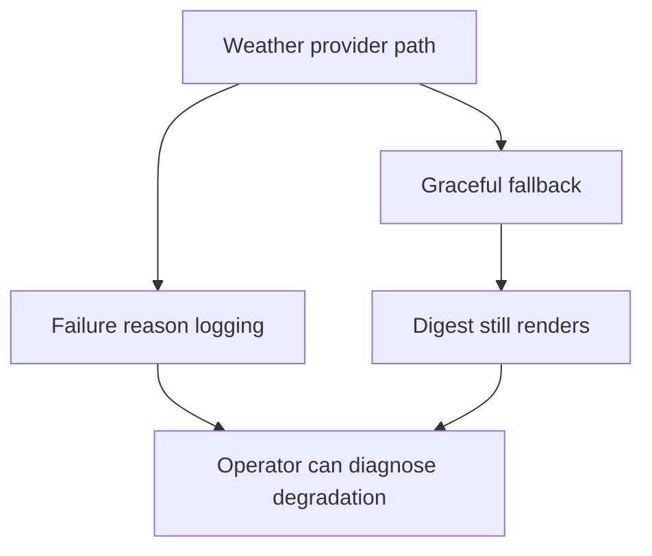

## req_047_day_captain_weather_failure_observability_and_degraded_path_logging - Day Captain weather failure observability and degraded path logging
> From version: 1.8.0
> Schema version: 1.0
> Status: Ready
> Understanding: 99%
> Confidence: 97%
> Complexity: Low
> Theme: Observability
> Reminder: Update status/understanding/confidence and references when you edit this doc.

# Needs
- Preserve the current graceful weather fallback behavior while adding enough observability that operators can tell when the weather capsule is missing because of config error, provider failure, or payload drift.
- Avoid silent degraded behavior on the weather path in production-like environments.
- Make weather failure modes diagnosable without breaking digest generation.

# Context
- The weather capsule is optional and should not break the digest when the provider is unavailable or misconfigured.
- That resilience is good, but the current behavior suppresses weather failures too quietly.
- As a result, an operator can see the weather block disappear without any clear indication of whether the reason was:
  - weather not configured
  - provider timeout
  - invalid payload
  - local config mistake
- This is an observability problem, not a product-feature problem. The degraded path should stay non-fatal, but it should no longer be opaque.

# In scope
- logging or otherwise surfacing weather-provider failure reasons while keeping digest generation resilient
- distinguishing between disabled weather and failed weather retrieval where useful
- preserving the non-fatal fallback contract
- tests and docs covering degraded weather behavior and observability

# Out of scope
- redesigning the weather capsule
- changing weather provider selection
- making weather mandatory
- broad logging-framework redesign outside the weather degraded path

# Acceptance criteria
- AC1: Weather retrieval failures no longer disappear silently; operators have enough signal to diagnose why the weather capsule was omitted.
- AC2: The digest still renders successfully when weather retrieval fails or is invalid.
- AC3: Disabled weather remains distinguishable from runtime weather failure where that distinction matters operationally.
- AC4: Tests and docs cover representative degraded weather scenarios and the chosen observability behavior.

# Risks and dependencies
- Logging too loudly could create noise if transient provider failures are frequent.
- Logging must not leak secrets or irrelevant payload details.
- The weather path should remain optional and bounded even after observability improves.

# Companion docs
- Product brief(s): None yet.
- Architecture decision(s): None yet.

# AI Context
- Summary: Add observability to the weather degraded path so missing weather capsules can be diagnosed without breaking the digest.
- Keywords: weather, observability, degraded path, logging, fallback, open-meteo
- Use when: The issue is silent weather failure rather than weather product design.
- Skip when: The work is about weather copy, rendering polish, or provider expansion.

# References
- Weather fallback path: [src/day_captain/app.py](/Users/alexandreagostini/Documents/day-captain/src/day_captain/app.py)
- Weather provider: [src/day_captain/adapters/weather.py](/Users/alexandreagostini/Documents/day-captain/src/day_captain/adapters/weather.py)

# Definition of Ready (DoR)
- [x] Problem statement is explicit and user impact is clear.
- [x] Scope boundaries (in/out) are explicit.
- [x] Acceptance criteria are testable.
- [x] Dependencies and known risks are listed.

# Backlog
- `item_093_day_captain_weather_degraded_path_observability` - Make weather degraded-path behavior observable without breaking digest generation. Status: `Ready`.

# Notes
- Created on Saturday, March 28, 2026 from audit findings about silent weather fallback behavior.
- This request intentionally preserves graceful degradation; the main change is diagnosability.
