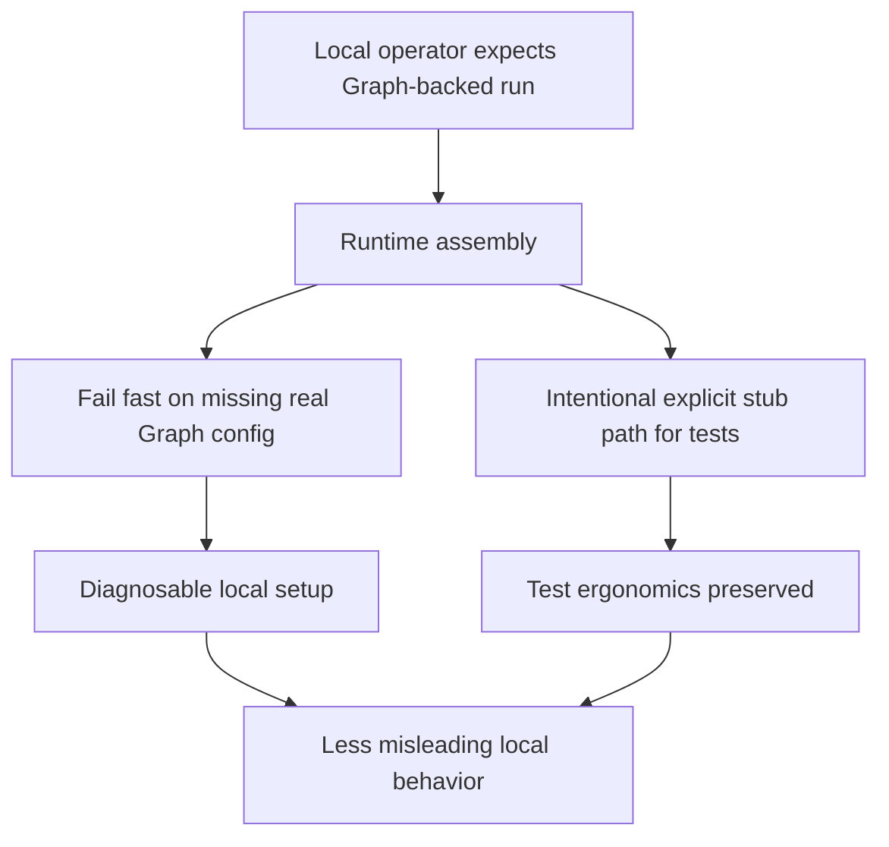

## req_048_day_captain_explicit_local_fail_fast_instead_of_stub_runtime_fallback - Day Captain explicit local fail-fast instead of stub runtime fallback
> From version: 1.8.0
> Schema version: 1.0
> Status: Done
> Understanding: 98%
> Confidence: 95%
> Complexity: Medium
> Theme: Reliability
> Reminder: Update status/understanding/confidence and references when you edit this doc.

# Needs
- Reduce misleading local success cases where Day Captain assembles with stub auth and static collectors instead of surfacing a real Graph/runtime misconfiguration.
- Preserve intentional test and fixture workflows while making ordinary local operator runs fail fast when Graph-backed execution was clearly expected.
- Make the local runtime contract explicit enough that empty or unrealistic output is not mistaken for a healthy Graph-backed run.

# Context
- Hosted runtime already moved toward more explicit fail-fast behavior in earlier work.
- A weaker local version of the same problem remains: when Graph configuration is absent or partially broken, application assembly can still fall back to stub auth and static collectors.
- That keeps tests easy to write, but in ordinary manual use it can create a false-positive experience:
  - the app boots
  - commands run
  - output is empty or unrealistic
  - the real root problem, missing Graph config, stays hidden
- This is mainly a local trust and ergonomics problem. The system should still support intentional stubbed tests, but accidental stub fallback should not masquerade as a real local runtime.

# In scope
- making ordinary local Graph-backed runs fail explicitly when required auth/runtime setup is missing
- preserving intentional stub behavior for tests or explicitly stubbed development scenarios
- clarifying how stub paths are entered so they are not accidental
- tests and docs covering local fail-fast versus explicit stub usage

# Out of scope
- redesigning hosted validation
- removing all test doubles from the codebase
- broad CLI redesign unrelated to local runtime contract clarity
- app-only versus delegated auth redesign

# Acceptance criteria
- AC1: When a local operator path is clearly intended to use Microsoft Graph but required config is missing, the runtime fails explicitly instead of quietly falling back to stubbed collectors/providers.
- AC2: Intentional stub behavior remains available for tests and explicitly stubbed scenarios.
- AC3: The entry conditions for stubbed execution are explicit enough that accidental fallback is materially reduced.
- AC4: Tests and docs cover the local fail-fast contract and the preserved explicit stub path.

# Risks and dependencies
- Tightening local behavior can reduce convenience for ad hoc experimentation if the explicit stub path is not simple enough.
- The final contract should not break the test suite or fixture-driven development flows.
- This request overlaps with earlier hosted fail-fast work but remains distinct because it targets local operator trust rather than hosted durability.

# Companion docs
- Product brief(s): None yet.
- Architecture decision(s): None yet.

# AI Context
- Summary: Make local Graph-backed runs fail fast on real misconfiguration instead of quietly degrading to stub runtime behavior, while preserving explicit stubs for tests.
- Keywords: local fail fast, stub auth provider, static collectors, graph misconfiguration, runtime contract
- Use when: The issue is misleading local fallback to stub behavior rather than hosted validation.
- Skip when: The work is only about tests, auth provider internals, or hosted-only runtime safeguards.

# References
- Local runtime assembly: [src/day_captain/app.py](/Users/alexandreagostini/Documents/day-captain/src/day_captain/app.py)
- Existing hosted fail-fast direction: [logics/request/req_034_day_captain_hosted_runtime_fail_fast_and_identity_normalization.md](/Users/alexandreagostini/Documents/day-captain/logics/request/req_034_day_captain_hosted_runtime_fail_fast_and_identity_normalization.md)
- Project status note about hosted hardening focus: [README.md](/Users/alexandreagostini/Documents/day-captain/README.md)

# Definition of Ready (DoR)
- [x] Problem statement is explicit and user impact is clear.
- [x] Scope boundaries (in/out) are explicit.
- [x] Acceptance criteria are testable.
- [x] Dependencies and known risks are listed.

# Backlog
- `item_094_day_captain_local_graph_fail_fast_and_explicit_stub_runtime_contract` - Make local Graph-backed runs fail fast and keep stub runtime explicit for tests and intentional scenarios. Status: `Ready`.

# Notes
- Created on Saturday, March 28, 2026 from audit findings about misleading local fallback to stub runtime behavior.
- This request intentionally keeps the testability benefits of explicit stubs while reducing accidental runtime ambiguity for local operators.
