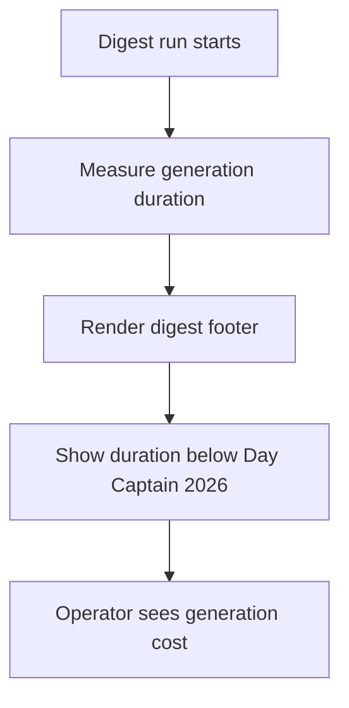

## req_049_day_captain_footer_processing_duration_in_delivered_digest_emails - Day Captain footer processing duration in delivered digest emails
> From version: 1.8.0
> Schema version: 1.0
> Status: Ready
> Understanding: 98%
> Confidence: 95%
> Complexity: Low
> Theme: Delivery
> Reminder: Update status/understanding/confidence and references when you edit this doc.

# Needs
- Show the digest processing duration in the delivered email footer.
- Display that duration directly under `Day Captain © 2026` so the operator can see how long the current digest took to generate.
- Make the displayed duration reflect the digest generation pipeline itself, not the downstream email transport latency.

# Context
- The delivered digest already ends with a small footer block that includes the project signature line `Day Captain © 2026`.
- That footer is a natural place for lightweight operator-facing runtime metadata.
- The requested addition is small, but it still needs a clear contract because `processing duration` can mean different things:
  - full command duration including Graph send
  - digest generation only
  - hosted end-to-end job duration
- For this request, the useful signal is the time needed to generate the digest content for the current run.
- That duration should remain readable inside both the text body and the HTML email footer.

# In scope
- capturing a bounded duration for the current digest generation run
- passing that duration into the delivery payload or equivalent renderer input
- rendering the duration in the text footer and HTML footer below `Day Captain © 2026`
- tests covering footer rendering and timing propagation

# Out of scope
- broad performance optimization of the digest pipeline
- displaying Graph or Outlook mail delivery latency
- adding historical performance dashboards or trend reporting
- exposing per-step timings for collectors, scoring, or LLM calls

# Acceptance criteria
- AC1: Delivered digest emails include a processing-duration line directly below `Day Captain © 2026` in the footer.
- AC2: The displayed value reflects the current digest generation duration, measured from run start until the delivery content is ready, and does not depend on downstream mailbox delivery latency.
- AC3: Both text and HTML rendering paths display the same duration information in a readable operator-facing format.
- AC4: If timing metadata is unavailable, the digest still renders safely without breaking footer layout or delivery.
- AC5: Tests cover timing capture/propagation and footer rendering.

# Risks and dependencies
- The timing contract must be defined carefully so operators do not confuse generation time with Outlook or Graph send latency.
- If the measurement point is chosen too late, the number may include transport overhead and become misleading.
- If the measurement point is chosen too early, the number may under-report expensive render or LLM work.

# References
- Footer rendering: [services.py](/Users/alexandreagostini/Documents/day-captain/src/day_captain/services.py)
- Application orchestration and run lifecycle: [app.py](/Users/alexandreagostini/Documents/day-captain/src/day_captain/app.py)

# Definition of Ready (DoR)
- [x] Problem statement is explicit and user impact is clear.
- [x] Scope boundaries (in/out) are explicit.
- [x] Acceptance criteria are testable.
- [x] Dependencies and known risks are listed.

# Companion docs
- Product brief(s): None yet.
- Architecture decision(s): None yet.

# AI Context
- Summary: Show the current digest generation duration below the Day Captain footer signature without conflating it with email transport latency.
- Keywords: footer duration, digest generation timing, email footer metadata, processing time, delivery footer
- Use when: The work is about exposing current-run generation time inside the delivered digest footer.
- Skip when: The work is about broader performance instrumentation, dashboards, or transport latency measurement.

# Backlog

- `item_095_day_captain_footer_processing_duration_in_delivered_digest_emails`
# Notes
- Created on Saturday, March 28, 2026 from an operator request to show the mail processing time in the footer.
- The intended reading is `generation duration for this digest`, not `total external delivery latency`.
