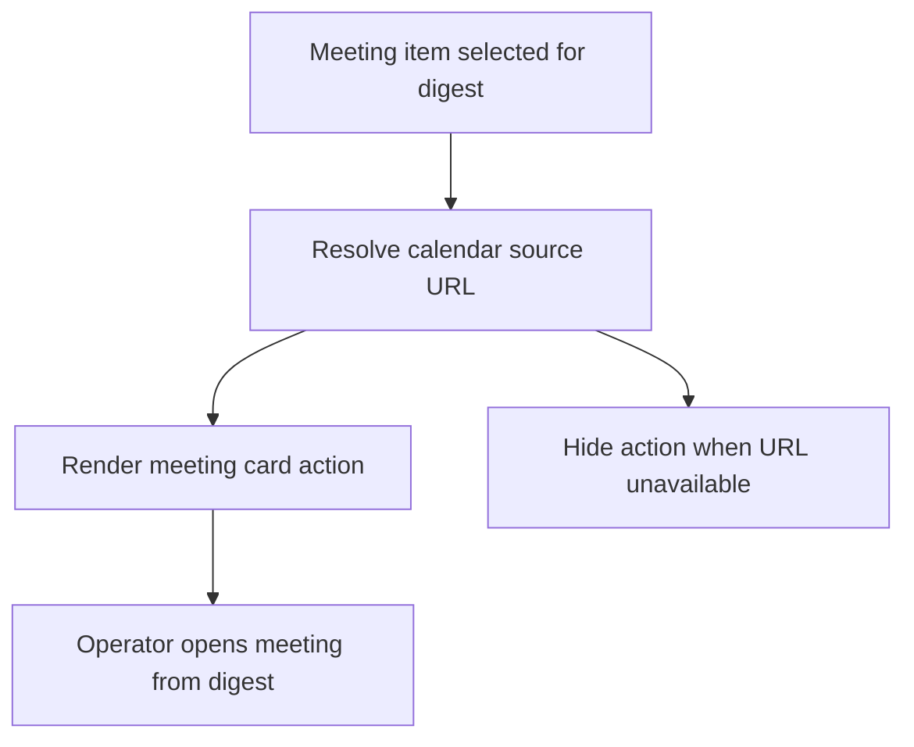

## req_050_day_captain_meeting_cards_direct_open_link_in_digest - Day Captain meeting cards direct open link in digest
> From version: 1.8.0
> Schema version: 1.0
> Status: Done
> Understanding: 99%
> Confidence: 97%
> Complexity: Low
> Theme: Delivery
> Reminder: Update status/understanding/confidence and references when you edit this doc.

# Needs
- Add a direct open link for calendar meetings in the digest, similarly to the open link already shown for emails.
- Make upcoming meeting cards actionable so the operator can jump from the digest to the calendar event in one click.
- Preserve safe rendering when a meeting does not expose a usable calendar URL.

# Context
- Digest message entries already expose a direct open affordance such as `Ouvrir dans Outlook`.
- Meeting entries already carry source URLs in the pipeline, but the rendering contract should make that action explicit and consistent for calendar items too.
- This is mainly a delivery and UX coherence improvement:
  - mail cards can be opened directly
  - meeting cards should offer the same operator shortcut
- The rendered action should exist in both the text digest and the HTML email so the behavior stays consistent across clients.
- The feature should stay conservative when a meeting URL is missing or not reliable: no broken or misleading action should be shown.

# In scope
- making the meeting open action explicit in delivered digest rendering
- showing an open link for eligible calendar meeting cards in text and HTML output
- aligning the wording and placement with existing mail open-link behavior
- tests covering meeting cards with and without resolvable URLs

# Out of scope
- redesigning the full layout of meeting cards
- adding edit, RSVP, or join-online-meeting actions beyond the basic calendar open link
- changing how Graph meeting URLs are generated upstream unless necessary for delivery correctness
- broader navigation changes outside digest rendering

# Acceptance criteria
- AC1: Meeting cards in the delivered digest expose a direct open action when a usable calendar source URL is available.
- AC2: The action is rendered in both text and HTML digests with wording consistent with the existing mail open-link affordance.
- AC3: When no reliable meeting URL is available, the digest omits the action gracefully without broken placeholders or malformed layout.
- AC4: Tests cover both the positive path and the no-URL fallback path.

# Risks and dependencies
- Some meetings may not expose a stable Outlook calendar URL, so the rendering must tolerate missing links cleanly.
- If the wording diverges too much from mail cards, the digest will feel inconsistent instead of more usable.
- The request depends on the existing meeting `source_url` contract being preserved or normalized before rendering.

# References
- Digest renderer and meeting card output: [services.py](/Users/alexandreagostini/Documents/day-captain/src/day_captain/services.py)
- Digest payload and entry contract: [models.py](/Users/alexandreagostini/Documents/day-captain/src/day_captain/models.py)

# Definition of Ready (DoR)
- [x] Problem statement is explicit and user impact is clear.
- [x] Scope boundaries (in/out) are explicit.
- [x] Acceptance criteria are testable.
- [x] Dependencies and known risks are listed.

# Companion docs
- Product brief(s): None yet.
- Architecture decision(s): None yet.

# AI Context
- Summary: Add a direct calendar open link to digest meeting cards, aligned with the existing open-link affordance already used for mail items.
- Keywords: meeting open link, calendar event link, digest meeting card, outlook calendar open action, renderer consistency
- Use when: The work is about making meeting cards directly openable from the delivered digest.
- Skip when: The work is about online join links, RSVP workflows, or broader digest redesign.

# Backlog

- `item_096_day_captain_meeting_cards_direct_open_link_in_digest`
# Notes
- Created on Saturday, March 28, 2026 from an operator request to align meeting cards with the existing mail open-link behavior.
- The intent is `open the calendar event from the digest`, not a broader meeting action menu.
- Completed on Saturday, March 28, 2026 through `task_046_day_captain_footer_timing_and_meeting_open_link_orchestration`; the renderer behavior is now explicitly covered for both positive and no-link fallback paths.
