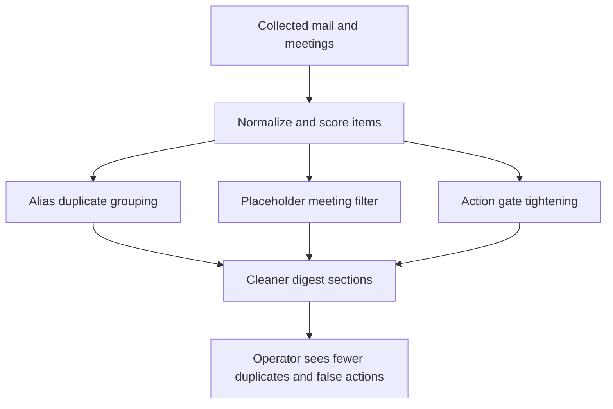

## req_051_day_captain_digest_alias_dedupe_placeholder_meeting_filtering_and_action_signal_tightening - Day Captain digest alias dedupe placeholder meeting filtering and action signal tightening
> From version: 1.9.0
> Schema version: 1.0
> Status: Ready
> Understanding: 98%
> Confidence: 96%
> Complexity: Medium
> Theme: Product Quality
> Reminder: Update status/understanding/confidence and references when you edit this doc.

# Needs
- Collapse duplicate operational alerts received through multiple aliases so the digest shows one coherent item instead of several near-identical entries.
- Stop placeholder or holding-slot calendar events from being rendered as normal upcoming meetings when they only carry system placeholder content.
- Tighten the `Actions to take` / `Actions a mener` gate so direct-recipient status alone does not promote low-value informational mail into the action section.
- Preserve explainable deterministic behavior so the operator can understand why an item was grouped, filtered, demoted, or kept.

# Context
- Recent live digest review showed that near-identical automated alerts delivered to several mailbox aliases are now surfaced independently after the transactional-alert fix. This makes the digest noisier even when all copies represent the same operational issue.
- The current mail grouping contract primarily relies on `thread_id`, so copies delivered across aliases can remain separate even when subject, sender, time, and preview are effectively the same event.
- The upcoming meetings section can still show self-created holding slots with zero attendees and placeholder calendar body text as if they were real meetings worth briefing.
- The message scoring pipeline still gives substantial weight to direct-recipient presence. As a result, some internal FYI or lightweight coordination mail can appear in `Actions to take` even when no clear action cue exists.
- The desired product behavior is not a generic mailbox classifier. The system should stay bounded, deterministic, and testable:
  - duplicate alert copies should collapse safely without merging distinct incidents
  - placeholder meetings should be filtered or compacted using explicit signals
  - action routing should require stronger evidence than being merely addressed to the target user
- External news visibility is currently controlled by runtime configuration and is not part of this request.

# In scope
- deduplicating near-identical operational alerts received across multiple aliases using a bounded canonical key based on normalized content and time proximity
- preserving a readable grouped digest representation when several aliases are affected by the same alert
- filtering or compacting placeholder meeting slots using explicit meeting metadata and placeholder-preview signals
- tightening `Actions to take` / `Actions a mener` routing so stronger action evidence is required beyond direct-recipient matching
- regression tests covering duplicate alerts, false merge protection, placeholder meetings, and action demotion behavior

# Out of scope
- enabling or configuring external news feeds
- broad spam filtering beyond the digest ranking issues identified here
- redesigning the overall digest layout beyond the minimum grouped or compact rendering needed for these fixes
- replacing the deterministic scoring model with an unbounded LLM classifier

# Acceptance criteria
- AC1: Near-identical operational alerts delivered to multiple aliases are collapsed into a single digest representation or explicit grouped item instead of appearing as repeated standalone entries.
- AC2: The dedupe logic does not merge materially distinct alerts when sender, normalized subject, preview fingerprint, or delivery timing indicate separate incidents.
- AC3: Placeholder or holding-slot meetings matching the bounded placeholder signature do not appear as normal upcoming meeting briefings; if retained at all, they are rendered with lower prominence and without misleading confidence.
- AC4: Direct-recipient status alone is no longer sufficient to place informational mail into `Actions to take` / `Actions a mener`; a stronger action-oriented signal is required.
- AC5: Explicitly actionable or transactional alerts still surface correctly after the action-gate tightening.
- AC6: Tests are updated to cover grouped alias duplicates, non-merge safeguards, placeholder meeting filtering, and action-section demotion or retention behavior.

# Risks and dependencies
- Over-aggressive deduplication could merge separate operational incidents that happen close together, so the grouping key must stay conservative.
- Placeholder-meeting filtering could hide legitimate private work blocks if the signature is too broad, so the contract should remain narrowly scoped to placeholder metadata and body patterns.
- Tightening the action gate could demote real work items if the remaining action cues are too strict.
- This request depends on the current message normalization, meeting metadata, and section-routing pipeline remaining explainable and testable.

# References
- Current digest scoring and grouping logic: [services.py](/Users/alexandreagostini/Documents/day-captain/src/day_captain/services.py)
- Digest horizon and meeting collection entrypoint: [app.py](/Users/alexandreagostini/Documents/day-captain/src/day_captain/app.py)

# Definition of Ready (DoR)
- [x] Problem statement is explicit and user impact is clear.
- [x] Scope boundaries (in/out) are explicit.
- [x] Acceptance criteria are testable.
- [x] Dependencies and known risks are listed.

# Companion docs
- Product brief(s): (none yet)
- Architecture decision(s): (none yet)

# AI Context
- Summary: Reduce remaining digest trust issues by deduplicating alias copies of the same alert, filtering placeholder meetings, and requiring stronger evidence before promoting a mail into the action section.
- Keywords: digest dedupe, alias grouping, placeholder meeting, action gate, operational alert, false action, meeting filter
- Use when: Use when the work is about reducing duplicate alerts, removing placeholder calendar noise, or tightening action promotion in the Day Captain digest.
- Skip when: Skip when the work is only about news configuration, broad spam handling, or unrelated delivery features.

# Backlog
- (none yet)

# Notes
- Created on Saturday, March 28, 2026 after live digest review identified duplicate alias alerts, placeholder calendar slots, and remaining false-positive action placement.
- Examples are intentionally generic in this request to avoid embedding business-sensitive mailbox content in workflow docs.
