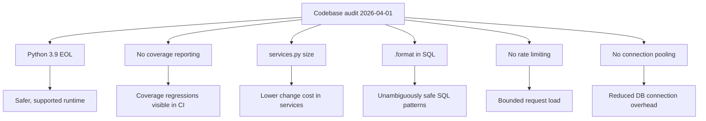

## req_053_day_captain_technical_debt_and_runtime_hardening - Day Captain technical debt and runtime hardening
> From version: 1.9.3
> Schema version: 1.0
> Status: Draft
> Understanding: 95
> Confidence: 90
> Complexity: Medium
> Theme: Engineering Quality
> Reminder: Update status/understanding/confidence and references when you edit this doc.

# Needs
- Migrate the runtime from Python 3.9 (EOL September 2025) to Python 3.11+ to stay on a supported interpreter.
- Add test coverage reporting to the CI pipeline so coverage regressions are visible before merging.
- Decompose the large functions in `services.py` (3,806 lines) to reduce cognitive load and improve individual testability.
- Replace SQL string interpolation via `.format()` in `storage.py` with explicit query builders or constants to eliminate the pattern even where it is currently safe.
- Add rate limiting on the HTTP job endpoints (`/jobs/*`) to prevent unintentional or malicious flooding.
- Introduce connection pooling or explicit connection lifecycle management in the storage adapter.

# Context
- A codebase audit conducted on 2026-04-01 identified six engineering quality issues that do not affect current correctness but accumulate risk over time.
- Python 3.9 reached end-of-life in September 2025. The CI matrix already includes 3.11; the minimum declared version in `pyproject.toml` should be raised and 3.9 dropped from the matrix.
- The CI pipeline runs `python -m unittest discover` with no coverage tooling. Regressions in coverage are invisible until a reviewer notices missing tests manually.
- `services.py` is a single 3,806-line module. Several scoring and digest-assembly functions are long enough that local reasoning requires scrolling across many screens. This is not a correctness issue today but increases the cost of future changes.
- `storage.py` uses `.format()` to assemble WHERE clauses from hardcoded string fragments. All user values go through parameterized placeholders (`?`), so the current code is safe, but the pattern is visually indistinguishable from unsafe SQL concatenation and will confuse future contributors.
- The `/jobs/*` HTTP endpoints are protected by a shared secret checked via `hmac.compare_digest`, but there is no rate limiting. A misconfigured scheduler or a credential leak could produce a burst of requests that queues up unbounded work.
- The storage adapter opens a new SQLite or PostgreSQL connection per operation. For SQLite this is acceptable; for PostgreSQL on Render this creates per-request TCP overhead and risks exhausting the connection limit under concurrent load.

# In scope
- Raising the minimum Python version to 3.11 in `pyproject.toml` and updating the CI matrix accordingly.
- Integrating a coverage tool (e.g. `coverage.py`) into the CI run and reporting the result; failing the build on significant regression is optional at first.
- Splitting the largest functions or logical groups in `services.py` into focused, independently testable units without changing observable behavior.
- Replacing all `.format()`-based SQL assembly in `storage.py` with explicit string constants or a minimal query builder pattern.
- Adding a simple rate limiter (token bucket or fixed window) on the `/jobs/*` endpoints in `web.py`.
- Adding connection pooling or an explicit reuse strategy in `adapters/storage.py` for PostgreSQL.

# Out of scope
- Rewriting `services.py` from scratch or changing scoring logic.
- Migrating to an ORM or external query builder library.
- Adding new product features as part of this request.
- Replacing the WSGI stack or changing the deployment platform.

# Acceptance criteria
- AC1: CI matrix targets Python 3.11 and `pyproject.toml` declares `python_requires >= "3.11"`; no Python 3.9 target remains.
- AC2: CI run reports a coverage percentage; the result is visible in the job output.
- AC3: No single function in `services.py` exceeds a defined line budget (suggested: 150 lines) after decomposition; all existing tests pass unchanged.
- AC4: No `.format()` call constructs SQL strings in `storage.py`; all existing parameterized-query protections are preserved.
- AC5: A burst of more than N rapid requests to any `/jobs/*` endpoint within a sliding window returns HTTP 429 instead of queuing unbounded work; N and the window are operator-configurable.
- AC6: The PostgreSQL storage adapter reuses connections across operations within a single job run rather than opening a new connection per query; SQLite behavior is unchanged.

# Risks and dependencies
- Raising the minimum Python version may surface incompatibilities in third-party packages or CI runner images; verify before merging.
- Splitting `services.py` carries refactoring risk; changes must be behavior-preserving and covered by the existing test suite before any new tests are added.
- Rate limiting must not interfere with legitimate scheduled triggers; the window and threshold must be tuned to the expected GitHub Actions call frequency.
- Connection pooling in PostgreSQL requires careful lifecycle management to avoid leaked connections under error conditions.

# References
- Audit source: codebase review conducted 2026-04-01
- Main scoring module: [services.py](src/day_captain/services.py)
- Storage adapter: [adapters/storage.py](src/day_captain/adapters/storage.py)
- HTTP endpoints: [web.py](src/day_captain/web.py)
- CI pipeline: [.github/workflows/ci.yml](.github/workflows/ci.yml)
- Package metadata: [pyproject.toml](pyproject.toml)

# Definition of Ready (DoR)
- [x] Problem statement is explicit and user impact is clear.
- [x] Scope boundaries (in/out) are explicit.
- [x] Acceptance criteria are testable.
- [x] Dependencies and known risks are listed.

# Companion docs
- Product brief(s): (none yet)
- Architecture decision(s): (none yet)

# AI Context
- Summary: Six engineering quality issues identified in an April 2026 audit — EOL Python, missing coverage reporting, large services module, unsafe-looking SQL patterns, no rate limiting on job endpoints, and no DB connection pooling.
- Keywords: python upgrade, coverage, services decomposition, sql safety, rate limiting, connection pooling, technical debt
- Use when: Use when the work targets runtime version, CI quality gates, services.py size, SQL construction patterns, endpoint protection, or storage connection lifecycle.
- Skip when: Skip when the work targets product features, digest logic, or delivery behavior.

# Backlog
- `item_100_day_captain_python_3_9_eol_migration_to_3_11` - Status: `Draft`.
- `item_101_day_captain_ci_coverage_reporting` - Status: `Draft`.
- `item_102_day_captain_services_decomposition_large_functions` - Status: `Draft`.
- `item_103_day_captain_replace_format_based_sql_construction_in_storage` - Status: `Draft`.
- `item_104_day_captain_rate_limiting_on_job_endpoints` - Status: `Draft`.
- `item_105_day_captain_postgresql_connection_pooling_in_storage_adapter` - Status: `Draft`.
- `task_048_day_captain_technical_debt_hardening_orchestration` - Status: `Draft`.
