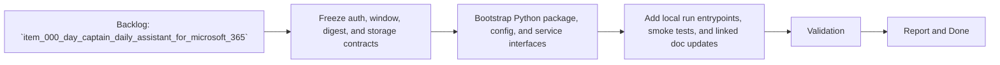

## task_000_day_captain_daily_assistant_for_microsoft_365 - Freeze Day Captain V1 contract and bootstrap the service skeleton
> From version: 0.1.0
> Status: Ready
> Understanding: 97%
> Confidence: 94%
> Progress: 0%
> Complexity: Medium
> Theme: Productivity
> Reminder: Update status/understanding/confidence/progress and dependencies/references when you edit this doc.

# Context
- Derived from backlog item `item_000_day_captain_daily_assistant_for_microsoft_365`.
- Source file: `logics/backlog/item_000_day_captain_daily_assistant_for_microsoft_365.md`.
- Related request(s): `req_000_day_captain_daily_assistant_for_microsoft_365`.
- Supporting spec: `spec_000_day_captain_v1_digest_contract`.
- Delivery target: remove ambiguity before implementation by freezing the auth model, data contracts, entrypoints, and service module boundaries, then bootstrap the minimal Python project skeleton those later tasks will extend.

# Plan
- [ ] 1. Freeze the V1 contract: delegated Graph auth, morning collection window, digest JSON/email schema, `SQLite` tables, recall contract, and `n8n`/Python responsibilities.
- [ ] 2. Bootstrap the Python project skeleton with configuration loading, service interfaces, normalized DTOs, and placeholders for auth, collection, storage, scoring, digest, recall, and feedback modules.
- [ ] 3. Add local run entrypoints, smoke-test scaffolding, and implementation notes that unblock `task_001_day_captain_graph_ingestion_and_storage` and `task_002_day_captain_digest_scoring_recall_and_delivery`.
- [ ] FINAL: Update related Logics docs

# AC Traceability
- AC1 -> This task freezes the auth model. Proof: Plan step 1 defines delegated Graph auth and required scopes.
- AC2 -> This task freezes the collection and persistence contracts. Proof: Plan step 1 defines the morning window and `SQLite` tables; step 2 adds the corresponding interfaces.
- AC3 -> This task freezes the digest contract. Proof: Plan step 1 defines the digest schema and step 2 adds normalized DTOs.
- AC6 -> This task bootstraps persistence boundaries. Proof: Plan steps 1 and 2 define and scaffold `SQLite` repositories.
- AC7 -> This task makes the service boundary explicit. Proof: Plan step 1 defines the `n8n` vs Python split and step 2 creates module placeholders.
- AC8 -> This task creates the first runnable integration surface. Proof: Plan step 3 adds local run entrypoints compatible with later `n8n` wiring.

# Links
- Backlog item: `item_000_day_captain_daily_assistant_for_microsoft_365`
- Request(s): `req_000_day_captain_daily_assistant_for_microsoft_365`
- Spec: `spec_000_day_captain_v1_digest_contract`

# Validation
- python3 -m pytest
- python3 logics/skills/logics-doc-linter/scripts/logics_lint.py --require-status
- python3 logics/skills/logics-flow-manager/scripts/workflow_audit.py --group-by-doc

# Definition of Done (DoD)
- [ ] Scope implemented and acceptance criteria covered.
- [ ] Validation commands executed and results captured.
- [ ] Linked request/backlog/task docs updated.
- [ ] Status is `Done` and progress is `100%`.

# Report
